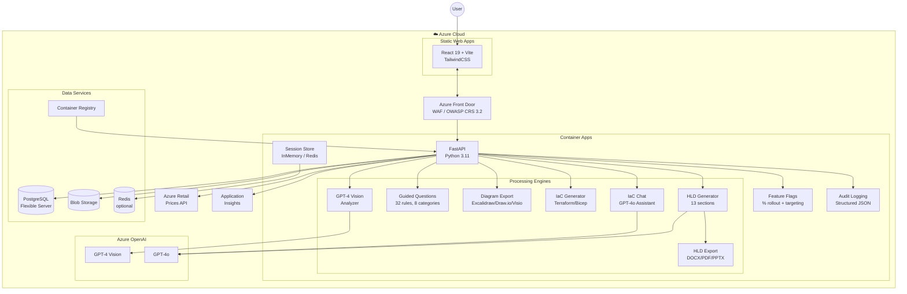
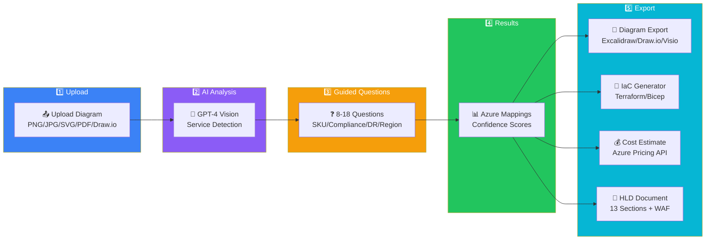

# Archmorph

**AI-Powered Cloud Architecture Translator to Azure**

Convert AWS and GCP architecture diagrams into Azure equivalents with guided migration questions, interactive diagram exports, ready-to-deploy Terraform/Bicep infrastructure code, dynamic cost estimates, and a self-updating service catalog.


> **[Live Demo](https://agreeable-ground-01012c003.2.azurestaticapps.net)** | **[API Docs](https://archmorph-api.nicesea-1430d1f7.westeurope.azurecontainerapps.io/docs)**

---

## Overview

Archmorph uses Azure OpenAI GPT-4 Vision to analyze cloud architecture diagrams, identify services, ask guided migration questions, map services to Azure equivalents with confidence scores, export architecture diagrams in multiple formats, generate deployable infrastructure as code, estimate costs using the Azure Retail Prices API, automatically discover and integrate new cloud services into its catalog, and provide a comprehensive icon registry with multi-format library export.

**Key Capabilities:**
- Upload architecture diagrams (PNG, JPG, SVG, PDF, Draw.io)
- Auto-detect AWS/GCP services with AI vision across a **405+ service catalog** (145 AWS, 143 Azure, 117 GCP — grows automatically)
- **Guided migration questions** — 32 contextual questions across 8 categories that refine SKU selection, compliance, networking, deployment region, and more
- Map to Azure equivalents with confidence scores and zone grouping
- **Export architecture diagrams** as Excalidraw, Draw.io, or Visio with Azure stencils
- Generate Terraform HCL or Bicep code with secure credential handling
- **Dynamic cost estimates** — region-aware pricing via Azure Retail Prices API with 46 service mappings and monthly cache
- **Self-updating service catalog** — daily auto-discovery and auto-integration of new cloud services with fuzzy matching and category classification
- **Icon Registry** — 405 normalized cloud service icons with Draw.io, Excalidraw, and Visio library builders
- **AI-powered HLD generation** — 13-section High-Level Design documents with WAF assessment
- **HLD document export** — download HLD as Word (.docx), PDF, or PowerPoint (.pptx) with branded formatting
- **IaC Chat assistant** — interactive GPT-4o assistant for code modifications
- **Chatbot assistant** — FAQ support and GitHub issue creation with intent detection
- **Admin dashboard** — conversion funnel, daily metrics, session tracking
- **JWT admin authentication** — HS256 tokens with 1-hour TTL, in-memory revocation
- **Persistent analytics** — Azure Blob Storage with background flush and crash-safe shutdown
- **Security hardening** — timing-safe auth, security headers, XSS protection, Dependabot
- **CI/CD security** — Semgrep SAST, Gitleaks secret detection, Trivy container scanning, CycloneDX SBOM
- **API versioning** — all `/api/*` routes mirrored at `/api/v1/*` for stable integrations
- **Feature flags system** — percentage rollout + user targeting with admin API
- **Comprehensive audit logging** — structured JSON with risk levels, alerting rules, compliance queries
- **Session persistence** — pluggable SessionStore with InMemory and Redis backends
- **GPT response caching** — content-hash TTLCache for GPT-4o responses
- **Zero Trust WAF** — Azure Front Door Premium with OWASP CRS 3.2
- **Helm charts** — self-hosted Kubernetes deployment via `charts/archmorph/`

---

## Quick Start

### Prerequisites
- Azure subscription
- Azure CLI installed
- Terraform 1.5+
- Node.js 20+
- Python 3.11+

### Deploy Infrastructure

```bash
cd infra
az login
terraform init
terraform apply -var-file="terraform.tfvars"
```

### Run Locally

**Backend:**
```bash
cd backend
python -m venv .venv && source .venv/bin/activate
pip install -r requirements.txt
uvicorn main:app --reload --port 8000
```

**Frontend:**
```bash
cd frontend
npm install
npm run dev
```

---

## Architecture

### System Architecture Diagram



### Component Overview

| Component | Technology | Azure Service |
|-----------|------------|---------------|
| Frontend | React 19.1, Vite 7.3, TailwindCSS 4.2, Lucide React | Static Web Apps |
| Backend API | Python 3.11, FastAPI 0.128 | Container Apps |
| AI Engine | GPT-4 Vision + GPT-4o | Azure OpenAI |
| Container Registry | Docker | Azure Container Registry |
| Database | PostgreSQL | Flexible Server |
| Storage | Blob | Storage Account (metrics persistence) |
| Scheduler | APScheduler (CronTrigger) | In-process |
| Service Auto-Discovery | Daily sync + auto-integration | In-process engine |
| Guided Questions | 32 questions, 8 categories | In-process engine |
| Diagram Export | Excalidraw / Draw.io / Visio | In-process engine |
| Icon Registry | 405 icons, 3 library formats | In-process engine |
| Pricing | Azure Retail Prices API (46 queries) | 30-day disk cache |
| HLD Generator | GPT-4o, 13 sections, 60+ doc links | In-process engine |
| HLD Export | DOCX/PDF/PPTX with branded formatting | In-process engine |
| IaC Chat | GPT-4o interactive assistant | In-process engine |
| Auth | JWT (HS256), in-memory revocation | Middleware |
| Security | Headers, timing-safe auth, XSS protection, Dependabot | Middleware |
| Feature Flags | Python module, % rollout + user targeting | In-process |
| Audit Logging | Structured JSON + querying with risk levels | In-process |
| Session Store | InMemory/Redis adapter | In-process / Azure Cache for Redis |
| API Versioning | v1 prefix mirror for all routes | Middleware |
| WAF | OWASP CRS 3.2 | Azure Front Door Premium |
| Testing | pytest (1149 tests) + Playwright E2E | CI/CD |

> 📐 **Detailed Diagrams:** [architecture.excalidraw](docs/architecture.excalidraw) | [application-flow.excalidraw](docs/application-flow.excalidraw) — Open in [Excalidraw](https://excalidraw.com)

---

## Application Flow

### User Journey



### Step-by-Step Flow

```
Upload Diagram → AI Analysis → Guided Questions → Results & Export → Generate IaC → Cost Estimate
```

1. **Upload** — User uploads an AWS or GCP architecture diagram
2. **AI Analysis** — GPT-4 Vision detects services, connections, and annotations
3. **Feature Flags** — Feature availability checked via flags system (percentage rollout + user targeting)
4. **Guided Questions** — 8–18 contextual questions refine migration choices (SKU, compliance, networking, DR, security, deployment region)
5. **Results** — Azure service mappings grouped by zone with confidence scores
6. **Diagram Export** — Download translated architecture as Excalidraw, Draw.io, or Visio
7. **IaC Generation** — Generate Terraform HCL or Bicep with syntax highlighting
8. **Cost Estimation** — Region-aware monthly cost breakdown via Azure Retail Prices API
9. **HLD Generation** — AI-powered High-Level Design document with WAF assessment
10. **HLD Export** — Download HLD as Word, PDF, or PowerPoint with branded formatting
11. **IaC Chat** — Interactive code modification via GPT-4o assistant

---

## Self-Updating Service Catalog

The service catalog automatically discovers and integrates new cloud services:

- **Daily sync** — APScheduler runs at 2:00 AM UTC, fetching from AWS Pricing Index, Azure Retail Prices API, and GCP Pricing Calculator
- **Auto-integration** — newly discovered services are written directly into the Python catalog files under an `AUTO-DISCOVERED` section
- **Fuzzy matching** — normalised comparison (name, fullName, id) prevents false-positive detections
- **Category classification** — 55 keyword hints auto-assign categories (Compute, Storage, Database, AI/ML, etc.) and matching icons
- **Dry-run mode** — CLI `--dry-run` flag detects without writing
- **Tracking** — cumulative `auto_added` counts per provider in `service_updates.json`

### CLI Usage

```bash
cd backend
python service_updater.py --run-now     # Discover + auto-add
python service_updater.py --dry-run     # Discover only (no file writes)
```

---

## Service Catalog

**405+ total services** across three providers, with 122 verified cross-cloud mappings.

### AWS → Azure (Sample)

| AWS | Azure | Confidence |
|-----|-------|------------|
| EC2 | Virtual Machines | 95% |
| S3 | Blob Storage | 95% |
| Lambda | Azure Functions | 90% |
| RDS | Azure SQL / PostgreSQL Flexible | 90% |
| DynamoDB | Cosmos DB | 85% |
| EKS | AKS | 90% |

### GCP → Azure (Sample)

| GCP | Azure | Confidence |
|-----|-------|------------|
| Compute Engine | Virtual Machines | 95% |
| Cloud Storage | Blob Storage | 95% |
| Cloud Functions | Azure Functions | 90% |
| GKE | AKS | 90% |
| BigQuery | Synapse Analytics | 80% |

Full mapping database: 405+ services across AWS, Azure, and GCP with 122 mappings.

---

## Cost Estimation

Dynamic pricing powered by the [Azure Retail Prices API](https://prices.azure.com/api/retail/prices):

- **Region-aware** — prices fetched per the user's selected deployment region (20 regions, default: West Europe)
- **SKU strategy multipliers** — Cost-optimized (0.65x), Balanced (1.0x), Performance-first (1.6x), Enterprise (2.2x)
- **46 service mappings** with built-in fallback estimates
- **Monthly cache** — prices cached to disk for 30 days
- **Per-service breakdown** — low/high range for each Azure service plus total monthly estimate

---

## API Reference

### Core Endpoints (~90+ total)

> **Note:** All `/api/*` routes are also available at `/api/v1/*` for versioned API access.

| Endpoint | Method | Description |
|----------|--------|-------------|
| `/api/health` | GET | Health check (version, mode, catalog stats) |
| `/api/services` | GET | List all services with optional filters |
| `/api/services/providers` | GET | List cloud providers with counts |
| `/api/services/categories` | GET | List categories with per-provider counts |
| `/api/services/mappings` | GET | List cross-cloud mappings |
| `/api/services/{provider}/{id}` | GET | Get specific service details |
| `/api/services/stats` | GET | Catalog statistics |

### Translation Flow

| Endpoint | Method | Description |
|----------|--------|-------------|
| `/api/projects/{id}/diagrams` | POST | Upload diagram file |
| `/api/diagrams/{id}/analyze` | POST | Analyze diagram |
| `/api/diagrams/{id}/questions` | POST | Generate guided migration questions |
| `/api/diagrams/{id}/apply-answers` | POST | Apply answers to refine mappings |
| `/api/diagrams/{id}/export-diagram` | POST | Export as Excalidraw, Draw.io, or Visio |
| `/api/diagrams/{id}/export-hld` | POST | Export HLD as DOCX, PDF, or PPTX |
| `/api/diagrams/{id}/generate` | POST | Generate Terraform or Bicep code |
| `/api/diagrams/{id}/cost-estimate` | GET | Dynamic cost estimate |

### Chatbot & Admin

| Endpoint | Method | Description |
|----------|--------|-------------|
| `/api/chat` | POST | Send message to chatbot assistant |
| `/api/chat/history/{session_id}` | GET | Get chat session history |
| `/api/chat/{session_id}` | DELETE | Clear chat session |
| `/api/admin/login` | POST | Authenticate with admin key, receive JWT |
| `/api/admin/logout` | POST | Revoke admin session token |
| `/api/admin/metrics` | GET | Usage metrics (JWT-protected) |
| `/api/admin/metrics/funnel` | GET | Conversion funnel data |
| `/api/admin/metrics/daily` | GET | Daily activity metrics |
| `/api/admin/metrics/recent` | GET | Recent events feed |
| `/api/admin/monitoring` | GET | System health & performance |
| `/api/admin/costs` | GET | Azure deployment cost tracking |
| `/api/admin/analytics` | GET | Comprehensive analytics dashboard |
| `/api/admin/analytics/performance` | GET | Performance metrics |
| `/api/admin/analytics/features` | GET | Feature usage analytics |
| `/api/admin/analytics/funnel` | GET | Detailed funnel analytics |
| `/api/admin/audit` | GET | Security audit log |
| `/api/admin/observability` | GET | Observability spans & traces |
| `/api/admin/feedback` | GET | User feedback summary |
| `/api/admin/leads` | GET | Lead capture data |

### Icon Registry

| Endpoint | Method | Description |
|----------|--------|-------------|
| `/api/icon-packs` | POST | Upload ZIP/JSON icon pack |
| `/api/icon-packs/{pack_id}` | DELETE | Remove icon pack and its icons |
| `/api/icons` | GET | Search icons (provider, query, category) |
| `/api/icons/packs` | GET | List registered icon packs |
| `/api/icons/metrics` | GET | Icon registry observability counters |
| `/api/icons/{icon_id}/svg` | GET | Get raw SVG for a single icon |
| `/api/libraries/drawio` | GET | Download Draw.io custom library |
| `/api/libraries/excalidraw` | GET | Download Excalidraw library bundle |
| `/api/libraries/visio` | GET | Download Visio sidecar stencil pack |

### Service Updates

| Endpoint | Method | Description |
|----------|--------|-------------|
| `/api/service-updates/status` | GET | Scheduler status + auto-added totals |
| `/api/service-updates/last` | GET | Last update details |
| `/api/service-updates/run-now` | POST | Trigger immediate catalog refresh + auto-add |

### Feature Flags

| Endpoint | Method | Description |
|----------|--------|-------------|
| `/api/flags` | GET | List all feature flags |
| `/api/flags/{name}` | GET | Get specific flag status |
| `/api/flags/{name}` | PUT | Update flag configuration (admin) |

> **Note:** All routes also available at `/api/v1/*`

Full API documentation: [Swagger UI](https://archmorph-api.nicesea-1430d1f7.westeurope.azurecontainerapps.io/docs)

---

## Testing

| Suite | Framework | Tests | Command |
|-------|-----------|-------|---------|
| Backend unit | pytest | 1149 | `cd backend && python -m pytest tests/ -v` |
| E2E | Playwright | 34 | `npx playwright test` |
| **Total** | | **1183** | |

### Coverage

- **35+ test files** covering all API endpoints and router modules
- **79 core API tests** covering the full translation flow
- **58 icon registry tests** covering SVG sanitization, registry ops, all 3 library builders, API routes, and Pydantic models
- **56 contract tests** covering API contract validation
- **55 middleware tests** covering correlation ID, logging, versioning, and feature flags middleware
- **46 coverage gap tests** covering edge cases and uncovered paths
- **45 service updater tests** covering auto-discovery, fuzzy matching, and catalog integration
- **36 HLD generator tests** covering AI document generation and WAF assessment
- **33 guided questions tests** covering rule evaluation and deduplication
- **32 prompt injection guard tests** covering input sanitization
- **28 analytics tests** covering funnel tracking, metrics persistence, and Azure Blob Storage
- **28 pricing tests** covering Azure Retail Prices API integration and caching
- **27 HLD export tests** covering Word/PDF/PowerPoint generation, edge cases, and diagram inclusion
- **26 chaos engineering tests** covering fault injection, recovery, and resilience
- **24 roadmap tests** covering feature requests and bug reports
- **21 auth tests** covering JWT session management, login/logout, token revocation
- **10 E2E test groups** covering full translation flow, diagram export, IaC generation, chat widget, services browser, admin dashboard, API validation, and additional API coverage
- All backend tests run against a test FastAPI client; E2E tests run against the deployed app

---

## Project Structure

```
Archmorph/
├── frontend/                        # React SPA
│   ├── src/
│   │   ├── App.jsx                  # Main application with tab routing
│   │   ├── constants.js             # API_BASE, APP_VERSION
│   │   ├── index.css                # Global styles, fonts, scrollbar
│   │   ├── main.jsx                 # Entry point
│   │   └── components/
│   │       ├── AdminDashboard.jsx   # Admin metrics & monitoring panel
│   │       ├── ChatWidget.jsx       # AI chatbot assistant overlay
│   │       ├── DiagramTranslator/   # Main diagram upload & translation flow (9 sub-components)
│   │       │   ├── index.jsx            # Root component with useReducer state machine
│   │       │   ├── UploadPanel.jsx
│   │       │   ├── AnalysisResults.jsx
│   │       │   ├── GuidedQuestions.jsx
│   │       │   ├── MappingView.jsx
│   │       │   ├── DiagramExport.jsx
│   │       │   ├── IaCPanel.jsx
│   │       │   ├── CostEstimate.jsx
│   │       │   └── HLDPanel.jsx
│   │       ├── ErrorBoundary.jsx    # React error boundary
│   │       ├── FeedbackWidget.jsx   # NPS and feedback collection
│   │       ├── MonitoringDashboard.jsx # Observability dashboard
│   │       ├── Nav.jsx              # Navigation bar
│   │       ├── Roadmap.jsx          # Product roadmap timeline
│   │       ├── ServicesBrowser.jsx  # Service catalog browser
│   │       └── ui.jsx               # Shared UI components
│   ├── vite.config.js
│   └── package.json
├── backend/                         # FastAPI service
│   ├── main.py                      # App factory, middleware (181 lines)
│   ├── routers/                     # 13 FastAPI router modules
│   │   ├── services.py              # Service catalog routes
│   │   ├── diagrams.py              # Diagram analysis routes
│   │   ├── iac.py                   # IaC generation routes
│   │   ├── hld.py                   # HLD generation & export routes
│   │   ├── chat.py                  # Chat & IaC chat routes
│   │   ├── admin.py                 # Admin dashboard routes
│   │   ├── auth.py                  # Auth routes
│   │   ├── feedback.py              # Feedback & NPS routes
│   │   ├── roadmap.py               # Roadmap routes
│   │   ├── flags.py                 # Feature flag routes
│   │   ├── icons.py                 # Icon registry routes
│   │   ├── versioning.py            # Architecture versioning routes
│   │   └── misc.py                  # Health, contact, etc.
│   ├── admin_auth.py                # JWT session management (HS256, 1h TTL)
│   ├── vision_analyzer.py           # GPT-4o image analysis engine
│   ├── image_classifier.py          # Pre-check gate for diagram validation
│   ├── guided_questions.py          # 32 questions across 8 categories
│   ├── diagram_export.py            # Excalidraw/Draw.io/Visio export
│   ├── hld_generator.py             # AI-powered HLD generation (13 sections)
│   ├── hld_export.py                # HLD export to DOCX/PDF/PPTX
│   ├── iac_generator.py             # Terraform/Bicep code generation
│   ├── iac_chat.py                  # Interactive IaC chat assistant
│   ├── chatbot.py                   # FAQ chatbot with intent detection
│   ├── service_updater.py           # APScheduler daily catalog sync
│   ├── openai_client.py             # Shared Azure OpenAI client factory
│   ├── feature_flags.py             # Feature flags with % rollout + user targeting
│   ├── session_store.py             # Session persistence (InMemory/Redis backends)
│   ├── logging_config.py            # Structured JSON logging + CorrelationIdMiddleware
│   ├── audit_logging.py             # Comprehensive audit logging with risk levels
│   ├── api_versioning.py            # API v1 prefix mirror middleware
│   ├── usage_metrics.py             # Analytics with Azure Blob Storage persistence
│   ├── icons/                       # Icon Registry system
│   │   ├── models.py                # Pydantic models
│   │   ├── svg_sanitizer.py         # SVG validation & XSS prevention
│   │   ├── registry.py              # Thread-safe icon catalog
│   │   ├── routes.py                # Icon management API endpoints
│   │   └── builders/                # Library format builders
│   │       ├── drawio.py            # Draw.io mxlibrary XML builder
│   │       ├── excalidraw.py        # Excalidraw JSON library builder
│   │       └── visio.py             # Visio sidecar stencil pack builder
│   ├── samples/                     # Built-in icon packs (405 SVGs)
│   │   ├── azure/                   # 143 Azure service icons
│   │   ├── aws/                     # 145 AWS service icons
│   │   └── gcp/                     # 117 GCP service icons
│   ├── services/                    # Service catalog data
│   │   ├── aws_services.py          # 145 AWS services
│   │   ├── azure_services.py        # 143 Azure services
│   │   ├── gcp_services.py          # 117 GCP services
│   │   ├── mappings.py              # 122 cross-cloud mappings
│   │   └── azure_pricing.py         # Azure Retail Prices API + cache
│   ├── tests/                       # 35+ test files, 1149 tests
│   ├── Dockerfile
│   └── requirements.txt
├── e2e/
│   └── archmorph.spec.ts            # Playwright E2E tests
├── infra/                           # Terraform IaC
│   ├── main.tf                      # All Azure resources
│   ├── variables.tf                 # Input variables
│   ├── outputs.tf                   # Output values
│   └── terraform.tfvars.example     # Example configuration
├── .github/
│   └── workflows/
│       ├── ci.yml                   # CI/CD: lint, test, build, deploy
│       ├── security.yml             # SAST/DAST/SCA security pipeline
│       ├── sbom.yml                 # CycloneDX SBOM generation
│       └── rollback.yml             # Blue-green rollback workflow
├── charts/
│   └── archmorph/                   # Helm chart for self-hosted K8s deployment
├── docs/                            # Documentation
│   ├── PRD.md                       # Product Requirements Document
│   ├── DEPLOYMENT_COSTS.md          # Azure cost breakdown
│   ├── architecture.excalidraw      # System architecture diagram
│   └── application-flow.excalidraw  # Application flow diagram
├── CONTRIBUTING.md
├── playwright.config.ts
└── README.md
```

---

## Deployment

Deployment is fully automated via **GitHub Actions CI/CD** on every push to `main`.

### Azure Resources

| Resource | SKU | Region |
|----------|-----|--------|
| Container Apps | Consumption | West Europe |
| Static Web Apps | Free | West Europe |
| Container Registry | Basic | West Europe |
| Azure OpenAI | S0 | East US |
| PostgreSQL Flexible Server | Burstable B1ms | West Europe |
| Application Insights | — | West Europe |

### CI/CD Pipeline

The CI/CD workflow (`.github/workflows/ci.yml`) runs 8 jobs:

1. **backend-lint** — Ruff linting + Bandit security scan + pip-audit
2. **sast-semgrep** — Semgrep SAST scan (OWASP Top 10, security-audit, Python rules)
3. **secret-detection** — Gitleaks full-history secret scanning
4. **sbom** — CycloneDX SBOM generation (Python + npm, 90-day artifact retention)
5. **backend-tests** — 1149 pytest tests (matrix: Python 3.11 + 3.12)
6. **frontend-build** — Vite production build + npm audit
7. **deploy-backend** — Docker build → ACR push → Trivy container scan → Container Apps revision (blue-green with instant rollback)
8. **deploy-frontend** — Azure Static Web Apps (automatic)

Additional workflows:
- **security.yml** — SAST/DAST/SCA security pipeline (Semgrep, Bandit, CodeQL, Trivy, Gitleaks)
- **sbom.yml** — CycloneDX + Grype SBOM generation and vulnerability scanning
- **rollback.yml** — Blue-green deployment rollback trigger

### Manual Deploy (if needed)

```bash
# Backend
cd backend
az acr build --registry <acr-name> --image archmorph-api:latest .
az containerapp update --name archmorph-api --resource-group <rg> --image <acr>.azurecr.io/archmorph-api:latest

# Frontend
cd frontend
npm run build
npx swa deploy dist --deployment-token <token> --env production
```

### Helm Chart (Self-Hosted Kubernetes)

```bash
helm install archmorph charts/archmorph/ \
  --set backend.image=<acr>.azurecr.io/archmorph-api:latest \
  --set frontend.image=<acr>.azurecr.io/archmorph-frontend:latest \
  --namespace archmorph --create-namespace
```

### Estimated Costs

See [docs/DEPLOYMENT_COSTS.md](docs/DEPLOYMENT_COSTS.md) for full breakdown.

| Tier | Monthly |
|------|---------|
| Dev/Test | ~$180–250 |
| Production | ~$500–800 |

---

## Roadmap

| Phase | Status | Features |
|-------|--------|----------|
| v1.0 — MVP | Done | AWS/GCP → Azure mapping, Terraform/Bicep output, basic cost estimation |
| v2.0 — Production | Done | Guided questions, diagram export, daily service sync, 405-service catalog, secure IaC, chatbot, admin dashboard |
| v2.1 — Pricing | Done | Dynamic Azure pricing, deployment region question, monthly cache, SKU multipliers |
| v2.2 — Self-Updating | Done | Auto-integration of new services, fuzzy name matching, category auto-classification, dry-run CLI |
| v2.5 — Audit & Quality | Done | 34 audit improvements, comprehensive test coverage |
| v2.6 — Icon Registry & Security | Done | Icon Registry (405 icons, 3 library formats), security hardening (timing-safe auth, headers, XSS protection) |
| v2.11.0 — Admin & Analytics | Done | JWT admin auth, persistent analytics (Azure Blob Storage), conversion funnel |
| v2.11.1 — UX Polish & Document Export | Done | HLD export (DOCX/PDF/PPTX), 15 UX improvements, CI/CD security (Semgrep, Gitleaks, SBOM, Trivy), 747 tests |
| v2.12.0 — Modular Architecture & Security | Done | Router decomposition (main.py 2,189→181 lines, 13 router modules), API versioning (v1 prefix), feature flags system, comprehensive audit logging, session persistence (InMemory/Redis), GPT response caching, DiagramTranslator decomposed (1,201→ 9 sub-components), structured JSON logging with correlation IDs, OTel observability rewrite, Azure Front Door WAF + Zero Trust, Helm charts, blue-green deployment, SBOM (CycloneDX + Grype), SAST/DAST/SCA pipeline, storage RBAC auth, pricing cache to Blob, monitoring optimization, 1149 tests (contract 56, chaos 26, coverage 46, middleware 55) |
| v3.0 — Enterprise | Planned | Visio import, SSO/RBAC, multi-tenant support |
| v4.0 — Advanced | Planned | Pulumi output, Azure Migrate integration, multi-diagram projects |

---

## Security

- **Authentication:** JWT tokens (HS256) with 1-hour expiry and in-memory revocation for admin endpoints
- **Input validation:** Pydantic models on all endpoints, prompt injection guard on AI inputs
- **Transport:** HTTPS-only with TLS 1.2+ for all Azure resources
- **Headers:** Security headers middleware (X-Content-Type-Options, X-Frame-Options, CSP, HSTS, Permissions-Policy)
- **SVG sanitization:** DefusedXML-based sanitizer strips scripts and event handlers
- **Rate limiting:** SlowAPI rate limits on public endpoints
- **Secrets management:** All credentials via environment variables or GitHub Secrets; no secrets in code or git history
- **Dependencies:** Dependabot enabled for automated security updates, pip-audit in CI
- **SAST:** Semgrep static analysis (OWASP Top 10, security-audit, Python rules) in CI
- **Secret scanning:** Gitleaks full-history detection in CI
- **Container security:** Trivy vulnerability scanning (CRITICAL/HIGH) on every deployment
- **SBOM:** CycloneDX Bill of Materials generated for Python and npm dependencies (90-day retention)
- **WAF:** Azure Front Door Premium with OWASP CRS 3.2, Zero Trust network configuration
- **Audit logging:** Comprehensive structured JSON audit logs with risk levels, alerting rules, compliance queries
- **Feature flags:** Controlled feature rollout with percentage-based and user-targeted flags
- **Blue-green deployment:** Instant rollback capability for production deployments

### Reporting Vulnerabilities

If you discover a security vulnerability, please report it privately by opening a [GitHub Security Advisory](https://github.com/idokatz86/Archmorph/security/advisories/new).

---

## Contributing

1. Fork the repository
2. Create a feature branch (`git checkout -b feature/amazing-feature`)
3. Commit changes (`git commit -m 'Add amazing feature'`)
4. Push to branch (`git push origin feature/amazing-feature`)
5. Open a Pull Request

---

## License

MIT License — see [LICENSE](LICENSE) for details.

---

## Links

- **Live App:** https://agreeable-ground-01012c003.2.azurestaticapps.net
- **API:** https://archmorph-api.nicesea-1430d1f7.westeurope.azurecontainerapps.io
- **API Docs (Swagger):** https://archmorph-api.nicesea-1430d1f7.westeurope.azurecontainerapps.io/docs
- **PRD:** [docs/PRD.md](docs/PRD.md)
- **Architecture Diagram:** [docs/architecture.excalidraw](docs/architecture.excalidraw) — Open in [Excalidraw](https://excalidraw.com)
- **Application Flow:** [docs/application-flow.excalidraw](docs/application-flow.excalidraw) — Open in [Excalidraw](https://excalidraw.com)
