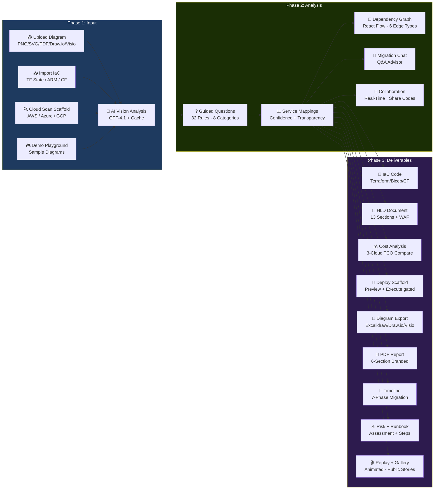

# Archmorph

**AI-Powered Multi-Cloud Architecture Translator & Migration Platform**

Translate AWS and GCP architecture diagrams into Azure-ready migration artifacts: service mappings, guided questions, IaC drafts, HLD exports, cost estimates, and reviewable migration packages. Archmorph is in preview/stabilization; some enterprise surfaces are implemented as beta or scaffolded workflows.


---

## Overview

Archmorph is an AI-assisted cloud migration workbench. The live path analyzes uploaded architecture diagrams, maps AWS/GCP services to Azure equivalents with confidence scoring, asks guided migration questions, generates IaC drafts, prepares HLD/report exports, and estimates costs. The application is 100% free for customers: there are no subscriptions, paid tiers, billing steps, or hidden customer charges. Adjacent platform capabilities such as scanner, deploy, collaboration, SSO/SCIM, gallery, and drift are present in the codebase at varying maturity levels and are labeled below so operators know what is ready to trust.

### Capability Status

| Status | Meaning | Capabilities |
|--------|---------|--------------|
| Live | Usable in the current product path | Diagram upload, sample playground, AI service mapping, guided questions, IaC/HLD/report export, cost estimates, service catalog, admin analytics, auth shell, CI/security scanning |
| Beta | Implemented but needs hardening, deeper tests, or production validation | RAG, Agent PaaS proof, cost/token observability, collaboration, gallery, replay, Terraform state import, multi-cloud cost comparison, social auth/RBAC |
| Scaffold | UI/routes/models exist, but execution needs integration or operator review | Live cloud scanner, deploy engine, credential vault, SSO/SAML/SCIM, live drift/living architecture |
| Planned | Not production-ready yet | VS Code extension, PR-based IaC workflow, multi-diagram projects |

**Key Capabilities:**
- Upload architecture diagrams (PNG, JPG, SVG, PDF, Draw.io, Visio) or import existing IaC (Terraform/ARM/CloudFormation)
- **Cloud Scanner scaffold** — AWS/Azure/GCP scan routes and wizard are present; production credential flow and provider validation still need hardening
- **Deploy scaffold** — generated IaC can be reviewed; direct deployment/rollback paths are not treated as production-ready yet
- Auto-detect AWS/GCP services with AI vision across a **405+ service catalog** (145 AWS, 143 Azure, 117 GCP — grows automatically)
- **Guided migration questions** — 32 contextual questions across 8 categories with **inter-question constraint system** that dynamically filters options based on compliance and data residency choices
- Map to Azure equivalents with **confidence scores and transparency explanations** showing why each level was assigned
- **Export architecture diagrams** as Excalidraw, Draw.io, or Visio with Azure stencils
- **Interactive Architecture Map** — dagre auto-layout with confidence rings, effort badges, typed edges, zone grouping, and full pan/zoom/drag interactivity
- **Service Dependency Graph** — React Flow interactive graph with 6 typed edges (traffic/database/auth/control/security/storage), dagre layout, click-to-reveal detail panel, SVG export
- **Email notifications** — Azure Communication Services integration for migration report delivery
- Generate Terraform HCL or Bicep code with secure credential handling and **8-rule IaC security scanning**
- **Dynamic cost estimates** — region-aware pricing via Azure Retail Prices API with 46 service mappings and monthly cache
- **Cost & Token Observability** — per-execution token metering, budget management with alerts, timeseries analytics, CSV export
- **Cost comparison** — side-by-side AWS/GCP vs Azure cost analysis with optimization recommendations
- **RAG Pipeline** — document ingestion (PDF/DOCX/HTML/CSV/JSON), hybrid search (vector + BM25), citation tracking for grounded AI responses
- **AI Agent PaaS** — agent creation, tool attachment, ReAct execution loop, RAG-grounded responses, per-agent cost tracking
- **Migration Timeline Generator** — 7-phase migration plan with dependency ordering (topological sort), parallel workstreams, export as JSON/Markdown/CSV
- **Self-updating service catalog** — daily auto-discovery and auto-integration of new cloud services with fuzzy matching and category classification
- **AI cross-cloud mapping suggestions** — GPT-powered mapping with few-shot learning, auto-approve at 0.9 confidence, admin review queue
- **Icon Registry** — 405 normalized cloud service icons with Draw.io, Excalidraw, and Visio library builders
- **AI-powered HLD generation** — 13-section High-Level Design documents with WAF assessment
- **HLD document export** — download HLD as Word (.docx), PDF, or PowerPoint (.pptx) with branded formatting
- **Full analysis PDF report** — 6-section branded report (cover, summary, mappings, costs, risks, IaC appendix)
- **IaC Chat assistant** — interactive GPT-4o assistant for code modifications
- **Chatbot assistant** — FAQ support and GitHub issue creation with intent detection
- **Compliance mapper** — map requirements to Azure compliance frameworks (GDPR, HIPAA, SOC2, FedRAMP)
- **Migration risk assessment** — risk scoring with automated runbook generation
- **Migration intelligence** — ML-powered analysis with historical pattern matching
- **Infrastructure import** — import existing Terraform/ARM/CloudFormation configurations
- **Terraform State Import** — reverse-engineer existing infrastructure from tfstate/CloudFormation/ARM into architecture diagrams
- **Multi-Cloud Cost Comparison** — side-by-side Azure vs AWS vs GCP TCO analysis with savings recommendations
- **SSO / SAML / SCIM scaffold** — enterprise auth routes exist, but require tenant-specific configuration and production validation before use
- **Real-time Collaboration** — multi-stakeholder migration workspace with share codes and role-based participants
- **Migration Replay** — animated analysis timeline for presentations with playback controls
- **Migration Gallery** — public anonymized success stories, filterable by cloud and complexity
- **Product Analytics** — funnel tracking (PostHog + backend), session-based event ingestion
- **API Developer Portal** — Swagger/Redoc integration with category overview and curl examples
- **Living architecture scaffold** — drift/versioning APIs include saved baselines, repeat compares, finding decisions, and Markdown report export; live environment monitoring still requires tenant-specific scanner validation
- **Social authentication** — Microsoft, Google, GitHub sign-in (Azure SWA + JWT fallback)
- **User profiles** — preferences, avatar, GDPR-compliant account deletion
- **RBAC & multi-tenant isolation** — 4-role hierarchy (viewer/member/admin/owner), org management, tier-based quotas
- **Admin dashboard** — conversion funnel, daily metrics, session tracking, runtime health, release gate view, audit stream, and guarded feature flag controls
- **Persistent analytics** — Azure Blob Storage with background flush and crash-safe shutdown
- **Toast notification system** — non-blocking success/error/warning notifications with auto-dismiss
- **Session expiry warning** — countdown banner with session extension capability
- **Browser close protection** — `beforeunload` guard prevents accidental data loss during analysis
- **Accessibility** — focus traps for modals, keyboard navigation, ARIA attributes
- **Error envelope middleware** — standardized JSON error responses with correlation IDs
- **Security hardening** — timing-safe auth, security headers, XSS protection, Dependabot
- **CI/CD security** — Semgrep SAST, Gitleaks secret detection, Trivy container scanning, CycloneDX SBOM
- **Multi-stage Docker** — optimized build with ~50% image size reduction, uv for fast installs
- **API versioning** — all `/api/*` routes mirrored at `/api/v1/*` for stable integrations
- **Feature flags system** — percentage rollout + user targeting with audited admin API and runtime dashboard toggles
- **Comprehensive audit logging** — structured JSON with risk levels, alerting rules, compliance queries
- **Session persistence** — pluggable SessionStore with InMemory and Redis backends
- **GPT response caching** — content-hash TTLCache for GPT-4o responses with configurable timeout and fallback model
- **Vision analysis cache** — TTLCache for repeated diagram analysis avoiding redundant API calls
- **Zero Trust WAF** — Azure Front Door Premium with OWASP CRS 3.2
- **Helm charts** — self-hosted Kubernetes deployment via `charts/archmorph/`
- **Server-Sent Events** — real-time progress streaming for long-running operations
- **Job queue** — background task processing with status tracking
- **Gunicorn process manager** — production worker management with UvicornWorker
- **Docker Compose** — local development with PostgreSQL 16 + Redis 7

---

## Quick Start

### Prerequisites
- Azure subscription
- Azure CLI installed
- Terraform 1.5+
- Node.js 20+
- Python 3.12+

### Deploy Infrastructure

```bash
cd infra
az login
terraform init
terraform apply -var-file="terraform.tfvars"
```

### Run Locally

**Backend:**
```bash
cd backend
python -m venv .venv && source .venv/bin/activate
pip install -r requirements.txt
uvicorn main:app --reload --port 8000
```

**Frontend:**
```bash
cd frontend
npm install
npm run dev
```

**Docker Compose (full stack):**
```bash
docker compose up -d   # PostgreSQL 16 + Redis 7 + Backend + Frontend
```

**Production-parity local guard mode:**
```bash
docker compose -f docker-compose.yml -f docker-compose.parity.yml up --build
```

This overlay keeps everything local, but starts the backend with production-like persistence guards:
`ENVIRONMENT=production`, `ENFORCE_POSTGRES=true`, `REQUIRE_REDIS=true`, PostgreSQL via `DATABASE_URL`, Redis via `REDIS_URL`, and Gunicorn/Uvicorn workers instead of the reload server.

**Refresh the API contract snapshot after intentional backend route/schema changes:**
```bash
cd backend
python export_openapi.py > openapi.snapshot.json
python check_openapi_contract.py
```

---

## Architecture

### System Architecture Diagram

```mermaid
flowchart TB
    subgraph Azure["☁️ Azure Cloud"]
        subgraph Frontend["Static Web Apps"]
            UI[React 19.2 + Vite 8.0<br/>TailwindCSS + Zustand]
        end
        
        WAF[Azure Front Door<br/>WAF / OWASP CRS 3.2]
        
        subgraph Backend["Container Apps — Gunicorn + Uvicorn"]
            API[FastAPI<br/>Python 3.12]
            subgraph Engines["Processing Engines"]
                Vision[GPT-4o Vision Analyzer<br/>+ TTLCache]
                GQ[Guided Questions<br/>32 rules, 8 categories<br/>+ Constraint System]
                Export[Diagram Export<br/>Excalidraw/Draw.io/Visio]
                IaC[IaC Generator<br/>Terraform/Bicep<br/>+ Security Scan]
                HLD[HLD Generator<br/>13 sections + WAF]
                HLDExport[HLD Export<br/>DOCX/PDF/PPTX]
                Chat[IaC Chat<br/>GPT-4o Assistant]
                AISuggest[AI Suggestions<br/>Few-Shot Learning]
                Compliance[Compliance Mapper<br/>GDPR/HIPAA/SOC2/FedRAMP]
                MigRisk[Migration Risk<br/>Assessment + Runbook]
                MigIntel[Migration Intelligence<br/>ML Pattern Matching]
                MigTimeline[Migration Timeline<br/>7-Phase DAG + Topo Sort]
                InfraImport[Infra Import<br/>TF/ARM/CFN]
                Living[Living Architecture<br/>Drift Baselines]
                CostComp[Cost Comparison<br/>Cross-Cloud Analysis]
                CostOpt[Cost Optimizer<br/>Savings Recommendations]
                CostMeter[Cost Metering<br/>Token/Budget Tracking]
                RAG[RAG Pipeline<br/>Ingest/Embed/Search]
                AgentPaaS[Agent PaaS<br/>ReAct Execution]
                ReportGen[PDF Report<br/>6-Section Export]
                Scanner[Cloud Scanner<br/>Scaffold / gated]
                CredVault[Credential Vault<br/>AES-256 + 1hr TTL]
                DeployEng[Deploy Engine<br/>Preview + gated execute]
                SSO[SSO / SAML / SCIM<br/>Tenant validation gated]
                Collab[Collaboration<br/>Real-Time Sessions]
                Replay[Migration Replay<br/>Animated Timeline]
                Gallery[Migration Gallery<br/>Public Stories]
                TFImport[TF State Import<br/>tfstate/ARM/CF]
                MultiCost[Multi-Cloud Cost<br/>3-Cloud TCO]
                Analytics[Product Analytics<br/>Funnel Tracking]
            end
            ErrorEnv[Error Envelope<br/>Middleware]
            FeatureFlags[Feature Flags<br/>% rollout + targeting]
            AuditLog[Audit Logging<br/>Structured JSON]
            SessionStore[Session Store<br/>InMemory / Redis]
            JobQueue[Job Queue + SSE<br/>Background Tasks]
            Auth[Auth + RBAC<br/>SWA + JWT + Orgs]
        end
        
        subgraph Data["Data Services"]
            ACR[Container Registry]
            DB[(PostgreSQL 16<br/>Flexible Server)]
            Blob[(Blob Storage)]
            Redis[(Redis 7<br/>Session + Cache)]
        end
        
        subgraph AI["Azure OpenAI"]
            GPT4O[GPT-4.1 Primary<br/>+ GPT-4o Fallback]
        end
        
        Pricing[Azure Retail<br/>Prices API]
        AppInsights[Application<br/>Insights]
    end
    
    User((User)) --> UI
    UI <--> WAF --> API
    API --> Vision --> GPT4O
    API --> GQ
    API --> Export
    API --> IaC
    API --> HLD --> GPT4O
    HLD --> HLDExport
    API --> Chat --> GPT4O
    API --> AISuggest --> GPT4O
    API --> Compliance
    API --> MigRisk
    API --> MigIntel
    API --> InfraImport
    API --> Living
    API --> CostComp
    API --> CostOpt
    API --> CostMeter
    API --> RAG --> GPT4O
    API --> AgentPaaS --> GPT4O
    AgentPaaS --> RAG
    API --> MigTimeline
    API --> ReportGen
    API --> Scanner --> CredVault
    API --> DeployEng
    API --> SSO
    API --> Collab
    API --> Replay
    API --> Gallery
    API --> TFImport
    API --> MultiCost
    API --> Analytics
    API --> Auth
    API --> Pricing
    API --> DB
    API --> Blob
    API --> FeatureFlags
    API --> AuditLog
    API --> ErrorEnv
    SessionStore --> Redis
    JobQueue -.-> API
    ACR --> API
    API --> AppInsights
```



### Component Overview

| Component | Technology | Azure Service |
|-----------|------------|---------------|
| Frontend | React 19.2, Vite 8.0, TailwindCSS 4.2, Zustand, Lucide React | Static Web Apps |
| Backend API | Python 3.12, FastAPI, Gunicorn + Uvicorn | Container Apps |
| AI Engine | GPT-4.1 (vision + chat) with GPT-4o fallback | Azure OpenAI |
| Container Registry | Docker | Azure Container Registry |
| Database | PostgreSQL 16 | Flexible Server |
| Cache / Sessions | Redis 7 | Azure Cache for Redis |
| Storage | Blob | Storage Account (metrics persistence) |
| Scheduler | APScheduler (CronTrigger) | In-process |
| Service Auto-Discovery | Daily sync + auto-integration | In-process engine |
| Guided Questions | 32 questions, 8 categories, inter-question constraints | In-process engine |
| Diagram Export | Excalidraw / Draw.io / Visio | In-process engine |
| Icon Registry | 405 icons, 3 library formats | In-process engine |
| Pricing | Azure Retail Prices API (46 queries) | 30-day disk cache |
| Cost Comparison | Cross-cloud price comparison | In-process engine |
| Cost Optimizer | Savings recommendations engine | In-process engine |
| HLD Generator | GPT-4o, 13 sections + WAF, 60+ doc links | In-process engine |
| HLD Export | DOCX/PDF/PPTX with branded formatting | In-process engine |
| IaC Generator | Terraform/Bicep + security scanning | In-process engine |
| IaC Chat | GPT-4o interactive assistant | In-process engine |
| AI Suggestions | Few-shot learning, review queue, auto-approve | In-process engine |
| Compliance Mapper | GDPR/HIPAA/SOC2/FedRAMP mapping | In-process engine |
| Migration Risk | Risk assessment + runbook generation | In-process engine |
| Migration Intelligence | ML-powered pattern matching | In-process engine |
| Migration Timeline | 7-phase DAG, topo sort, JSON/MD/CSV export | In-process engine |
| Infrastructure Import | TF/ARM/CloudFormation parser | In-process engine |
| Living Architecture | Drift baselines, compare history, finding decisions, report export | In-process engine |
| RAG Pipeline | Document ingest, embed, hybrid search (vector+BM25) | In-process engine |
| Agent PaaS | Agent CRUD, ReAct loop, tool execution | In-process engine |
| Cost Metering | Token tracking, budgets, alerts, CSV export | In-process engine |
| PDF Report | 6-section branded report generator | In-process engine |
| Auth | Social login (MS/Google/GitHub), JWT, SWA integration | Middleware |
| RBAC | 4-role org hierarchy, quotas, audit | Middleware |
| Security | Headers, timing-safe auth, XSS protection, Dependabot | Middleware |
| Error Envelope | Structured error responses with correlation IDs | Middleware |
| Feature Flags | Python module, % rollout + user targeting | In-process |
| Audit Logging | Structured JSON + querying with risk levels | In-process |
| Session Store | InMemory/Redis adapter | Azure Cache for Redis |
| Job Queue + SSE | Background task processing with Server-Sent Events | In-process |
| API Versioning | v1 prefix mirror for all routes | Middleware |
| WAF | OWASP CRS 3.2 | Azure Front Door Premium |
| Testing | pytest (1554 tests) + Vitest (262 tests) + Playwright smoke (17 tests) | CI/CD |
| Cloud Scanner | AWS/Azure/GCP scanner scaffold, gated before tenant use | In-process engine |
| Credential Vault | AES-256 encrypted, 1hr TTL, zero-persist scaffold | In-process engine |
| Deploy Engine | Preview (plan/what-if) + operator-gated execute/rollback scaffold | In-process engine |
| SSO / SAML / SCIM | SAML 2.0 ACS + SCIM v2.0 provisioning, pending tenant validation | Middleware |
| Collaboration | Real-time multi-stakeholder sessions | In-process engine |
| Migration Replay | Animated analysis timeline playback | In-process engine |
| Migration Gallery | Public anonymized success stories | In-process engine |
| TF State Import | tfstate/ARM/CF → architecture diagrams | In-process engine |
| Multi-Cloud Cost | Side-by-side Azure/AWS/GCP TCO | In-process engine |
| Product Analytics | PostHog + backend funnel tracking | In-process engine |
> 📐 **Detailed Diagrams:** [architecture.excalidraw](docs/architecture.excalidraw) | [application-flow.excalidraw](docs/application-flow.excalidraw) — Open in [Excalidraw](https://excalidraw.com)

---

## Application Flow

### User Journey



### Step-by-Step Flow

```
Input (Upload / Scan / Import) → AI Analysis → Guided Questions → Collaboration → Deliverables (IaC / HLD / Cost / Deploy)
```

**Phase 1 — Input** (choose one or more entry points):
1. **Upload Diagram** — PNG, JPG, SVG, PDF, Draw.io (.drawio), or Visio (.vsdx) architecture diagram
2. **Import IaC** — Upload existing Terraform state (v3/v4), CloudFormation template, or ARM deployment JSON
3. **Cloud scan scaffold** — Connectors and credential-handling model exist, but live tenant scanning stays gated until provider validation is complete
4. **Demo Playground** — Try with sample diagrams, no sign-up required
5. **AI Vision Analysis** — GPT-4.1 detects services, connections, and annotations (with TTL cache)

**Phase 2 — Analysis** (collaborative, real-time):
6. **Guided Questions** — 8–18 contextual questions refine migration (SKU, compliance, networking, DR, security, region) with inter-question constraints
7. **Service Mappings** — Multi-cloud mappings with confidence scores and transparency explanations
8. **Dependency Graph** — Interactive React Flow canvas with 6 typed edges and dagre layout
9. **Migration Chat** — GPT-4o Q&A advisor for migration questions
10. **Collaboration** — Invite team members via share code with role-based access (architect/devops/manager/security)

**Phase 3 — Deliverables** (tabbed interface):
11. **IaC Code** — Terraform HCL, Bicep, or CloudFormation with security scanning and IaC Chat assistant
12. **HLD Document** — 13-section AI-generated design document with WAF assessment, export as DOCX/PDF/PPTX
13. **Cost Analysis** — Side-by-side Azure vs AWS vs GCP TCO with optimization recommendations
14. **Deploy scaffold** — Preview (plan/what-if) and execute paths are feature-gated and require operator review before tenant use
15. **Diagram Export** — Download as Excalidraw, Draw.io, or Visio with cloud-specific stencils
16. **PDF Report** — 6-section branded analysis report
17. **Migration Timeline** — 7-phase plan with topological dependency ordering and parallel workstreams
18. **Risk Assessment** — Risk scoring with automated runbook generation
19. **Migration Replay** — Animated timeline playback for presentations (play/pause/speed controls)
20. **Migration Gallery** — Submit anonymized success stories to the public gallery

---

## Self-Updating Service Catalog

The service catalog automatically discovers and integrates new cloud services:

- **Daily sync** — APScheduler runs at 2:00 AM UTC, fetching from AWS Pricing Index, Azure Retail Prices API, and GCP Pricing Calculator
- **Auto-integration** — newly discovered services are written directly into the Python catalog files under an `AUTO-DISCOVERED` section
- **Fuzzy matching** — normalised comparison (name, fullName, id) prevents false-positive detections
- **Category classification** — 55 keyword hints auto-assign categories (Compute, Storage, Database, AI/ML, etc.) and matching icons
- **Dry-run mode** — CLI `--dry-run` flag detects without writing
- **Tracking** — cumulative `auto_added` counts per provider in `service_updates.json`

### CLI Usage

```bash
cd backend
python service_updater.py --run-now     # Discover + auto-add
python service_updater.py --dry-run     # Discover only (no file writes)
```

---

## Service Catalog

**405+ total services** across three providers, with 122 verified cross-cloud mappings.

### AWS → Azure (Sample)

| AWS | Azure | Confidence |
|-----|-------|------------|
| EC2 | Virtual Machines | 95% |
| S3 | Blob Storage | 95% |
| Lambda | Azure Functions | 90% |
| RDS | Azure SQL / PostgreSQL Flexible | 90% |
| DynamoDB | Cosmos DB | 85% |
| EKS | AKS | 90% |

### GCP → Azure (Sample)

| GCP | Azure | Confidence |
|-----|-------|------------|
| Compute Engine | Virtual Machines | 95% |
| Cloud Storage | Blob Storage | 95% |
| Cloud Functions | Azure Functions | 90% |
| GKE | AKS | 90% |
| BigQuery | Synapse Analytics | 80% |

Full mapping database: 405+ services across AWS, Azure, and GCP with 122 mappings.

---

## Cost Estimation

Dynamic pricing powered by the [Azure Retail Prices API](https://prices.azure.com/api/retail/prices):

- **Region-aware** — prices fetched per the user's selected deployment region (20 regions, default: West Europe)
- **SKU strategy multipliers** — Cost-optimized (0.65x), Balanced (1.0x), Performance-first (1.6x), Enterprise (2.2x)
- **46 service mappings** with built-in fallback estimates
- **Monthly cache** — prices cached to disk for 30 days
- **Per-service breakdown** — low/high range for each Azure service plus total monthly estimate

---

## API Reference

### Core Endpoints (200+ total across 59 router modules)

> **Note:** All `/api/*` routes are also available at `/api/v1/*` for versioned API access.

| Endpoint | Method | Description |
|----------|--------|-------------|
| `/api/health` | GET | Health check (version, mode, catalog stats) |
| `/api/services` | GET | List all services with optional filters |
| `/api/services/providers` | GET | List cloud providers with counts |
| `/api/services/categories` | GET | List categories with per-provider counts |
| `/api/services/mappings` | GET | List cross-cloud mappings |
| `/api/services/{provider}/{id}` | GET | Get specific service details |
| `/api/services/stats` | GET | Catalog statistics |

### Translation Flow

| Endpoint | Method | Description |
|----------|--------|-------------|
| `/api/projects/{id}/diagrams` | POST | Upload diagram file |
| `/api/diagrams/{id}/analyze` | POST | Analyze diagram |
| `/api/diagrams/{id}/questions` | POST | Generate guided migration questions |
| `/api/diagrams/{id}/apply-answers` | POST | Apply answers to refine mappings |
| `/api/diagrams/{id}/export-diagram` | POST | Export as Excalidraw, Draw.io, or Visio |
| `/api/diagrams/{id}/export-hld` | POST | Export HLD as DOCX, PDF, or PPTX |
| `/api/diagrams/{id}/generate` | POST | Generate Terraform or Bicep code |
| `/api/diagrams/{id}/cost-estimate` | GET | Dynamic cost estimate |

### Chatbot & Admin

| Endpoint | Method | Description |
|----------|--------|-------------|
| `/api/chat` | POST | Send message to chatbot assistant |
| `/api/chat/history/{session_id}` | GET | Get chat session history |
| `/api/chat/{session_id}` | DELETE | Clear chat session |
| `/api/admin/login` | POST | Authenticate with admin key, receive JWT |
| `/api/admin/logout` | POST | Revoke admin session token |
| `/api/admin/metrics` | GET | Usage metrics (JWT-protected) |
| `/api/admin/metrics/funnel` | GET | Conversion funnel data |
| `/api/admin/metrics/daily` | GET | Daily activity metrics |
| `/api/admin/metrics/recent` | GET | Recent events feed |
| `/api/admin/monitoring` | GET | System health & performance |
| `/api/admin/costs` | GET | Azure deployment cost tracking |
| `/api/admin/analytics` | GET | Comprehensive analytics dashboard |
| `/api/admin/analytics/performance` | GET | Performance metrics |
| `/api/admin/analytics/features` | GET | Feature usage analytics |
| `/api/admin/analytics/funnel` | GET | Detailed funnel analytics |
| `/api/admin/audit` | GET | Security audit log |
| `/api/admin/observability` | GET | Observability spans & traces |
| `/api/admin/feedback` | GET | User feedback summary |
| `/api/admin/leads` | GET | Lead capture data |

### Icon Registry

| Endpoint | Method | Description |
|----------|--------|-------------|
| `/api/icon-packs` | POST | Upload ZIP/JSON icon pack |
| `/api/icon-packs/{pack_id}` | DELETE | Remove icon pack and its icons |
| `/api/icons` | GET | Search icons (provider, query, category) |
| `/api/icons/packs` | GET | List registered icon packs |
| `/api/icons/metrics` | GET | Icon registry observability counters |
| `/api/icons/{icon_id}/svg` | GET | Get raw SVG for a single icon |
| `/api/libraries/drawio` | GET | Download Draw.io custom library |
| `/api/libraries/excalidraw` | GET | Download Excalidraw library bundle |
| `/api/libraries/visio` | GET | Download Visio sidecar stencil pack |

### Service Updates

| Endpoint | Method | Description |
|----------|--------|-------------|
| `/api/service-updates/status` | GET | Scheduler status + auto-added totals |
| `/api/service-updates/last` | GET | Last update details |
| `/api/service-updates/run-now` | POST | Trigger immediate catalog refresh + auto-add |

### Feature Flags

| Endpoint | Method | Description |
|----------|--------|-------------|
| `/api/flags` | GET | List all feature flags |
| `/api/flags/{name}` | GET | Get specific flag status |
| `/api/flags/{name}` | PATCH | Update flag configuration (admin) |

### Drift Baselines

| Endpoint | Method | Description |
|----------|--------|-------------|
| `/api/drift/detect` | POST | Run one-off drift detection |
| `/api/drift/baselines` | POST | Create a saved drift baseline and optional first audit |
| `/api/drift/baselines` | GET | List saved drift baselines with last audit status |
| `/api/drift/baselines/{id}` | GET | Get a baseline with history and last result |
| `/api/drift/baselines/{id}/compare` | POST | Compare live state against a saved baseline |
| `/api/drift/baselines/{id}/findings/{finding_id}` | PATCH | Accept, reject, defer, or reopen a finding |
| `/api/drift/baselines/{id}/report` | GET | Export the latest audit as Markdown |

> **Note:** All routes also available at `/api/v1/*`

### AI & Intelligence

| Endpoint | Method | Description |
|----------|--------|-------------|
| `/api/ai-suggestions` | POST | Generate AI-powered service recommendations |
| `/api/compliance-map` | POST | Map architecture to compliance frameworks |
| `/api/migration-risk` | POST | Assess migration risks + generate runbook |
| `/api/migration-intelligence` | POST | ML-powered migration pattern matching |
| `/api/infra-import` | POST | Import existing TF/ARM/CFN infrastructure |
| `/api/living-architecture` | GET | Drift detection and change tracking |
| `/api/cost-comparison` | POST | Cross-cloud cost comparison |
| `/api/cost-optimizer` | POST | Savings recommendations |

### Jobs & Real-Time

| Endpoint | Method | Description |
|----------|--------|-------------|
| `/api/jobs/{id}` | GET | Check background job status |
| `/api/jobs/{id}/stream` | GET | SSE stream for real-time progress |


---

## Testing

| Suite | Framework | Tests | Command |
|-------|-----------|-------|---------|
| Backend unit | pytest | 76 files | `cd backend && python -m pytest --tb=short -q -n auto --dist loadfile --cov=. --cov-report=term-missing --cov-config=.coveragerc --cov-context=test --cov-fail-under=63` |
| Frontend unit | Vitest | 262 | `cd frontend && npx vitest run` |
| Browser smoke | Playwright | 17 | `npx playwright test` |
| Frontend lint | ESLint | hard gate | `cd frontend && npm run lint` |

### Coverage

- **76 backend test files** covering the translation flow, analytics, auth/RBAC, RAG/Agent PaaS proof paths, policies, models, and property-based checks
- **262 frontend Vitest tests** covering component rendering, navigation, storage/session behavior, and interaction contracts
- **17 Playwright smoke tests** covering golden-path UI flows, React Flow canvas behavior, and critical accessibility checks
- CI now treats backend coverage, frontend lint, and frontend tests as hard gates. Previously ignored backend tests are included.

---

## Project Structure

```
Archmorph/
├── frontend/                        # React SPA
│   ├── src/
│   │   ├── App.jsx                  # Main application with tab routing
│   │   ├── constants.js             # API_BASE, APP_VERSION
│   │   ├── index.css                # Global styles, fonts, scrollbar
│   │   ├── main.jsx                 # Entry point
│   │   ├── components/
│   │   │   ├── DiagramTranslator/   # Main diagram upload & translation flow
│   │   │   │   ├── index.jsx            # Root component with useWorkflow hook
│   │   │   │   ├── UploadStep.jsx       # Diagram upload + infra import
│   │   │   │   ├── AnalysisResults.jsx  # AI analysis results display
│   │   │   │   ├── GuidedQuestions.jsx  # Guided questions with constraints
│   │   │   │   ├── IaCViewer.jsx        # IaC code viewer with security scan
│   │   │   │   ├── CostPanel.jsx        # Cost estimation + comparison
│   │   │   │   ├── HLDTab.jsx           # HLD generation & export
│   │   │   │   ├── DeployPanel.jsx      # One-click deployment
│   │   │   │   └── useWorkflow.js       # Workflow state machine hook
│   │   │   ├── ScannerWizard/       # Live cloud scanner flow
│   │   │   │   ├── ConnectStep.jsx      # Cloud provider + credentials
│   │   │   │   ├── ScanStep.jsx         # Scan execution + progress
│   │   │   │   ├── ReviewStep.jsx       # Results review
│   │   │   │   └── index.jsx            # 3-step wizard flow
│   │   │   ├── CanvasEditor/        # Interactive architecture canvas
│   │   │   ├── DriftDashboard/      # Infrastructure drift monitoring
│   │   │   ├── Auth/                # Social auth + user profiles
│   │   │   ├── CollabWorkspace.jsx  # Real-time collaboration panel
│   │   │   ├── MigrationReplay.jsx  # Animated replay viewer
│   │   │   ├── MigrationGallery.jsx # Public migration gallery
│   │   │   ├── ApiDocs.jsx          # API developer portal
│   │   │   ├── EmptyState.jsx       # Reusable empty state component
│   │   │   ├── PhaseIndicator.jsx   # 3-phase progress indicator
│   │   │   ├── LandingPage.jsx      # Marketing landing page
│   │   │   ├── Nav.jsx              # Navigation bar (9 tabs + Gallery)
│   │   │   ├── ui.jsx               # Design system (Button, Badge, Card, Input, Select, Modal, Tabs, etc.)
│   │   │   └── ... (109 total)      # + additional components
│   │   ├── hooks/
│   │   │   ├── useBeforeUnload.js   # Unsaved changes protection
│   │   │   ├── useFocusTrap.js      # Modal focus trap (accessibility)
│   │   │   ├── useJobStatus.js      # Background job polling
│   │   │   ├── useSSE.js            # Server-Sent Events hook
│   │   │   └── useSessionExpiry.js  # JWT session expiry handling
│   │   └── stores/
│   │       └── useAppStore.js       # Zustand global state store
│   ├── vite.config.js
│   └── package.json
├── backend/                         # FastAPI service
│   ├── main.py                      # App factory, middleware (181 lines)
│   ├── routers/                     # 59 FastAPI router modules
│   │   ├── services.py              # Service catalog routes
│   │   ├── diagrams.py              # Diagram analysis routes
│   │   ├── chat.py                  # Chat & IaC chat routes
│   │   ├── admin.py                 # Admin dashboard routes
│   │   ├── auth.py                  # Social auth routes (MS/Google/GitHub)
│   │   ├── sso_routes.py            # SAML/SCIM enterprise SSO
│   │   ├── collaboration_routes.py  # Real-time collaboration sessions
│   │   ├── replay_routes.py         # Migration replay timeline
│   │   ├── gallery_routes.py        # Public migration gallery
│   │   ├── scanner_routes.py        # Live cloud infrastructure scanner
│   │   ├── credentials.py           # Secure credential vault
│   │   ├── deployments.py           # Deploy engine (preview + execute)
│   │   ├── terraform_import_routes.py # TF state/ARM/CF import
│   │   ├── cost_comparison_routes.py # Multi-cloud cost compare
│   │   ├── analytics_routes.py      # Product analytics ingestion
│   │   ├── agents.py                # Agent PaaS CRUD
│   │   ├── executions.py            # Agent execution + ReAct loop
│   │   ├── rag_routes.py            # RAG pipeline routes
│   │   ├── drift.py                 # Infrastructure drift detection
│   │   ├── feature_flags.py         # Feature flag management
│   │   ├── organizations.py         # Multi-tenant org management
│   │   ├── jobs.py                  # Background job & SSE routes
│   │   ├── v1.py                    # API v1 prefix router
│   │   └── ... (59 total)           # + 35 more domain routers
│   ├── admin_auth.py                # JWT session management (HS256, 1h TTL)
│   ├── ai_suggestion.py             # AI-powered service recommendations
│   ├── compliance_mapper.py         # GDPR/HIPAA/SOC2/FedRAMP compliance mapping
│   ├── cost_comparison.py           # Cross-cloud cost comparison engine
│   ├── cost_optimizer.py            # Savings recommendation engine
│   ├── error_envelope.py            # Structured error response middleware
│   ├── vision_analyzer.py           # GPT-4o image analysis engine + TTL cache
│   ├── image_classifier.py          # Pre-check gate for diagram validation
│   ├── guided_questions.py          # 32 questions, 8 categories, constraint system
│   ├── diagram_export.py            # Excalidraw/Draw.io/Visio export
│   ├── hld_generator.py             # AI-powered HLD generation (13 sections)
│   ├── hld_export.py                # HLD export to DOCX/PDF/PPTX
│   ├── iac_generator.py             # Terraform/Bicep/CFN code generation
│   ├── iac_chat.py                  # Interactive IaC chat assistant
│   ├── chatbot.py                   # FAQ chatbot with intent detection
│   ├── infra_import.py              # Import TF/ARM/CloudFormation
│   ├── job_queue.py                 # Background job queue + SSE
│   ├── journey_analytics.py         # User journey tracking engine
│   ├── living_architecture.py       # Drift detection & change tracking
│   ├── migration_intelligence.py    # ML-powered migration patterns
│   ├── migration_risk.py            # Risk assessment engine
│   ├── migration_runbook.py         # Automated runbook generation
│   ├── service_updater.py           # APScheduler daily catalog sync
│   ├── openai_client.py             # Shared Azure OpenAI client factory
│   ├── feature_flags.py             # Feature flags with % rollout + user targeting
│   ├── session_store.py             # Session persistence (InMemory/Redis backends)
│   ├── logging_config.py            # Structured JSON logging + CorrelationIdMiddleware
│   ├── audit_logging.py             # Comprehensive audit logging with risk levels
│   ├── api_versioning.py            # API v1 prefix mirror middleware
│   ├── usage_metrics.py             # Analytics with Azure Blob Storage persistence
│   ├── prompt_guard.py              # Prompt injection detection
│   ├── best_practices.py            # Best practices evaluation
│   ├── marketplace.py               # Template marketplace engine
│   ├── whitelabel.py                # White-label SDK
│   ├── icons/                       # Icon Registry system
│   │   ├── models.py                # Pydantic models
│   │   ├── svg_sanitizer.py         # SVG validation & XSS prevention
│   │   ├── registry.py              # Thread-safe icon catalog
│   │   ├── routes.py                # Icon management API endpoints
│   │   └── builders/                # Library format builders
│   │       ├── drawio.py            # Draw.io mxlibrary XML builder
│   │       ├── excalidraw.py        # Excalidraw JSON library builder
│   │       └── visio.py             # Visio sidecar stencil pack builder
│   ├── samples/                     # Built-in icon packs (405 SVGs)
│   │   ├── azure/                   # 143 Azure service icons
│   │   ├── aws/                     # 145 AWS service icons
│   │   └── gcp/                     # 117 GCP service icons
│   ├── services/                    # Service catalog data
│   │   ├── aws_services.py          # 145 AWS services
│   │   ├── azure_services.py        # 143 Azure services
│   │   ├── gcp_services.py          # 117 GCP services
│   │   ├── mappings.py              # 122 cross-cloud mappings
│   │   └── azure_pricing.py         # Azure Retail Prices API + cache
│   ├── tests/                       # 70+ test files, 1554 tests
│   ├── Dockerfile
│   └── requirements.txt
├── e2e/
│   └── archmorph.spec.ts            # Playwright E2E tests
├── infra/                           # Terraform IaC
│   ├── main.tf                      # All Azure resources
│   ├── variables.tf                 # Input variables
│   ├── outputs.tf                   # Output values
│   └── terraform.tfvars.example     # Example configuration
├── .github/
│   └── workflows/
│       ├── ci.yml                   # CI/CD: lint, test, build, deploy
│       ├── security.yml             # SAST/DAST/SCA security pipeline
│       ├── sbom.yml                 # CycloneDX SBOM generation
│       └── rollback.yml             # Blue-green rollback workflow
├── charts/
│   └── archmorph/                   # Helm chart for self-hosted K8s deployment
├── docs/                            # Documentation
│   ├── PRD.md                       # Product Requirements Document
│   ├── DEPLOYMENT_COSTS.md          # Azure cost breakdown
│   ├── architecture.excalidraw      # System architecture diagram
│   └── application-flow.excalidraw  # Application flow diagram
├── docker-compose.yml               # Full-stack local development
├── docker-compose.parity.yml        # Local production-parity overlay with Postgres/Redis guards
├── CONTRIBUTING.md
├── playwright.config.ts
└── README.md
```

---

## Deployment

Deployment is automated through GitHub Actions from `main` to production. Keep cloud credentials and deployment values in GitHub Secrets; do not commit secrets or local `terraform.tfvars` values.

Before promoting a build, use the release checklist in [docs/RELEASE_CHECKLIST.md](docs/RELEASE_CHECKLIST.md).

Production hardening switches:

- `DATABASE_URL` must point to PostgreSQL for production; set `ENFORCE_POSTGRES=true` to fail startup if SQLite is accidentally configured.
- `REDIS_HOST` or `REDIS_URL` should be configured for horizontal scale; set `REQUIRE_REDIS=true` to fail startup instead of falling back to local file-backed stores.
- `FEATURE_FLAG_LIVE_CLOUD_SCANNER`, `FEATURE_FLAG_DEPLOY_ENGINE`, and `FEATURE_FLAG_ENTERPRISE_SSO_SCIM` default to disabled and must only be enabled after the admin release gate and tenant validation pass.
- No customer billing or subscription setup is required; Archmorph is free for customers.

### Azure Resources

| Resource | SKU | Region |
|----------|-----|--------|
| Container Apps (`archmorph-api`, `archmorph-mcp-gateway`) | Consumption | West Europe |
| Static Web Apps | Free | West Europe |
| Container Registry (`archmorphacm7pd`) | Basic | West Europe |
| Azure OpenAI | S0 | East US¹ |
| PostgreSQL Flexible Server | Burstable B1ms | West Europe |
| Azure Cache for Redis | Basic C0 | West Europe |
| Application Insights | — | West Europe |

¹ Tracked for consolidation into West Europe — see [#607](https://github.com/idokatz86/Archmorph/issues/607). The April 2026 hub used to also run an `archmorph-backend` App Service (Canada Central), a duplicate `cafd43cfd4deacr` registry (East US), and a stray `secondnature-openai-whisper` cognitive account. All three were retired during the May 2026 infra consolidation; the dev RG now hosts only the active Container Apps stack and supporting data services.

### CI/CD Pipeline

The CI/CD workflow (`.github/workflows/ci.yml`) runs the main quality gates:

1. **backend-tests** — installs with `uv`, runs Ruff, executes pytest with coverage threshold, exports OpenAPI, generates backend SBOM, and runs Grype
2. **frontend-build** — installs npm dependencies, runs ESLint, runs Vitest, builds Vite output, generates frontend SBOM, and runs Grype
3. **upload-sarif** — uploads Grype SARIF when available without blocking successful builds on upload rate limits
4. **deploy-backend / deploy-frontend** — production Azure Container Apps and Static Web Apps deployment from `main` using GitHub Secrets and OIDC
5. **post-deploy-smoke** — deployed frontend/API smoke checks for root, sample routes, health, and OpenAPI schema

Additional workflows:
- **security.yml** — SAST/DAST/SCA security pipeline (Semgrep, Bandit, CodeQL, Trivy, Gitleaks)
- **sbom.yml** — CycloneDX + Grype SBOM generation and vulnerability scanning
- **rollback.yml** — Blue-green deployment rollback trigger
- **monitoring.yml** — Scheduled and manual deployed health checks

### Manual Deploy (if needed)

```bash
# Backend
cd backend
az acr build --registry <acr-name> --image archmorph-api:latest .
az containerapp update --name archmorph-api --resource-group <rg> --image <acr>.azurecr.io/archmorph-api:latest

# Frontend
cd frontend
npm run build
npx swa deploy dist --deployment-token <token> --env production
```

### Helm Chart (Self-Hosted Kubernetes)

```bash
helm install archmorph charts/archmorph/ \
  --set backend.image=<acr>.azurecr.io/archmorph-api:latest \
  --set frontend.image=<acr>.azurecr.io/archmorph-frontend:latest \
  --namespace archmorph --create-namespace
```

### Estimated Costs

See [docs/DEPLOYMENT_COSTS.md](docs/DEPLOYMENT_COSTS.md) for full breakdown.

| Tier | Monthly |
|------|---------|
| Dev/Test | ~$180–250 |
| Production | ~$500–800 |

---

## Roadmap

| Phase | Status | Features |
|-------|--------|----------|
| v1.0 — MVP | Done | AWS/GCP → Azure mapping, Terraform/Bicep output, basic cost estimation |
| v2.0 — Foundation | Done | Guided questions, diagram export, daily service sync, 405-service catalog, secure IaC, chatbot, admin dashboard |
| v2.1 — Pricing | Done | Dynamic Azure pricing, deployment region question, monthly cache, SKU multipliers |
| v2.2 — Self-Updating | Done | Auto-integration of new services, fuzzy name matching, category auto-classification, dry-run CLI |
| v2.5 — Audit & Quality | Done | 34 audit improvements, comprehensive test coverage |
| v2.6 — Icon Registry & Security | Done | Icon Registry (405 icons, 3 library formats), security hardening (timing-safe auth, headers, XSS protection) |
| v2.11.0 — Admin & Analytics | Done | JWT admin auth, persistent analytics (Azure Blob Storage), conversion funnel |
| v2.11.1 — UX Polish & Document Export | Done | HLD export (DOCX/PDF/PPTX), 15 UX improvements, CI/CD security (Semgrep, Gitleaks, SBOM, Trivy), 747 tests |
| v2.12.0 — Modular Architecture & Security | Done | Router decomposition (main.py 2,189→181 lines, 13 router modules), API versioning (v1 prefix), feature flags system, comprehensive audit logging, session persistence (InMemory/Redis), GPT response caching, DiagramTranslator decomposed (1,201→ 9 sub-components), structured JSON logging with correlation IDs, OTel observability rewrite, Azure Front Door WAF + Zero Trust, Helm charts, blue-green deployment, SBOM (CycloneDX + Grype), SAST/DAST/SCA pipeline, storage RBAC auth, pricing cache to Blob, monitoring optimization, 1149 tests |
| v3.0 — Multi-Cloud & Enterprise | Done | Multi-cloud targets (AWS/GCP/Azure), CloudFormation IaC, User Dashboard, Template Gallery, Visio import, i18n (en/es/fr), Living Architecture engine, Migration Intelligence, White-Label SDK, multi-tenant foundation |
| v3.0.1 — Confidence Transparency | Done | Confidence score explanations, transparency badge indicators, factor breakdown in analysis results |
| v3.1.0 — Stabilization Sprint | Done | Docker Compose stack, error envelope middleware, Gunicorn + Uvicorn workers, session expiry handling, before-unload protection, focus trap accessibility, toast notifications |
| v3.2.0 — Intelligence Suite | Done | AI suggestions engine, compliance mapper (GDPR/HIPAA/SOC2/FedRAMP), migration risk assessment, migration runbook generator, infrastructure import (TF/ARM/CFN) |
| v3.3.0 — Analytics & UX | Done | Journey analytics engine, cost comparison engine, cost optimizer, job queue with SSE, cookie consent banner, landing page, legal pages, organization settings |
| v3.4.0 — Quality & Documentation | Done | 1609 backend tests (70 files), PRD v3.4.0, roadmap alignment with 40 open issues, comprehensive documentation update |
| v3.5.0 — Customer Intelligence | Done | Confidence deep-dive (strengths/limitations/migration notes per mapping), 7-step workflow (Upload→Analyze→Customize→Results→IaC→HLD→Pricing), HLD auto-generation tab, dedicated Pricing tab with cost drivers, SKU alternatives, optimization recommendations, source vs target comparison, custom domain archmorphai.com |
| v3.6.0 — Platform Hardening & UX | Done | Dark mode toggle with light/full theme, skeleton loaders, focus-visible a11y, reduced-motion support, Cache-Control headers on read endpoints, HLD v2 with 10 professional sections, contextual help tooltips, confidence deep-dive UI (Strengths/Limitations/Migration tabs per mapping) |
| v3.8.0 — Complete Migration Flow | Done | Migration package ZIP export (IaC + HLD + costs), before/after architecture visualization, guided onboarding tour, CI coverage gate (60%), stale bot, migration Q&A chat advisor |
| v3.8.1 — UX Polish & Bug Bash | Done | Fix HLD generation 500 crashes, recover missing Map layers, unblock IaC dynamic modifications, populate Coming Soon tab, and Drift Alpha warnings |
| v4.0.0 — Platform Scale | Done | RAG pipeline, AI Agent PaaS PoC, cost/token observability, AI mapping auto-suggestions, migration timeline generator, service dependency graph, social auth, user profiles, RBAC/multi-tenant, PDF report export, DevOps modernization (uv, Trivy, Helm) |
| v4.1.0 — Enterprise & Collaboration Preview | Mixed | Product analytics, UX Wave 1/2, Terraform import, replay/gallery/collaboration, RAG/Agent PaaS, cost observability, drift baselines, admin release gates, and security evidence are implemented or beta. Live scanner, deploy engine, credential vault, and SSO/SCIM production validation remain scaffolded/hardening work. |
| v5.0 — Next | Planned | VS Code extension, Pulumi/CDK output, multi-diagram projects, GitHub/GitLab IaC PR integration |

---

## Security

- **Authentication:** JWT tokens (HS256) with 1-hour expiry and in-memory revocation for admin endpoints
- **Input validation:** Pydantic models on all endpoints, prompt injection guard on AI inputs
- **Error envelope:** Structured error responses with correlation IDs, no stack trace leakage
- **Transport:** HTTPS-only with TLS 1.2+ for all Azure resources
- **Headers:** Security headers middleware (X-Content-Type-Options, X-Frame-Options, CSP, HSTS, Permissions-Policy)
- **SVG sanitization:** DefusedXML-based sanitizer strips scripts and event handlers
- **IaC security scanning:** Generated Terraform/Bicep scanned for misconfigurations
- **Rate limiting:** SlowAPI rate limits on public endpoints
- **Secrets management:** All credentials via environment variables or GitHub Secrets; no secrets in code or git history
- **Dependencies:** Dependabot enabled for automated security updates, pip-audit in CI
- **SAST:** Semgrep static analysis (OWASP Top 10, security-audit, Python rules) in CI
- **Secret scanning:** Gitleaks full-history detection in CI
- **Container security:** Trivy vulnerability scanning (CRITICAL/HIGH) on every deployment
- **SBOM:** CycloneDX Bill of Materials generated for Python and npm dependencies (90-day retention)
- **WAF:** Azure Front Door Premium with OWASP CRS 3.2, Zero Trust network configuration
- **Audit logging:** Comprehensive structured JSON audit logs with risk levels, alerting rules, compliance queries
- **Feature flags:** Controlled feature rollout with percentage-based and user-targeted flags
- **Release gates:** Server-side feature gates block live scanner, deployment execution/rollback, and SSO/SCIM routes until operator-approved flags are enabled
- **Blue-green deployment:** Instant rollback capability for production deployments
- **Privacy:** Cookie consent banner, legal pages, GDPR-aware data handling
- **GPT truncation detection:** Guards against incomplete AI responses

### Reporting Vulnerabilities

If you discover a security vulnerability, please report it privately by opening a [GitHub Security Advisory](https://github.com/idokatz86/Archmorph/security/advisories/new).

---

## Contributing

1. Fork the repository
2. Create a feature branch (`git checkout -b feature/amazing-feature`)
3. Commit changes (`git commit -m 'Add amazing feature'`)
4. Push to branch (`git push origin feature/amazing-feature`)
5. Open a Pull Request

---

## License

MIT License — see [LICENSE](LICENSE) for details.

---

## Links

- **PRD:** [docs/PRD.md](docs/PRD.md)
- **Architecture Diagram:** [docs/architecture.excalidraw](docs/architecture.excalidraw) — Open in [Excalidraw](https://excalidraw.com)
- **Application Flow:** [docs/application-flow.excalidraw](docs/application-flow.excalidraw) — Open in [Excalidraw](https://excalidraw.com)
