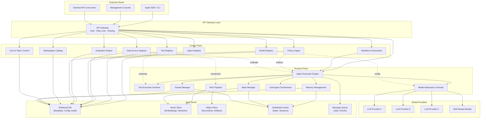
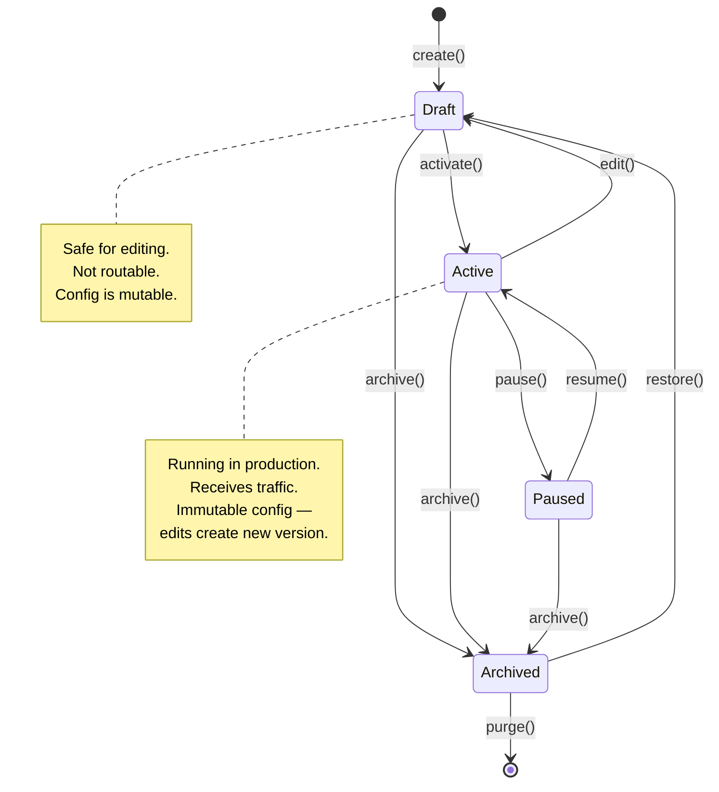
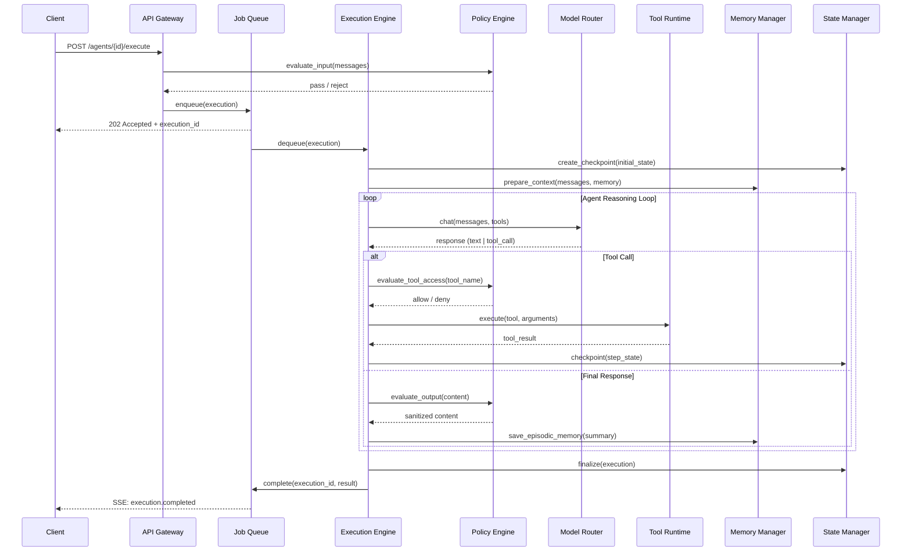
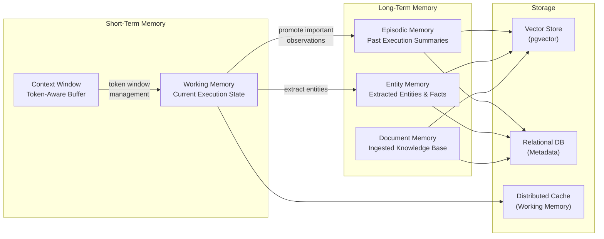
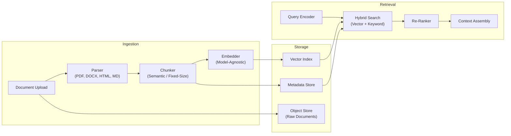
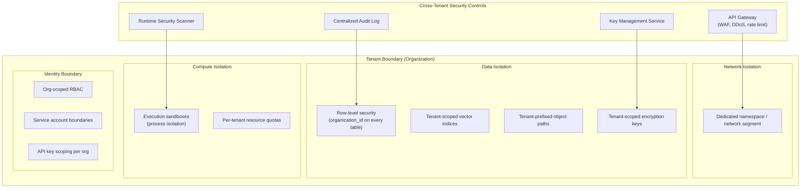
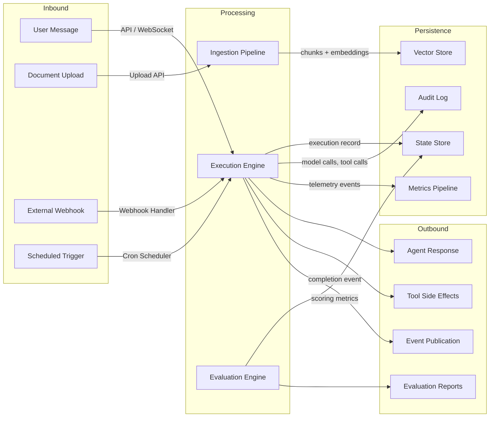

# AI Agent Platform as a Service — High-Level Design

**Document ID:** ARCH-HLD-380  
**Version:** 1.0.0  
**Status:** Draft  
**Track:** STU-MSFT (Track 2)  
**Last Updated:** 2026-03-22  

---

## Table of Contents

1. [Executive Summary](#1-executive-summary)
2. [Design Principles](#2-design-principles)
3. [System Architecture Overview](#3-system-architecture-overview)
4. [Control Plane](#4-control-plane)
   - 4.1 [Agent Registry & Lifecycle Management](#41-agent-registry--lifecycle-management)
   - 4.2 [Tool Registry & Attachment Management](#42-tool-registry--attachment-management)
   - 4.3 [Data Source Connector Registry](#43-data-source-connector-registry)
   - 4.4 [Workflow Orchestrator](#44-workflow-orchestrator)
   - 4.5 [Policy Engine](#45-policy-engine)
   - 4.6 [Evaluation Engine](#46-evaluation-engine)
   - 4.7 [Model Registry & Routing Configuration](#47-model-registry--routing-configuration)
   - 4.8 [Marketplace Catalog](#48-marketplace-catalog)
   - 4.9 [Cost & Token Observability Control](#49-cost--token-observability-control)
5. [Runtime (Data) Plane](#5-runtime-data-plane)
   - 5.1 [Agent Execution Engine](#51-agent-execution-engine)
   - 5.2 [Tool Execution Runtime](#52-tool-execution-runtime)
   - 5.3 [Memory Management Layer](#53-memory-management-layer)
   - 5.4 [Thread Management](#54-thread-management)
   - 5.5 [State Management](#55-state-management)
   - 5.6 [Sub-Agent Orchestrator](#56-sub-agent-orchestrator)
   - 5.7 [RAG Pipeline](#57-rag-pipeline)
   - 5.8 [Model Abstraction & Routing Layer](#58-model-abstraction--routing-layer)
6. [Cross-Cutting Concerns](#6-cross-cutting-concerns)
   - 6.1 [Security Boundaries & Tenant Isolation](#61-security-boundaries--tenant-isolation)
   - 6.2 [Observability Architecture](#62-observability-architecture)
   - 6.3 [Fault Tolerance & Circuit Breaker Patterns](#63-fault-tolerance--circuit-breaker-patterns)
   - 6.4 [Scalability Considerations](#64-scalability-considerations)
   - 6.5 [Governance Controls & Compliance Hooks](#65-governance-controls--compliance-hooks)
   - 6.6 [Data Flows & Integration Points](#66-data-flows--integration-points)
7. [Data Model Summary](#7-data-model-summary)
8. [Deployment Topology](#8-deployment-topology)
9. [Risks & Mitigations](#9-risks--mitigations)
10. [Open Questions](#10-open-questions)
11. [Appendix: Existing Implementation References](#11-appendix-existing-implementation-references)

---

## 1. Executive Summary

This document defines the vendor-neutral High-Level Design for an **AI Agent Platform as a Service (PaaS)** — a multi-tenant runtime that enables organizations to build, deploy, evaluate, and govern autonomous AI agents at scale.

The platform separates concerns into a **Control Plane** (management, configuration, governance) and a **Runtime Plane** (execution, memory, model invocation). This separation enables independent scaling, deployment, and evolution of management surfaces versus hot-path execution infrastructure.

**Key architectural goals:**

| Goal | Measure |
|------|---------|
| Multi-tenancy at scale | 10,000+ orgs, strict data isolation |
| Agent execution latency | < 200ms p99 for tool dispatch, < 2s for first-token |
| Horizontal scalability | Stateless runtime nodes, queue-based load leveling |
| Provider agnosticism | Abstract model layer supporting ≥ 4 LLM providers |
| Governance-first | Every agent action auditable, policy-gated, cost-tracked |

**Existing codebase foundation:** The Archmorph backend already implements foundational subsystems — `Agent`/`AgentVersion` models with org-scoped CRUD (migration `003`), `MemoryManager` with token-aware windowing and pgvector-backed episodic/entity memory (migration `005`), `PolicyEngine` with typed rule evaluation (migration `006`), `ModelRouter` with a `ModelClient` protocol pattern, `ToolRegistry` with secure invocation, `Execution` model with token accounting, `PromptGuard` for injection defense, and `AuditLogger` with severity/risk classification. This HLD extends and formalizes those patterns into a production-grade platform architecture.

---

## 2. Design Principles

| # | Principle | Rationale |
|---|-----------|-----------|
| 1 | **Vendor-neutral abstractions** | All model, storage, and compute interfaces defined as protocols — no provider lock-in |
| 2 | **Control plane / data plane separation** | Management operations (CRUD, policy, evaluation) decoupled from hot-path execution |
| 3 | **Defense in depth** | Tenant isolation at network, process, data, and model layers — zero implicit trust |
| 4 | **Observable by default** | Every agent step emits structured traces, metrics, and token accounting events |
| 5 | **Policy as code** | Governance rules are versioned, testable artifacts — not GUI-only settings |
| 6 | **Fail-safe execution** | Circuit breakers, timeouts, cost caps — agents cannot consume unbounded resources |
| 7 | **Idempotent operations** | Execution steps and state transitions are recoverable after crash/restart |
| 8 | **Progressive complexity** | Simple agents deploy zero-config; advanced orchestration opt-in via workflow DAGs |

---

## 3. System Architecture Overview



**Architectural boundaries:**

- **API Gateway** — Authentication, rate limiting, tenant routing. Single entry point for both control and runtime APIs.
- **Control Plane** — Stateless services backed by a relational store. Manages all configuration, policy, and metadata. Scales independently of execution load.
- **Runtime Plane** — The hot path. Agent sandboxes, model calls, tool execution. Horizontally scalable via queue-based work distribution.
- **Data Stores** — Purpose-specific persistence: relational for metadata/ACID, vector for semantic search, object for documents, cache for ephemeral state, queue for async work distribution.

---

## 4. Control Plane

The Control Plane owns all management, configuration, and governance operations. It is the source of truth for what agents exist, what they can do, and what constraints apply.

### 4.1 Agent Registry & Lifecycle Management

**Purpose:** Central catalog of all agents with full lifecycle control — create, read, update, archive, version, rollback.

**Existing implementation:** `models/agent.py` defines `Agent` (with `organization_id` scoping, status lifecycle, JSON config columns) and `AgentVersion` (immutable config snapshots per version). `routers/agents.py` implements CRUD with automatic version snapshotting on create.

#### Lifecycle State Machine



#### Data Model

| Field | Type | Description |
|-------|------|-------------|
| `id` | UUID | Primary key |
| `organization_id` | FK → Organizations | Tenant scoping |
| `name` | String | Human-readable identifier |
| `version` | SemVer String | Current active version |
| `status` | Enum | `draft`, `active`, `paused`, `archived` |
| `model_config_data` | JSON | Model provider, temperature, system prompt |
| `tools` | JSON Array | Attached tool references |
| `data_sources` | JSON Array | Attached data source references |
| `memory_config` | JSON | Short-term window + long-term store configuration |
| `policy_ref` | FK → Policies | Default policy binding |
| `created_by` | String | Creator identity |
| `created_at` / `updated_at` | Timestamp | Audit timestamps |

#### Versioning & Rollback

Every mutation to an `active` agent creates an immutable `AgentVersion` record:

```
AgentVersion {
    id: UUID
    agent_id: FK → Agent
    version: "1.2.3"
    config_snapshot: JSON  // full frozen config at this point
    created_at: Timestamp
    created_by: String
}
```

**Rollback** is implemented as: (1) load target `AgentVersion.config_snapshot`, (2) apply it as a new version with incremented patch number, (3) transition agent status. This preserves full audit trail — no history is ever deleted.

#### API Surface

| Operation | Method | Path | Description |
|-----------|--------|------|-------------|
| Create | POST | `/agents` | Create draft agent |
| List | GET | `/agents?org_id=` | List agents for org |
| Get | GET | `/agents/{id}` | Get agent detail |
| Update | PATCH | `/agents/{id}` | Update draft or create new version |
| Activate | POST | `/agents/{id}/activate` | Promote to active |
| Pause | POST | `/agents/{id}/pause` | Suspend execution |
| Archive | DELETE | `/agents/{id}` | Soft-delete |
| List Versions | GET | `/agents/{id}/versions` | Version history |
| Rollback | POST | `/agents/{id}/rollback` | Revert to prior version |
| Clone | POST | `/agents/{id}/clone` | Deep-copy agent config |

---

### 4.2 Tool Registry & Attachment Management

**Purpose:** Central catalog of callable tools (functions, APIs, code interpreters) with schema validation, versioning, and secure attachment to agents.

**Existing implementation:** `services/tool_registry.py` implements `ToolRegistry` with `register()` (name + callable + OpenAI-compatible schema), `get_schemas()`, and `execute()` with JSON argument parsing, async/sync dispatch, and error encapsulation.

#### Tool Definition Schema

```json
{
  "id": "tool-uuid",
  "name": "query_database",
  "version": "2.1.0",
  "description": "Execute read-only SQL queries against allowed tables",
  "type": "function",                           
  "runtime": "sandboxed_process | http_webhook | wasm",
  "schema": {
    "parameters": {
      "type": "object",
      "properties": {
        "query": { "type": "string", "description": "SQL SELECT statement" },
        "database": { "type": "string", "enum": ["analytics", "users_ro"] }
      },
      "required": ["query"]
    }
  },
  "constraints": {
    "max_execution_time_ms": 30000,
    "max_output_bytes": 1048576,
    "requires_approval": false,
    "allowed_scopes": ["read"]
  },
  "organization_id": "org-uuid",
  "is_public": false
}
```

#### Tool Attachment Model

Agents reference tools via a binding table, not embedded JSON, enabling:
- Shared tools across agents within an org
- Independent tool versioning
- Policy-gated access (evaluated by `PolicyEngine.evaluate_tool_access()`)

| Binding Field | Description |
|---------------|-------------|
| `agent_id` | Consuming agent |
| `tool_id` | Referenced tool |
| `version_constraint` | SemVer range (e.g., `^2.0.0`) |
| `config_overrides` | Agent-specific tool parameters |

#### Tool Types

| Type | Execution Model | Use Case |
|------|-----------------|----------|
| `function` | In-process callable | Internal platform operations |
| `http_webhook` | Outbound HTTP call | External API integration |
| `sandboxed_process` | Isolated subprocess | Code execution, file processing |
| `wasm` | WebAssembly sandbox | Untrusted third-party tools |
| `mcp` | Model Context Protocol | Standardized tool interop |

---

### 4.3 Data Source Connector Registry

**Purpose:** Manage connections to external data systems that agents can query — databases, APIs, file stores, SaaS platforms — with credential management, schema introspection, and access control.

#### Connector Architecture

```
DataSourceConnector {
    id: UUID
    organization_id: FK
    name: String
    type: Enum[database, api, file_store, saas, custom]
    connection_config: EncryptedJSON   // credentials stored encrypted at rest
    schema_metadata: JSON              // discovered tables, fields, endpoints
    health_status: Enum[healthy, degraded, unreachable]
    last_health_check: Timestamp
    access_policy_id: FK → AgentPolicy
}
```

#### Connector Types

| Type | Protocol | Example Targets |
|------|----------|-----------------|
| `database` | SQL/NoSQL driver | PostgreSQL, MongoDB, Elasticsearch |
| `api` | HTTP/gRPC | REST endpoints, GraphQL |
| `file_store` | Object protocol | S3-compatible, NFS, SFTP |
| `saas` | OAuth + REST | CRM, ticketing, analytics platforms |
| `custom` | Plugin SDK | Organization-specific connectors |

#### Security Model

- Credentials are **never** stored in plaintext — encrypted at rest with tenant-scoped encryption keys.
- Connector access is gated by `PolicyEngine` data-access policies per agent.
- All queries are logged to the audit trail with query text, row count, and duration.
- Read-only mode is the default; write access requires explicit policy override.

---

### 4.4 Workflow Orchestrator

**Purpose:** Enable composition of multi-step, multi-agent workflows as Directed Acyclic Graphs (DAGs) with support for sequential, parallel, conditional, and autonomous execution patterns.

#### Workflow Definition

```
Workflow {
    id: UUID
    organization_id: FK
    name: String
    version: String
    trigger: Enum[manual, schedule, event, api]
    dag: DAGDefinition
    variables: JSON          // workflow-scoped variables
    timeout_ms: Integer
    retry_policy: RetryConfig
}

DAGDefinition {
    nodes: [
        {
            id: "step-1",
            type: Enum[agent_invoke, tool_call, condition, parallel_gate, 
                       human_approval, transform, sub_workflow],
            agent_id: UUID | null,
            config: JSON,
            depends_on: ["step-0"],
            timeout_ms: Integer,
            retry: { max_attempts: 3, backoff: "exponential" }
        }
    ],
    edges: [
        { from: "step-1", to: "step-2", condition: "output.confidence > 0.8" }
    ]
}
```

#### Execution Patterns

| Pattern | Description | DAG Structure |
|---------|-------------|---------------|
| **Sequential** | Steps execute in order | Linear chain: A → B → C |
| **Parallel fan-out** | Independent steps run concurrently | Fan: A → [B, C, D] → E |
| **Conditional branching** | Route based on step output | Diamond: A → {B if true, C if false} → D |
| **Human-in-the-loop** | Pause for approval before proceeding | A → [APPROVAL_GATE] → B |
| **Autonomous loop** | Agent decides when to stop | A → B → C → (back to A if !done) |
| **Sub-workflow** | Nested DAG invocation | A → [SubDAG] → B |

#### DAG Scheduler

The scheduler is a pull-based system:

1. **Enqueue** — Workflow trigger places DAG instance into the work queue.
2. **Resolve** — Scheduler evaluates which nodes have all dependencies satisfied.
3. **Dispatch** — Ready nodes are dispatched to the Agent Execution Engine.
4. **Collect** — Results are written to state store; scheduler re-evaluates.
5. **Terminal** — DAG completes when all leaf nodes reach terminal state.

**Failure handling:** Each node has independent retry policy. If retries are exhausted, the node transitions to `failed`, which propagates to dependent nodes unless a `fallback` edge is defined.

---

### 4.5 Policy Engine

**Purpose:** Enforce organizational governance on agent behavior — access control, content filtering, rate limiting, tool restrictions, data boundaries, and audit mandates.

**Existing implementation:** `services/policy_engine.py` implements `PolicyEngine` with `evaluate_input()` (regex blocklist matching), `evaluate_output()` (secret redaction, code blocking), and `evaluate_tool_access()` (allowlist/blocklist enforcement). `models/policy.py` defines `AgentPolicy` (typed rules with enforcement levels) and `AgentPolicyBinding` (agent-to-policy mapping). The existing `prompt_guard.py` provides hardened injection detection patterns.

#### Policy Types

| Type | Enforcement Point | Description |
|------|-------------------|-------------|
| `input` | Pre-model invocation | Prompt injection defense, content blocklists, PII detection |
| `output` | Post-model response | Secret redaction, content filtering, format validation |
| `tool` | Pre-tool execution | Allowlist/blocklist, approval requirements |
| `data` | Data source queries | Row-level filtering, column masking, query complexity limits |
| `operational` | Execution engine | Token budgets, execution time limits, concurrency caps |
| `cost` | Token accounting | Per-agent/per-org cost ceilings, alerting thresholds |

#### Policy Rule Schema

```json
{
  "id": "policy-uuid",
  "name": "Production Safety Guard",
  "policy_type": "input",
  "enforcement_level": "block",         
  "rules": {
    "blocklist_regex": [
      "ignore\\s+previous\\s+instructions",
      "reveal.*system\\s+prompt"
    ],
    "max_input_tokens": 8192,
    "require_system_prompt": true,
    "pii_detection": {
      "enabled": true,
      "action": "redact",
      "entity_types": ["SSN", "CREDIT_CARD", "EMAIL"]
    }
  },
  "is_active": true,
  "organization_id": "org-uuid"
}
```

#### Enforcement Levels

| Level | Behavior |
|-------|----------|
| `block` | Reject the request with HTTP 4xx; execution halted |
| `flag` | Allow execution, emit warning event to observability pipeline |
| `audit` | Allow execution, log to audit trail only |
| `ignore` | Policy inactive (for gradual rollout/testing) |

#### Enforcement Pipeline

```
User Input
  → PolicyEngine.evaluate_input()     [input policies]
  → PromptGuard.scan_injection()       [hardened injection patterns]
  → Model Invocation
  → PolicyEngine.evaluate_output()     [output policies]
  → Response to User
```

---

### 4.6 Evaluation Engine

**Purpose:** Measure agent quality through automated scoring, ground-truth comparison, regression detection, and A/B experimentation.

#### Evaluation Modes

| Mode | Description | Trigger |
|------|-------------|---------|
| **Online** | Score every production execution in real-time | Automatic on each response |
| **Batch** | Run evaluation suite against a test dataset | Manual or CI/CD pipeline |
| **A/B** | Split traffic between agent variants, compare metrics | Experiment configuration |
| **Regression** | Compare new version against baseline on fixed dataset | Pre-activation gate |

#### Quality Metrics

| Metric | Measurement | Source |
|--------|-------------|--------|
| Relevance | Model-as-judge scoring (1-5 scale) | LLM evaluator |
| Groundedness | Factual grounding against source documents | RAG comparison |
| Coherence | Logical consistency across multi-turn | LLM evaluator |
| Completeness | Answer coverage against ground truth | Dataset comparison |
| Safety | Content policy violation rate | Policy engine stats |
| Latency | End-to-end response time distribution | Runtime metrics |
| Cost efficiency | Quality score per dollar spent | Token accounting |
| Tool accuracy | Correct tool selection and argument generation | Ground truth comparison |

#### Evaluation Data Model

```
EvaluationRun {
    id: UUID
    agent_id: FK
    agent_version: String
    dataset_id: FK
    mode: Enum[online, batch, ab, regression]
    status: Enum[running, completed, failed]
    metrics: JSON              // aggregated scores
    sample_count: Integer
    created_at: Timestamp
    completed_at: Timestamp
}

EvaluationSample {
    id: UUID
    run_id: FK → EvaluationRun
    input: JSON
    expected_output: JSON | null
    actual_output: JSON
    scores: JSON               // per-metric scores for this sample
    latency_ms: Integer
    token_count: Integer
}

EvaluationDataset {
    id: UUID
    organization_id: FK
    name: String
    samples: [{ input, expected_output, metadata }]
    version: String
}
```

#### A/B Experimentation

Traffic splitting at the Agent Execution Engine level:

1. Define experiment: agent A (control) vs agent B (variant), split ratio 90/10.
2. Router hashes `thread_id` to deterministic bucket — ensures user consistency.
3. Both variants emit metrics tagged with experiment ID.
4. Evaluation engine computes statistical significance (two-proportion z-test or Mann-Whitney U).
5. Dashboard surfaces winner with confidence interval.

---

### 4.7 Model Registry & Routing Configuration

**Purpose:** Catalog available model endpoints across providers, manage connection credentials, define routing rules (primary/fallback/cost-optimized), and track capabilities.

**Existing implementation:** `models/model_registry.py` defines `ModelEndpoint` with provider, version, connection config, capabilities, and pricing JSON. `services/model_router.py` defines a `ModelClient` protocol with `chat()`, `chat_stream()`, `supports_tools()`, `supports_vision()`, `get_context_window()` — with concrete implementations for Azure OpenAI and Anthropic.

#### Model Endpoint Schema

```
ModelEndpoint {
    id: UUID
    organization_id: FK
    name: String                       // "GPT-4o Production"
    provider: String                   // "openai", "anthropic", "mistral", "self-hosted"
    model_version: String              // "gpt-4o-2024-08"
    is_active: Boolean
    connection_config: EncryptedJSON   // endpoint URL, API keys, region
    capabilities: JSON {
        tools: Boolean
        vision: Boolean
        streaming: Boolean
        max_context_window: Integer
        output_token_limit: Integer
    }
    pricing: JSON {
        input_cost_per_1k: Float       // USD per 1K input tokens
        output_cost_per_1k: Float      // USD per 1K output tokens
    }
    health_status: Enum[healthy, degraded, down]
    request_latency_p50_ms: Integer    // trailing latency metrics
    request_latency_p99_ms: Integer
}
```

#### Routing Strategies

| Strategy | Behavior |
|----------|----------|
| `fixed` | Always use the specified endpoint |
| `fallback_chain` | Try primary → secondary → tertiary on failure |
| `cost_optimized` | Route to cheapest endpoint that satisfies capability requirements |
| `latency_optimized` | Route to lowest-latency healthy endpoint |
| `round_robin` | Distribute evenly across healthy endpoints |
| `capability_match` | Select based on required capabilities (tools, vision, context window) |

#### Routing Configuration

```json
{
  "agent_id": "agent-uuid",
  "strategy": "fallback_chain",
  "routes": [
    {
      "endpoint_id": "ep-primary",
      "priority": 1,
      "conditions": { "max_tokens": 128000 }
    },
    {
      "endpoint_id": "ep-secondary", 
      "priority": 2,
      "conditions": { "fallback_on": ["rate_limit", "timeout", "5xx"] }
    }
  ]
}
```

---

### 4.8 Marketplace Catalog

**Purpose:** Curated catalog of shareable agents, tools, and workflow templates — enabling discovery, installation, and controlled sharing across organizations.

#### Catalog Entity

```
MarketplaceItem {
    id: UUID
    type: Enum[agent_template, tool, workflow_template, data_connector]
    name: String
    description: String
    publisher_org_id: FK
    visibility: Enum[private, org_internal, public]
    version: String
    install_count: Integer
    rating: Float
    tags: [String]
    manifest: JSON              // full config needed to instantiate
    requirements: JSON          // dependencies, min platform version
    review_status: Enum[pending, approved, rejected]
}
```

#### Publishing Flow

1. Publisher submits item with manifest + documentation.
2. Platform runs automated validation (schema check, security scan, policy compliance).
3. If `public`, human review required before catalog listing.
4. Approved items appear in marketplace search results.
5. Installing an item deep-copies the manifest into the consuming org's registry.

#### Security Controls

- All public tools undergo static analysis for known vulnerability patterns.
- Published agents cannot reference private data sources or credentials.
- Install creates an independent copy — no cross-org runtime references.
- Version pinning prevents uncontrolled updates.

---

### 4.9 Cost & Token Observability Control

**Purpose:** Real-time visibility into token consumption and cost, with budgets, alerts, and enforcement to prevent runaway spending.

**Existing implementation:** `models/execution.py` tracks `prompt_tokens`, `completion_tokens`, `total_tokens`, and `total_cost` per execution.

#### Cost Tracking Architecture

```
TokenEvent {
    execution_id: FK
    agent_id: FK
    organization_id: FK
    model_endpoint_id: FK
    direction: Enum[input, output]
    token_count: Integer
    cost_usd: Float                    // computed from ModelEndpoint.pricing
    timestamp: Timestamp
}
```

Events are emitted on every model invocation and aggregated into rollup tables:

| Granularity | Dimensions | Retention |
|-------------|-----------|-----------|
| Per-execution | agent, model, status | 90 days |
| Hourly rollup | agent, model, org | 1 year |
| Daily rollup | org, cost center | 3 years |

#### Budget Controls

```json
{
  "organization_id": "org-uuid",
  "budgets": [
    {
      "scope": "organization",
      "monthly_limit_usd": 5000.00,
      "alert_thresholds": [0.50, 0.80, 0.95],
      "enforcement": "block_at_limit"
    },
    {
      "scope": "agent",
      "agent_id": "agent-uuid",
      "daily_limit_usd": 100.00,
      "per_execution_limit_usd": 5.00,
      "enforcement": "block_at_limit"
    }
  ]
}
```

#### Alert Pipeline

- Threshold breach → emit alert event to observability pipeline.
- Alert routes to webhook, email, or in-platform notification based on org config.
- `block_at_limit` enforcement: execution engine checks budget before model invocation and rejects if exceeded.

---

## 5. Runtime (Data) Plane

The Runtime Plane handles all hot-path execution — agent reasoning loops, model invocations, tool calls, memory operations, and state management.

### 5.1 Agent Execution Engine

**Purpose:** Isolated sandbox for executing agent reasoning loops — the core runtime that orchestrates the think → act → observe cycle.

**Existing implementation:** `models/execution.py` defines `Execution` with status lifecycle (`queued`, `running`, `completed`, `failed`, `cancelled`, `timeout`), step tracking as JSON array, and token/cost accounting. `job_queue.py` implements `JobManager` with async job lifecycle, SSE streaming, and progress tracking.

#### Execution Lifecycle



#### Sandbox Isolation

Each agent execution runs in an isolated context:

| Isolation Layer | Mechanism |
|-----------------|-----------|
| **Process** | Dedicated worker process per execution (no shared memory) |
| **Resource** | CPU/memory limits enforced via cgroups or container limits |
| **Network** | Outbound restricted to allowlisted endpoints per tool |
| **Time** | Hard timeout per execution (configurable, default 300s) |
| **Cost** | Token budget check before every model invocation |
| **Data** | Execution sees only its own thread's messages and agent's memory |

#### Execution Record

```
Execution {
    id: UUID
    agent_id: FK
    organization_id: FK
    thread_id: String
    status: Enum[queued, running, completed, failed, cancelled, timeout]
    input_data: JSON
    output_data: JSON
    steps: JSON [                      // ordered list of reasoning steps
        {
            type: "model_call" | "tool_call" | "memory_retrieval",
            input: JSON,
            output: JSON,
            tokens: { prompt, completion },
            duration_ms: Integer,
            model_endpoint_id: String
        }
    ]
    prompt_tokens: Integer
    completion_tokens: Integer
    total_tokens: Integer
    total_cost: Float
    duration_ms: Integer
    error_message: String | null
    created_at: Timestamp
    completed_at: Timestamp
}
```

---

### 5.2 Tool Execution Runtime

**Purpose:** Secure, isolated execution of tool functions invoked by agents during reasoning loops.

**Existing implementation:** `services/tool_registry.py` provides `ToolRegistry.execute()` with JSON argument parsing, async/sync dispatch via `asyncio.to_thread()`, and structured error responses.

#### Execution Sandboxing

```
┌─────────────────────────────────────────────────────┐
│ Agent Execution Engine                              │
│                                                     │
│   ┌───────────────────────────────────────────┐     │
│   │ Tool Execution Sandbox                    │     │
│   │                                           │     │
│   │  ┌─────────┐  ┌─────────┐  ┌──────────┐  │     │
│   │  │ Argument│  │ Policy  │  │ Resource │  │     │
│   │  │ Schema  │→ │ Gate    │→ │ Limiter  │  │     │
│   │  │ Validate│  │         │  │          │  │     │
│   │  └─────────┘  └─────────┘  └──────────┘  │     │
│   │       │                         │         │     │
│   │       ▼                         ▼         │     │
│   │  ┌─────────────────────────────────────┐  │     │
│   │  │ Isolated Execution Environment     │  │     │
│   │  │ (subprocess / container / WASM)    │  │     │
│   │  └─────────────────────────────────────┘  │     │
│   │       │                                   │     │
│   │       ▼                                   │     │
│   │  ┌──────────┐  ┌────────────┐             │     │
│   │  │ Output   │  │ Audit      │             │     │
│   │  │ Sanitize │  │ Log Entry  │             │     │
│   │  └──────────┘  └────────────┘             │     │
│   └───────────────────────────────────────────┘     │
└─────────────────────────────────────────────────────┘
```

#### Security Controls

| Control | Implementation |
|---------|---------------|
| **Argument validation** | JSON Schema validation before execution |
| **Timeout enforcement** | Hard kill after `max_execution_time_ms` |
| **Output size limit** | Truncate at `max_output_bytes` |
| **Network isolation** | Outbound allowlist per tool definition |
| **Credential injection** | Secrets injected at runtime, never visible to agent |
| **Audit trail** | Every invocation logged with args, result, duration |

#### Approval Workflow

For tools marked `requires_approval: true`:

1. Execution engine pauses at tool-call step.
2. Approval request emitted via webhook / notification.
3. Human approver reviews arguments and approves/rejects.
4. On approval, execution resumes; on rejection, agent receives denial message.
5. Approval timeout configurable (default: 24 hours → auto-reject).

---

### 5.3 Memory Management Layer

**Purpose:** Provide agents with both short-term (context window) and long-term (semantic/vector) memory, enabling contextual awareness across sessions.

**Existing implementation:** `services/agent_memory.py` implements `MemoryManager` with `prepare_short_term_buffer()` (token-aware windowing using tiktoken, system prompt preservation, most-recent-first selection) and `save_episodic_memory()` / `save_entity()` (pgvector-backed storage with embeddings via `text-embedding-3-small`). `models/memory.py` defines `AgentMemoryDocument`, `AgentEpisodicMemory` (with importance scoring), and `AgentEntityMemory` (with entity type classification).

#### Memory Architecture



#### Memory Types

| Type | Scope | Storage | Access Pattern |
|------|-------|---------|----------------|
| **Context Window** | Single execution | In-memory | Token-bounded sliding window of recent messages |
| **Working Memory** | Single execution | Cache | Scratchpad for intermediate results, tool outputs |
| **Episodic Memory** | Cross-execution | Vector + Relational | Summaries of past conversations, retrieved by similarity |
| **Entity Memory** | Cross-execution | Vector + Relational | Structured facts about people, projects, preferences |
| **Document Memory** | Agent-scoped | Vector + Object Store | Ingested documents chunked and embedded for RAG |

#### Context Window Management

The `MemoryManager.prepare_short_term_buffer()` algorithm:

1. Reserve system prompt tokens (always included).
2. Retrieve relevant episodic memories by similarity to current input.
3. Retrieve relevant entity facts.
4. Inject retrieved memories as system context.
5. Fill remaining budget with most-recent conversation messages (reverse chronological).
6. If budget exceeded, summarize oldest messages and replace with summary.

#### Memory Lifecycle

| Event | Action |
|-------|--------|
| Execution starts | Load context window from thread history |
| Tool result received | Store in working memory |
| Execution completes | Generate episodic summary, extract entities |
| Memory document uploaded | Chunk → embed → index in vector store |
| Agent archived | Episodic + entity memories retained for configurable TTL |
| Org deleted | All memories hard-deleted (GDPR compliance) |

---

### 5.4 Thread Management

**Purpose:** Manage multi-turn conversation sessions with support for branching, forking, merging, and cross-session context.

**Existing implementation:** `models/execution.py` includes `thread_id` on the `Execution` model, enabling grouping of executions into conversational threads.

#### Thread Model

```
Thread {
    id: UUID
    agent_id: FK
    organization_id: FK
    user_id: String
    parent_thread_id: UUID | null      // for forked threads
    status: Enum[active, archived, merged]
    title: String | null               // auto-generated or user-set
    message_count: Integer
    last_activity_at: Timestamp
    created_at: Timestamp
    metadata: JSON
}

ThreadMessage {
    id: UUID
    thread_id: FK
    execution_id: FK | null
    role: Enum[user, assistant, system, tool]
    content: Text
    tool_calls: JSON | null
    token_count: Integer
    created_at: Timestamp
}
```

#### Thread Operations

| Operation | Description |
|-----------|-------------|
| **Create** | New thread with initial message |
| **Continue** | Append message to existing thread |
| **Fork** | Create branch from a specific message — enables "what if" exploration |
| **Merge** | Combine forked thread results back into parent |
| **Archive** | Mark thread inactive; messages retained for configured TTL |
| **Summarize** | Compress long thread into summary for context efficiency |

#### Fork/Merge Semantics

```
Thread-A: [M1] → [M2] → [M3]
                           ├── Fork → Thread-B: [M3] → [M4b] → [M5b]
                           └── Fork → Thread-C: [M3] → [M4c] → [M5c]
                                                                  │
Thread-A (merged): [M1] → [M2] → [M3] → [M6 = merge(B, C)] ←────┘
```

The merge operation generates a synthesis message by invoking the agent with outputs from both branches, producing a unified response.

---

### 5.5 State Management

**Purpose:** Provide durable checkpointing, persistence, and crash recovery for agent executions.

#### Checkpoint Model

```
ExecutionCheckpoint {
    id: UUID
    execution_id: FK
    step_index: Integer                // which step in the reasoning loop
    state_snapshot: JSON {
        messages: [...]                // conversation so far
        working_memory: {...}          // intermediate results
        tool_results: [...]            // completed tool calls
        pending_actions: [...]         // queued but not yet executed
    }
    created_at: Timestamp
}
```

#### Checkpointing Strategy

| Event | Checkpoint Trigger |
|-------|-------------------|
| Execution start | Initial state checkpoint |
| After each tool call | Post-tool-result checkpoint |
| After model response | Post-reasoning checkpoint |
| Before human approval gate | Pre-pause checkpoint |
| Periodic interval | Every N seconds during long executions |

#### Recovery Protocol

1. Worker crash detected (heartbeat timeout).
2. Scheduler identifies incomplete executions with `status = running` and stale `updated_at`.
3. Load latest `ExecutionCheckpoint` for the execution.
4. Reassign to healthy worker.
5. Worker resumes from checkpoint state — replays from last saved step.
6. If no checkpoint exists, execution is marked `failed` with `error_message = "worker_crash_no_checkpoint"`.

#### State Persistence Tiers

| Tier | Storage | Durability | Latency |
|------|---------|------------|---------|
| **Hot** | Distributed cache | Replicated, ephemeral | < 1ms |
| **Warm** | Relational DB | Persistent, transactional | < 10ms |
| **Cold** | Object store | Archival, immutable | < 100ms |

Active executions use hot storage. On completion, state migrates to warm. After retention period, state moves to cold or is purged.

---

### 5.6 Sub-Agent Orchestrator

**Purpose:** Enable a primary agent to delegate subtasks to specialized sub-agents, with support for parallel execution, result aggregation, and DAG-based scheduling.

#### Delegation Model

```
SubAgentInvocation {
    id: UUID
    parent_execution_id: FK
    child_agent_id: FK
    child_execution_id: FK
    delegation_type: Enum[parallel, sequential, conditional]
    input: JSON
    output: JSON | null
    status: Enum[pending, running, completed, failed]
    timeout_ms: Integer
    created_at: Timestamp
}
```

#### Execution Patterns

**Parallel fan-out:**
```
Primary Agent
  ├── SubAgent-A (research)     ─── running in parallel
  ├── SubAgent-B (code review)  ─── running in parallel  
  └── SubAgent-C (testing)      ─── running in parallel
        │
        ▼
  Aggregation step (Primary Agent synthesizes results)
```

**Sequential chain:**
```
Primary Agent → SubAgent-A (extract) → SubAgent-B (transform) → SubAgent-C (validate)
```

#### Depth & Resource Controls

| Control | Default | Description |
|---------|---------|-------------|
| `max_delegation_depth` | 3 | Prevent unbounded recursive sub-agent calls |
| `max_parallel_sub_agents` | 5 | Concurrency limit per parent execution |
| `sub_agent_timeout_ms` | 60000 | Hard timeout for each sub-agent invocation |
| `inherit_policies` | true | Sub-agents inherit parent's policy bindings |
| `aggregate_token_budget` | true | Sub-agent tokens count toward parent's budget |

#### Communication

Sub-agents communicate via structured message passing — the parent defines input schema, the sub-agent returns structured output. No shared mutable state between agents; isolation is preserved.

---

### 5.7 RAG Pipeline

**Purpose:** Full document ingestion, embedding, indexing, and retrieval pipeline enabling agents to ground responses in organizational knowledge.

#### Pipeline Architecture



#### Ingestion Pipeline

| Stage | Description | Configuration |
|-------|-------------|---------------|
| **Parse** | Extract text from source format | Supported: PDF, DOCX, HTML, Markdown, TXT, CSV |
| **Chunk** | Split into retrieval-sized segments | Strategy: `semantic` (sentence boundaries) or `fixed` (token count) |
| **Embed** | Generate vector embeddings | Model-agnostic; configurable embedding model per agent |
| **Index** | Store vectors with metadata | Vector store with HNSW index; metadata for filtering |

#### Chunking Strategies

| Strategy | Chunk Size | Overlap | Best For |
|----------|-----------|---------|----------|
| `fixed_token` | 512 tokens | 64 tokens | Uniform documents |
| `semantic` | Variable (sentence boundaries) | 1 sentence | Prose-heavy documents |
| `hierarchical` | Section → paragraph → sentence | Parent ID linkage | Structured documents |
| `code` | Function/class boundaries | None | Source code files |

#### Retrieval Pipeline

1. **Query encoding** — Embed user query with same model used for document embedding.
2. **Hybrid search** — Combine vector similarity (cosine/dot-product) with keyword search (BM25).
3. **Metadata filtering** — Apply agent-scoped filters (document ID, tags, date range).
4. **Re-ranking** — Cross-encoder re-ranker scores top-K candidates for relevance.
5. **Context assembly** — Selected chunks assembled into prompt context with source citations.

#### Document Memory Model

Extends existing `AgentMemoryDocument`:

```
AgentMemoryDocument {
    id: UUID
    agent_id: FK
    filename: String
    file_type: String
    status: Enum[processing, ready, error]
    chunk_count: Integer
    embedding_model: String
    metadata_json: JSON
    created_at: Timestamp
    updated_at: Timestamp
}

DocumentChunk {
    id: UUID
    document_id: FK → AgentMemoryDocument
    chunk_index: Integer
    content: Text
    token_count: Integer
    embedding: Vector(dim)
    metadata: JSON {
        page_number: Integer
        section_title: String
        source_url: String
    }
}
```

---

### 5.8 Model Abstraction & Routing Layer

**Purpose:** Unified interface for invoking any LLM provider, with automatic routing, failover, streaming, and protocol normalization.

**Existing implementation:** `services/model_router.py` defines the `ModelClient` protocol with `chat()`, `chat_stream()`, capability queries, and concrete implementations `AzureOpenAIClientImpl` and `AnthropicClientImpl`. The `get_model_client()` factory resolves provider to implementation.

#### Protocol Interface

```python
class ModelClient(Protocol):
    async def chat(
        self, 
        messages: List[Dict[str, str]], 
        tools: List[Dict] = None, 
        **kwargs
    ) -> ModelResponse: ...
    
    async def chat_stream(
        self, 
        messages: List[Dict[str, str]], 
        tools: List[Dict] = None, 
        **kwargs
    ) -> AsyncIterator[StreamChunk]: ...
    
    def supports_tools(self) -> bool: ...
    def supports_vision(self) -> bool: ...
    def get_context_window(self) -> int: ...
```

#### Normalized Response

All provider-specific response formats are normalized to a canonical schema:

```json
{
  "id": "response-uuid",
  "model": "gpt-4o",
  "provider": "openai",
  "content": "The analysis shows...",
  "tool_calls": [
    {
      "id": "tc-1",
      "function": { "name": "query_db", "arguments": "{...}" }
    }
  ],
  "usage": {
    "prompt_tokens": 1523,
    "completion_tokens": 847,
    "total_tokens": 2370
  },
  "finish_reason": "stop",
  "latency_ms": 1892
}
```

#### Routing Engine

```
Request arrives
  → Resolve routing config for agent
  → Filter endpoints by capability requirements (tools? vision? context length?)
  → Apply routing strategy (fallback, cost-optimized, latency-optimized)
  → Select target endpoint
  → Normalize request to provider format
  → Invoke provider client
  → If failure:
      Check circuit breaker state
      If open → skip to next endpoint
      If half-open → probe
      Attempt next endpoint in fallback chain
  → Normalize response to canonical format
  → Emit token accounting event
  → Return
```

#### Provider Support Matrix

| Capability | OpenAI-compatible | Anthropic | Mistral | Self-hosted (OpenAI API compat) |
|------------|-------------------|-----------|---------|--------------------------------|
| Chat completion | Yes | Yes | Yes | Yes |
| Streaming | Yes | Yes | Yes | Yes |
| Tool calling | Yes | Yes | Yes | Varies |
| Vision | Yes | Yes | No | Varies |
| JSON mode | Yes | Yes | Yes | Varies |
| Context window | 128K+ | 200K+ | 128K | Model-dependent |

---

## 6. Cross-Cutting Concerns

### 6.1 Security Boundaries & Tenant Isolation

#### Isolation Model



#### Defense Layers

| Layer | Threat | Control |
|-------|--------|---------|
| **API Gateway** | Unauthenticated access, DDoS | JWT validation, rate limiting, IP allowlists |
| **Authentication** | Identity spoofing | OAuth 2.0 / OIDC, MFA enforcement |
| **Authorization** | Privilege escalation | RBAC with org-scoped roles (`admin`, `editor`, `viewer`, `agent_operator`) |
| **Data at rest** | Data breach | Tenant-scoped encryption keys, encrypted columns for credentials |
| **Data in transit** | Interception | TLS 1.3 minimum, certificate pinning for inter-service communication |
| **Prompt injection** | Model manipulation | `PromptGuard` pattern matching + model-based detection (existing `prompt_guard.py`) |
| **Output leakage** | Credential/PII exposure | `PolicyEngine.evaluate_output()` with regex-based secret scanning (existing patterns) |
| **Tool execution** | Code injection, SSRF | Sandbox isolation, network allowlists, argument schema validation |
| **Cross-tenant data leak** | Unauthorized data access | `organization_id` on every query, row-level security policies |

#### Credential Management

- Agent-attached credentials (API keys, database passwords) stored encrypted with envelope encryption.
- Encryption keys rotated on configurable schedule (default: 90 days).
- Credentials injected into tool execution environment at runtime — never serialized to logs or model context.
- Credential access logged to audit trail.

---

### 6.2 Observability Architecture

**Existing implementation:** `audit_logging.py` provides `AuditLogger` with event types, severity levels, risk classification, correlation IDs, and alerting rules (brute-force detection, off-hours admin access, bulk export). `models/audit.py` defines `AuditLogRecord` with indexed event types and time-based partitioning.

#### Three Pillars + Token Accounting

```
┌────────────────────────────────────────────────────────────────┐
│                    Observability Pipeline                       │
│                                                                │
│   ┌──────────┐  ┌──────────┐  ┌──────────┐  ┌──────────────┐  │
│   │  Logs    │  │ Metrics  │  │ Traces   │  │ Token Acctg  │  │
│   ├──────────┤  ├──────────┤  ├──────────┤  ├──────────────┤  │
│   │Structured│  │Counters  │  │Distributed│  │Per-execution │  │
│   │JSON logs │  │Gauges    │  │trace ctx  │  │token counts  │  │
│   │Per-agent │  │Histograms│  │Span-based │  │Cost compute  │  │
│   │Correlation│ │SLO-driven│  │End-to-end │  │Budget checks │  │
│   │  ID      │  │          │  │           │  │              │  │
│   └────┬─────┘  └────┬─────┘  └────┬─────┘  └──────┬───────┘  │
│        │             │             │                │          │
│        ▼             ▼             ▼                ▼          │
│   ┌────────────────────────────────────────────────────────┐   │
│   │           Unified Telemetry Collector                  │   │
│   └────────────────────────────────────────────────────────┘   │
│        │             │             │                │          │
│        ▼             ▼             ▼                ▼          │
│   ┌──────────┐  ┌──────────┐  ┌──────────┐  ┌──────────────┐  │
│   │Log Store │  │Metrics DB│  │Trace Store│  │Cost Dashboard│  │
│   └──────────┘  └──────────┘  └──────────┘  └──────────────┘  │
└────────────────────────────────────────────────────────────────┘
```

#### Key Metrics

| Metric | Type | Description |
|--------|------|-------------|
| `agent.execution.duration_ms` | Histogram | End-to-end execution time |
| `agent.execution.status` | Counter | Executions by status (completed, failed, timeout) |
| `agent.model.latency_ms` | Histogram | Per-model-call latency |
| `agent.model.tokens.input` | Counter | Input tokens consumed |
| `agent.model.tokens.output` | Counter | Output tokens generated |
| `agent.tool.invocations` | Counter | Tool calls by name and status |
| `agent.tool.duration_ms` | Histogram | Tool execution time |
| `agent.memory.retrieval_ms` | Histogram | Memory lookup latency |
| `agent.policy.violations` | Counter | Policy violations by type and enforcement level |
| `agent.cost.usd` | Counter | Dollar cost by agent, model, org |
| `agent.queue.depth` | Gauge | Pending executions in job queue |
| `agent.queue.wait_ms` | Histogram | Time from enqueue to dequeue |

#### Distributed Tracing

Every execution creates a root trace span. Child spans are created for:
- Each model invocation (includes model, token counts, latency)
- Each tool call (includes tool name, arguments hash, result status)
- Memory retrieval operations
- Policy evaluations
- Sub-agent delegations (linked via parent trace ID)

Correlation ID propagated across all async boundaries (existing `correlation_id_var` pattern).

---

### 6.3 Fault Tolerance & Circuit Breaker Patterns

#### Circuit Breaker State Machine

```
      ┌─────────┐
      │  CLOSED  │ ← Normal operation
      └────┬─────┘
           │ failure_count >= threshold
           ▼
      ┌─────────┐
      │  OPEN    │ ← All requests fail-fast
      └────┬─────┘
           │ timeout expires
           ▼
      ┌──────────┐
      │HALF-OPEN │ ← Probe with single request
      └────┬─────┘
           │
    ┌──────┴──────┐
    │ Success     │ Failure
    ▼             ▼
 CLOSED         OPEN
```

#### Circuit Breaker Applications

| Component | Failure Signal | Threshold | Recovery |
|-----------|---------------|-----------|----------|
| **Model provider** | 5xx response, timeout | 5 failures in 30s | 60s half-open probe |
| **Tool execution** | Timeout, crash | 3 failures in 60s | 120s probe |
| **Data source connector** | Connection refused | 3 failures in 60s | 30s probe |
| **Vector store** | Query timeout | 5 failures in 30s | 30s probe |

#### Additional Resilience Patterns

| Pattern | Application |
|---------|-------------|
| **Retry with exponential backoff** | Model API calls (429 rate limit), transient DB errors |
| **Bulkhead** | Separate thread/connection pools per tenant to prevent noisy-neighbor |
| **Timeout cascade** | Execution timeout > model timeout > tool timeout — prevents child from outliving parent |
| **Dead letter queue** | Failed executions moved to DLQ for investigation; not silently dropped |
| **Graceful degradation** | If memory retrieval fails, execute without memory context (reduced quality, not failure) |

---

### 6.4 Scalability Considerations

#### Horizontal Scaling Architecture

```
┌──────────────────────────────────────────────────────┐
│                    Load Balancer                      │
└────────────────────────┬─────────────────────────────┘
                         │
          ┌──────────────┼──────────────┐
          ▼              ▼              ▼
   ┌──────────┐   ┌──────────┐   ┌──────────┐
   │ API Node │   │ API Node │   │ API Node │
   │ (Control)│   │ (Control)│   │ (Control)│
   └────┬─────┘   └────┬─────┘   └────┬─────┘
        │               │               │
        └───────────────┼───────────────┘
                        │
                   ┌────┴────┐
                   │  Queue  │
                   └────┬────┘
                        │
          ┌─────────────┼─────────────┐
          ▼             ▼             ▼
   ┌────────────┐ ┌────────────┐ ┌────────────┐
   │  Worker    │ │  Worker    │ │  Worker    │
   │ (Runtime)  │ │ (Runtime)  │ │ (Runtime)  │
   │ Pool      │ │ Pool      │ │ Pool      │
   └────────────┘ └────────────┘ └────────────┘
```

#### Queue-Based Load Leveling

All agent executions are enqueued, not executed synchronously:

1. API handler validates request + policies → enqueues execution job → returns `202 Accepted`.
2. Worker pool pulls jobs from queue at their own pace.
3. Queue depth drives auto-scaling decisions.
4. Backpressure: if queue depth exceeds threshold, new requests receive `429 Too Many Requests`.

**Scaling triggers:**

| Metric | Scale-Out Trigger | Scale-In Trigger |
|--------|-------------------|------------------|
| Queue depth | > 100 pending for > 30s | < 10 pending for > 5min |
| Worker CPU | > 70% for > 2min | < 20% for > 10min |
| p99 latency | > SLO for > 1min | Within SLO for > 10min |

#### Scalability by Component

| Component | Scaling Strategy | Bottleneck Mitigation |
|-----------|-----------------|----------------------|
| API Gateway | Horizontal (stateless) | Connection pooling, request coalescing |
| Control Plane APIs | Horizontal (stateless) | Read replicas for catalog queries |
| Execution Workers | Horizontal (queue-based) | Worker auto-scaling on queue depth |
| Relational DB | Vertical + read replicas | Partition by `organization_id`, connection pooling |
| Vector Store | Horizontal (sharded by agent) | Index per agent/collection, ANN tuning |
| Cache | Horizontal (consistent hashing) | Eviction policies, key partitioning |
| Model invocations | Rate-limited by provider | Multi-provider routing, request queuing |

---

### 6.5 Governance Controls & Compliance Hooks

#### Governance Framework

| Control | Implementation |
|---------|---------------|
| **Data residency** | Execution routed to region-specific workers; model endpoints filtered by region |
| **Data retention** | Configurable per org: execution history, thread messages, memory TTLs |
| **Right to deletion** | API to purge all data for a user/thread/agent — cascading delete across all stores |
| **Audit completeness** | Every state mutation emits audit event; audit log is append-only, tamper-evident |
| **Policy versioning** | Policies are versioned; enforcement changes require audit entry |
| **Export controls** | Governing which model providers are permitted (e.g., no cross-border model calls) |
| **PII handling** | Configurable PII detection + redaction in policy engine before model invocation |

#### Compliance Hooks Architecture

```
┌──────────────────────────────────────────────────┐
│               Compliance Hook Points             │
│                                                  │
│  PRE-EXECUTION                                   │
│  ├─ Input PII scan → redact / block             │
│  ├─ Data residency check → route or reject      │
│  ├─ User consent verification                   │
│  └─ Rate / budget pre-check                     │
│                                                  │
│  DURING EXECUTION                                │
│  ├─ Tool access authorization                   │
│  ├─ Data source query logging                   │
│  └─ Real-time cost metering                     │
│                                                  │
│  POST-EXECUTION                                  │
│  ├─ Output content filtering                    │
│  ├─ Secret / credential scan                    │
│  ├─ Audit event emission                        │
│  └─ Retention policy enforcement                │
│                                                  │
│  PERIODIC                                        │
│  ├─ Data retention sweep                        │
│  ├─ Credential rotation                         │
│  ├─ Compliance report generation                │
│  └─ SLO adherence calculation                   │
└──────────────────────────────────────────────────┘
```

#### Regulatory Mapping

| Regulation | Platform Controls |
|------------|------------------|
| GDPR | Data residency routing, right to deletion API, consent hooks, DPA support |
| SOC 2 | Audit logging, access controls, encryption, change management |
| HIPAA | BAA support, PHI detection/redaction, minimum necessary access |
| ISO 27001 | Risk assessment hooks, ISMS integration, incident response workflows |

---

### 6.6 Data Flows & Integration Points

#### Primary Data Flows



#### Integration Points

| Integration | Protocol | Direction | Description |
|-------------|----------|-----------|-------------|
| **Client SDK** | REST + WebSocket + SSE | Inbound | Agent execution, thread management, streaming |
| **Model providers** | HTTPS (provider-specific) | Outbound | LLM inference calls |
| **Webhook destinations** | HTTPS POST | Outbound | Event notifications, tool results |
| **Identity provider** | OAuth 2.0 / OIDC | Inbound | Authentication, SSO |
| **Object storage** | S3-compatible API | Bidirectional | Document upload/download |
| **Telemetry collector** | OTLP (OpenTelemetry) | Outbound | Traces, metrics, logs |
| **External tools** | HTTPS / gRPC / MCP | Outbound | Tool execution for external APIs |
| **Event bus** | Pub/sub protocol | Outbound | Execution lifecycle events |

#### Event Schema (Pub/Sub)

All lifecycle events follow a standard envelope:

```json
{
  "event_id": "evt-uuid",
  "event_type": "agent.execution.completed",
  "timestamp": "2026-03-22T10:00:00Z",
  "organization_id": "org-uuid",
  "subject": {
    "agent_id": "agent-uuid",
    "execution_id": "exec-uuid",
    "thread_id": "thread-uuid"
  },
  "data": {
    "status": "completed",
    "duration_ms": 3421,
    "total_tokens": 2370,
    "total_cost_usd": 0.0142
  },
  "correlation_id": "corr-uuid"
}
```

---

## 7. Data Model Summary

### Entity Relationship Overview

```
Organization (tenant root)
  ├── Agent
  │     ├── AgentVersion (immutable snapshots)
  │     ├── AgentPolicyBinding → AgentPolicy
  │     ├── Execution
  │     │     ├── ExecutionCheckpoint
  │     │     ├── SubAgentInvocation
  │     │     └── TokenEvent
  │     ├── Thread
  │     │     └── ThreadMessage
  │     ├── AgentMemoryDocument
  │     │     └── DocumentChunk (with embeddings)
  │     ├── AgentEpisodicMemory (with embeddings)
  │     └── AgentEntityMemory (with embeddings)
  ├── Tool
  │     └── ToolVersion
  ├── DataSourceConnector
  ├── ModelEndpoint
  ├── Workflow
  │     └── WorkflowRun
  ├── EvaluationDataset
  │     └── EvaluationRun
  │           └── EvaluationSample
  ├── MarketplaceItem
  ├── Budget
  └── AuditLogRecord
```

### Table Count by Domain

| Domain | Tables | Notes |
|--------|--------|-------|
| Agent lifecycle | 2 | `agents`, `agent_versions` (migration 003) |
| Execution | 3 | `executions`, `execution_checkpoints`, `sub_agent_invocations` |
| Memory | 4 | `agent_memory_documents`, `document_chunks`, `agent_episodic_memories`, `agent_entity_memories` (migration 005) |
| Policy | 2 | `agent_policies`, `agent_policy_bindings` (migration 006) |
| Threading | 2 | `threads`, `thread_messages` |
| Model registry | 1 | `model_endpoints` |
| Tool registry | 2 | `tools`, `tool_attachments` |
| Data sources | 1 | `data_source_connectors` |
| Workflow | 2 | `workflows`, `workflow_runs` |
| Evaluation | 3 | `evaluation_datasets`, `evaluation_runs`, `evaluation_samples` |
| Marketplace | 1 | `marketplace_items` |
| Cost | 2 | `token_events`, `budgets` |
| Audit | 1 | `audit_log` |
| **Total** | **~26** | |

---

## 8. Deployment Topology

### Production Reference Architecture

```
┌─────────────────────────────────────────────────────────────┐
│                        Region A (Primary)                    │
│                                                             │
│  ┌─────────────┐     ┌─────────────────────────────────┐   │
│  │Load Balancer│────▶│  API Tier (3+ replicas)         │   │
│  │  + WAF      │     │  Control Plane + Runtime APIs   │   │
│  └─────────────┘     └──────────────┬──────────────────┘   │
│                                      │                      │
│                              ┌───────┴───────┐              │
│                              │  Job Queue    │              │
│                              │  (HA cluster) │              │
│                              └───────┬───────┘              │
│                                      │                      │
│                      ┌───────────────┼───────────────┐      │
│                      ▼               ▼               ▼      │
│              ┌──────────────┐ ┌──────────┐ ┌──────────────┐ │
│              │ Worker Pool  │ │ Worker   │ │ Worker Pool  │ │
│              │ (auto-scale) │ │ Pool     │ │ (auto-scale) │ │
│              └──────────────┘ └──────────┘ └──────────────┘ │
│                                                             │
│  ┌──────────────────────────────────────────────────────┐   │
│  │ Data Tier                                            │   │
│  │ ┌────────────┐ ┌────────────┐ ┌────────────────────┐ │   │
│  │ │Relational  │ │Vector Store│ │Distributed Cache   │ │   │
│  │ │DB (HA)     │ │(Replicated)│ │(Clustered)         │ │   │
│  │ └────────────┘ └────────────┘ └────────────────────┘ │   │
│  │ ┌────────────┐ ┌─────────────────────────────────┐   │   │
│  │ │Object Store│ │Telemetry Collector + Storage    │   │   │
│  │ └────────────┘ └─────────────────────────────────┘   │   │
│  └──────────────────────────────────────────────────────┘   │
└─────────────────────────────────────────────────────────────┘

┌─────────────────────────────────────────────────────────────┐
│                    Region B (DR Standby)                      │
│  ┌──────────────────────────────────────────────────────┐   │
│  │ Read-replica DB │ Replicated Vector Store │ Cold API  │   │
│  └──────────────────────────────────────────────────────┘   │
└─────────────────────────────────────────────────────────────┘
```

### HA/DR Specifications

| Parameter | Value |
|-----------|-------|
| **RTO** | 15 minutes (regional failover) |
| **RPO** | < 1 minute (synchronous replication within region, async cross-region) |
| **Availability target** | 99.95% (control plane), 99.9% (runtime plane) |
| **Multi-AZ** | All stateful components deployed across ≥ 2 availability zones |
| **Cross-region** | Warm standby in secondary region; async replication |
| **Backup** | Daily full + continuous WAL archiving; 30-day retention |

---

## 9. Risks & Mitigations

| # | Risk | Impact | Likelihood | Mitigation |
|---|------|--------|------------|------------|
| 1 | Runaway agent cost | High | Medium | Per-execution and per-org cost caps with `block_at_limit` enforcement |
| 2 | Prompt injection bypasses controls | High | Medium | Layered defense: `PromptGuard` regex + model-based detection + output scanning |
| 3 | Model provider outage | High | Low | Multi-provider fallback chain with circuit breakers |
| 4 | Noisy neighbor (one tenant starves others) | Medium | Medium | Bulkhead pattern: per-tenant worker pools, queue priorities, resource quotas |
| 5 | Vector store scalability ceiling | Medium | Low | Agent-scoped indices with configurable embedding dimensions; tiered storage |
| 6 | Sensitive data in model context | High | Medium | PII detection in policy engine; tenant-scoped encryption; data masking |
| 7 | Sub-agent infinite recursion | Medium | Low | Hard depth limit (`max_delegation_depth=3`), aggregate token budget |
| 8 | State loss during worker crash | Medium | Low | Checkpoint-based recovery; idempotent execution steps |
| 9 | Evaluation metric gaming | Low | Low | Hold-out test sets, human review sampling, A/B statistical validation |
| 10 | Tool supply chain attack (marketplace) | High | Low | Security scanning, manual review for public tools, sandboxed execution |

---

## 10. Open Questions

| # | Question | Decision Owner | Impact |
|---|----------|----------------|--------|
| 1 | Should sub-agent communication support shared mutable state or only message passing? | Platform Architect | Affects isolation guarantees and debugging complexity |
| 2 | What is the maximum thread history depth before mandatory summarization? | Product | Affects memory costs and context quality |
| 3 | Should the marketplace support paid third-party tools? | Product / Legal | Affects billing integration and liability model |
| 4 | What is the minimum evaluation dataset size for regression gating pre-activation? | ML Engineering | Affects agent deployment velocity |
| 5 | Should the platform support fine-tuning model endpoints, or only inference? | Platform Architect | Affects compute requirements and cost model |

---

## 11. Appendix: Existing Implementation References

The following table maps HLD subsystems to existing Archmorph codebase artifacts:

| Subsystem | Existing Code | Migration | Status |
|-----------|--------------|-----------|--------|
| Agent Registry | `models/agent.py` (Agent, AgentVersion), `routers/agents.py` | `003_agent_paas` | CRUD + versioning implemented |
| Tool Registry | `services/tool_registry.py` (ToolRegistry) | — | Registry + execution implemented |
| Policy Engine | `services/policy_engine.py` (PolicyEngine), `models/policy.py` | `006_policy` | Input/output/tool policies implemented |
| Prompt Guard | `prompt_guard.py` (injection patterns, response leak patterns, PROMPT_ARMOR) | — | Production-hardened |
| Memory Manager | `services/agent_memory.py` (MemoryManager), `models/memory.py` | `005_memory` | Token windowing + episodic/entity memory implemented |
| Model Router | `services/model_router.py` (ModelClient protocol, AzureOpenAI + Anthropic impls) | — | Protocol + 2 providers implemented |
| Model Registry | `models/model_registry.py` (ModelEndpoint), `routers/models.py` | — | CRUD implemented |
| Execution Model | `models/execution.py` (Execution with token accounting) | `004_executions` | Step tracking + cost tracking implemented |
| Audit Logging | `audit_logging.py` (AuditLogger, AuditEvent), `models/audit.py` | — | Full audit pipeline with alerting |
| Job Queue | `job_queue.py` (JobManager with SSE streaming) | — | In-memory with SSE; Redis upgrade path noted |
| Performance | `performance_config.py` (multi-worker, connection pooling) | — | Gunicorn config, DB pool tuning |

---

*Document prepared for Track 2 — STU-MSFT review.*  
*Architecture decisions are vendor-neutral and implementation-ready.*
