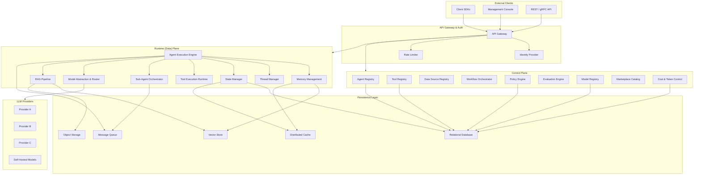
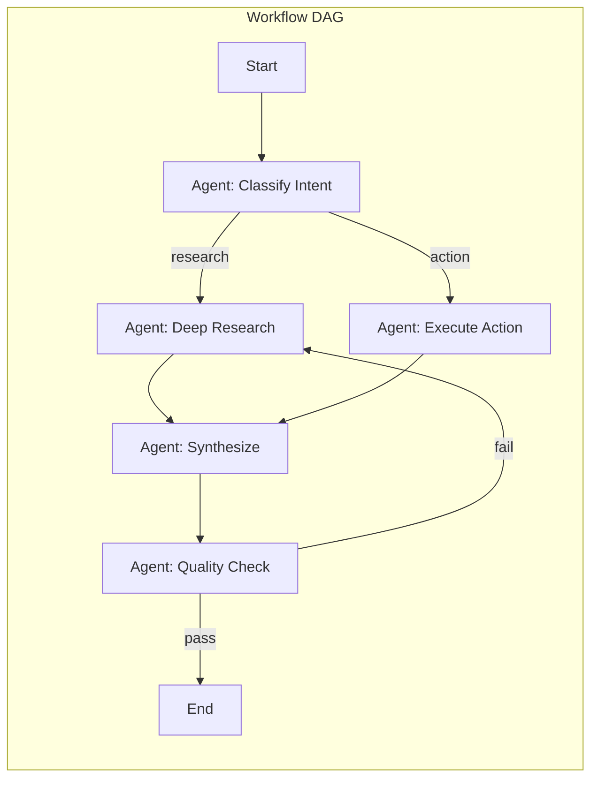
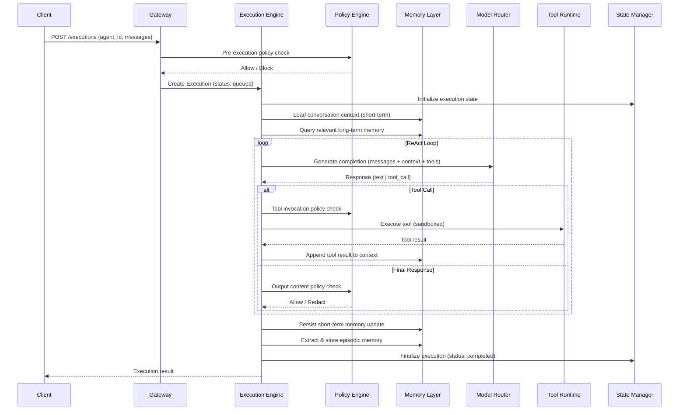
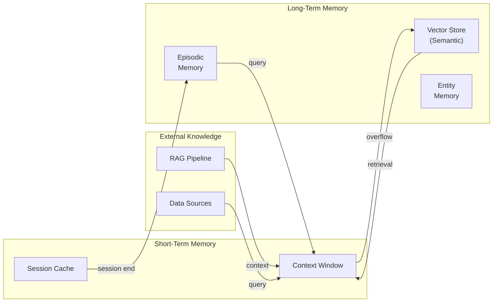
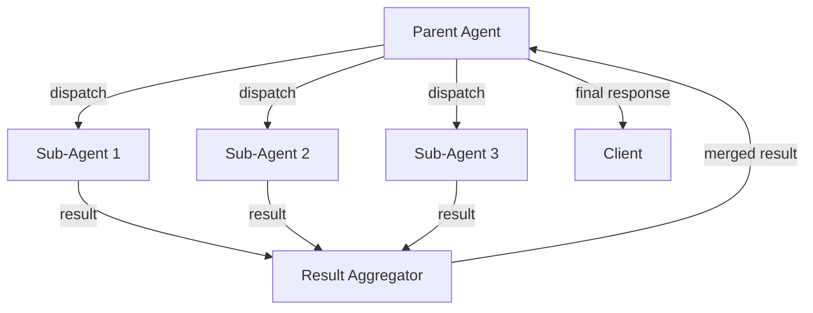
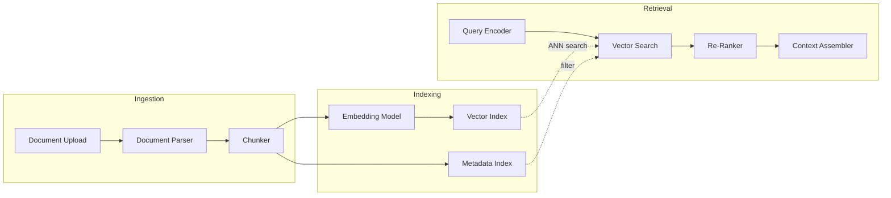
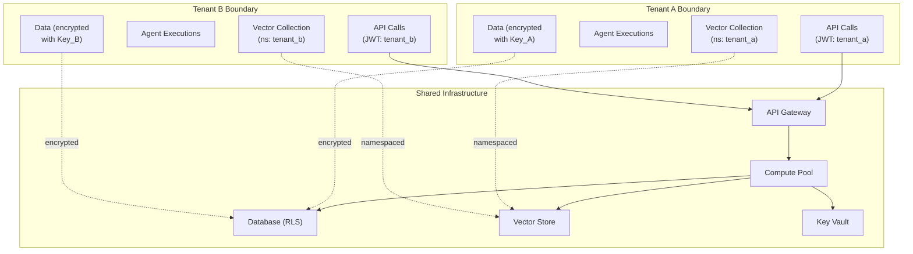

# AI Agent Platform as a Service — High-Level Design

**Document ID:** ARCH-HLD-380  
**Version:** 1.0.0  
**Status:** Draft  
**Track:** STU-MSFT (Track 2)  
**Last Updated:** 2026-03-22  
**Author:** Archmorph Engineering  

---

## Table of Contents

1. [Executive Summary](#1-executive-summary)
2. [Design Principles](#2-design-principles)
3. [Architecture Overview](#3-architecture-overview)
4. [Control Plane](#4-control-plane)
   - 4.1 [Agent Registry & Lifecycle Management](#41-agent-registry--lifecycle-management)
   - 4.2 [Tool Registry & Attachment Management](#42-tool-registry--attachment-management)
   - 4.3 [Data Source Connector Registry](#43-data-source-connector-registry)
   - 4.4 [Workflow Orchestrator](#44-workflow-orchestrator)
   - 4.5 [Policy Engine](#45-policy-engine)
   - 4.6 [Evaluation Engine](#46-evaluation-engine)
   - 4.7 [Model Registry & Routing Configuration](#47-model-registry--routing-configuration)
   - 4.8 [Marketplace Catalog](#48-marketplace-catalog)
   - 4.9 [Cost & Token Observability Control](#49-cost--token-observability-control)
5. [Runtime (Data) Plane](#5-runtime-data-plane)
   - 5.1 [Agent Execution Engine](#51-agent-execution-engine)
   - 5.2 [Tool Execution Runtime](#52-tool-execution-runtime)
   - 5.3 [Memory Management Layer](#53-memory-management-layer)
   - 5.4 [Thread Management](#54-thread-management)
   - 5.5 [State Management](#55-state-management)
   - 5.6 [Sub-Agent Orchestrator](#56-sub-agent-orchestrator)
   - 5.7 [RAG Pipeline](#57-rag-pipeline)
   - 5.8 [Model Abstraction & Routing Layer](#58-model-abstraction--routing-layer)
6. [Cross-Cutting Concerns](#6-cross-cutting-concerns)
   - 6.1 [Security Boundaries & Tenant Isolation](#61-security-boundaries--tenant-isolation)
   - 6.2 [Observability Architecture](#62-observability-architecture)
   - 6.3 [Fault Tolerance & Circuit Breaker Patterns](#63-fault-tolerance--circuit-breaker-patterns)
   - 6.4 [Scalability Considerations](#64-scalability-considerations)
   - 6.5 [Governance Controls & Compliance Hooks](#65-governance-controls--compliance-hooks)
   - 6.6 [Data Flows & Integration Points](#66-data-flows--integration-points)
7. [Security Architecture](#7-security-architecture)
   - 7.1 [Authentication & Authorization Model](#71-authentication--authorization-model)
   - 7.2 [Tenant Isolation Model](#72-tenant-isolation-model)
   - 7.3 [Secret Management](#73-secret-management)
   - 7.4 [Network Security Zones](#74-network-security-zones)
   - 7.5 [Data Encryption](#75-data-encryption)
8. [Scalability Model](#8-scalability-model)
   - 8.1 [Horizontal Scaling Strategy](#81-horizontal-scaling-strategy)
   - 8.2 [Queue-Based Load Leveling](#82-queue-based-load-leveling)
   - 8.3 [Autoscaling Triggers](#83-autoscaling-triggers)
   - 8.4 [Multi-Region Considerations](#84-multi-region-considerations)
9. [Fault Tolerance](#9-fault-tolerance)
   - 9.1 [Circuit Breaker Patterns](#91-circuit-breaker-patterns)
   - 9.2 [Retry Strategies](#92-retry-strategies)
   - 9.3 [Dead Letter Queues](#93-dead-letter-queues)
   - 9.4 [State Recovery Mechanisms](#94-state-recovery-mechanisms)
10. [Memory Architecture](#10-memory-architecture)
    - 10.1 [Short-Term Memory (Conversation Context)](#101-short-term-memory-conversation-context)
    - 10.2 [Long-Term Memory (Vector Store & Semantic Memory)](#102-long-term-memory-vector-store--semantic-memory)
    - 10.3 [Memory Lifecycle Management](#103-memory-lifecycle-management)
11. [RAG Pipeline Design](#11-rag-pipeline-design)
    - 11.1 [Document Ingestion Flow](#111-document-ingestion-flow)
    - 11.2 [Chunking Strategies](#112-chunking-strategies)
    - 11.3 [Embedding Pipeline](#113-embedding-pipeline)
    - 11.4 [Vector Index Architecture](#114-vector-index-architecture)
    - 11.5 [Retrieval and Ranking](#115-retrieval-and-ranking)
    - 11.6 [Context Assembly](#116-context-assembly)
12. [Governance & Policy Enforcement](#12-governance--policy-enforcement)
    - 12.1 [Pre-Execution Policies](#121-pre-execution-policies)
    - 12.2 [Runtime Guardrails](#122-runtime-guardrails)
    - 12.3 [Post-Execution Audit](#123-post-execution-audit)
    - 12.4 [Content Filtering Model](#124-content-filtering-model)
13. [Data Model Summary](#13-data-model-summary)
14. [Deployment Topology](#14-deployment-topology)
15. [Risks & Mitigations](#15-risks--mitigations)
16. [Appendix: Existing Implementation References](#16-appendix-existing-implementation-references)

---

## 1. Executive Summary

The AI Agent Platform as a Service (Agent PaaS) is a multi-tenant, vendor-neutral platform for building, deploying, managing, and observing autonomous AI agents at enterprise scale. It provides a complete lifecycle — from agent definition and tool attachment through execution, memory management, and governance — as a hosted service that abstracts away infrastructure complexity.

**Purpose.** Organizations building AI-powered workflows today face fragmented tooling: separate systems for model hosting, prompt management, tool orchestration, memory stores, guardrails, and observability. Agent PaaS unifies these into a single platform with well-defined control plane and runtime plane separation, enabling teams to ship production agents without operating bespoke infrastructure.

**Key Differentiators:**

| Differentiator | Description |
|---|---|
| **Full lifecycle management** | CRUD, versioning, rollback, canary promotion — agents treated as first-class deployable artifacts |
| **Vendor-neutral model routing** | Single abstraction over OpenAI, Anthropic, Mistral, open-weight, and self-hosted models with cost-aware routing |
| **Built-in governance** | Pre-execution policy gates, runtime guardrails, post-execution audit trails, and content filtering — not bolted on after the fact |
| **Multi-tier memory** | Short-term conversation context, long-term vector/semantic memory, and episodic recall — managed per-agent with configurable retention |
| **Enterprise multi-tenancy** | Cryptographic tenant isolation between control plane metadata and runtime data, with per-tenant encryption keys |
| **Composable agent DAGs** | Agents can orchestrate sub-agents in sequential, parallel, or autonomous topologies with checkpoint/resume |
| **Integrated RAG pipeline** | End-to-end document ingestion, chunking, embedding, vector indexing, and retrieval — no external pipeline needed |
| **Token-level cost observability** | Per-execution, per-agent, per-tenant token accounting with budget alerts and throttling |

**Scope.** This document covers the platform's high-level architecture, subsystem responsibilities, cross-cutting concerns, security model, scalability approach, and operational considerations. It is vendor-neutral — all cloud service references use generic terms (e.g., "Object Storage" rather than a branded service name).

---

## 2. Design Principles

| # | Principle | Rationale |
|---|---|---|
| 1 | **Control plane / data plane separation** | Management operations (CRUD, policy, config) are isolated from execution-time operations (inference, tool calls, memory reads) to allow independent scaling and failure isolation |
| 2 | **Tenant isolation by default** | Every data path — storage, compute, network, encryption keys — enforces tenant boundaries. No data mixing, no shared secrets |
| 3 | **Vendor-neutral abstractions** | Model providers, vector stores, and cloud primitives are accessed through abstraction layers. Swapping providers requires configuration changes, not code changes |
| 4 | **Policy as code** | Guardrails, access controls, and content filters are expressed as declarative policy objects, versioned alongside agent definitions |
| 5 | **Observability built-in** | Every execution emits structured traces, metrics, and logs. Token accounting is a first-class concern, not an afterthought |
| 6 | **Immutable versioning** | Agent definitions, tool schemas, and policy rules are versioned immutably. Rollback is a pointer change, not a mutation |
| 7 | **Secure by default** | Secrets never appear in logs or API responses. All inter-service communication is mTLS. Least-privilege access is enforced at every boundary |
| 8 | **Graceful degradation** | Circuit breakers, retry budgets, and fallback chains ensure the platform degrades gracefully under partial failure rather than cascading |

---

## 3. Architecture Overview

The platform is divided into two primary planes separated by an API gateway:

- **Control Plane** — Handles agent lifecycle, configuration, policy management, model registry, marketplace, and cost controls. Operates on metadata. Low throughput, high consistency.
- **Runtime (Data) Plane** — Handles agent execution, tool invocation, memory reads/writes, RAG retrieval, and model inference. Operates on user data and LLM tokens. High throughput, eventual consistency acceptable for non-critical paths.



**Key architectural boundaries:**

| Boundary | Mechanism |
|---|---|
| External → Gateway | TLS termination, JWT validation, rate limiting |
| Gateway → Control Plane | Authenticated API calls, RBAC enforcement |
| Gateway → Runtime Plane | Authenticated API calls, tenant context injection |
| Control Plane → Persistence | Connection pooling, row-level tenant filtering |
| Runtime Plane → LLM Providers | Circuit-breaker-wrapped HTTP, API key rotation |
| Runtime Plane → Vector Store | Tenant-namespaced collections, mTLS |

---

## 4. Control Plane

The control plane manages all configuration, metadata, and governance state. It is the source of truth for what agents exist, what tools they can use, which models they route to, and what policies constrain them.

### 4.1 Agent Registry & Lifecycle Management

The Agent Registry is the central catalog of all agent definitions within a tenant. Each agent is a versioned, immutable artifact with a well-defined lifecycle.

**Lifecycle States:**

```
draft → active → deprecated → archived
         ↑          ↓
         └── rollback ──┘
```

| State | Description |
|---|---|
| `draft` | Under development. Not invocable. Editable. |
| `active` | Deployed and serving requests. Immutable at this version. |
| `deprecated` | Marked for sunset. Still serves requests but emits warnings. New threads are discouraged. |
| `archived` | Soft-deleted. Not invocable. Retained for audit and rollback. |

**Core Operations:**

| Operation | Behavior |
|---|---|
| **Create** | Instantiate a new agent with name, description, model config, tool bindings, data source bindings, and memory config. Assigned version `1.0.0` in `draft` status |
| **Update** | Mutating a `draft` agent edits in place. Mutating an `active` agent creates a new version (semantic versioning) |
| **Promote** | Transition `draft` → `active`. Validates all tool bindings resolve, model endpoints are reachable, and bound policies are satisfiable |
| **Rollback** | Revert an `active` agent to a previous version. The current version is moved to `deprecated`. Pointer swap — no data duplication |
| **Deprecate** | Mark an `active` version as `deprecated`. Set a sunset timestamp. Emit deprecation headers on invocation |
| **Archive** | Soft-delete. Remove from active query results. Retain in storage for compliance-mandated retention periods |

**Version Storage:**

Every agent version is stored as a complete snapshot (not a diff) to enable atomic rollback:

```json
{
  "agent_id": "agt_01HXYZ",
  "version": "2.1.0",
  "status": "active",
  "model_config": {
    "provider": "anthropic",
    "model": "claude-sonnet-4",
    "temperature": 0.3,
    "max_tokens": 4096,
    "system_prompt": "..."
  },
  "tools": ["tool_search_web", "tool_run_sql"],
  "data_sources": ["ds_customer_kb"],
  "memory_config": {
    "short_term": { "type": "sliding_window", "max_tokens": 8192 },
    "long_term": { "type": "vector", "collection": "agt_01HXYZ_ltm" }
  },
  "policy_bindings": ["pol_content_filter", "pol_pii_redact"],
  "created_at": "2026-03-22T10:00:00Z",
  "created_by": "usr_abc123"
}
```

### 4.2 Tool Registry & Attachment Management

The Tool Registry catalogs all callable tools available within the platform. Tools are typed, versioned, and schema-validated.

**Tool Definition Schema:**

| Field | Description |
|---|---|
| `tool_id` | Globally unique identifier |
| `name` | Human-readable name (e.g., `search_web`) |
| `version` | Semantic version of the tool implementation |
| `type` | `function` · `api` · `mcp_server` · `sub_agent` |
| `input_schema` | JSON Schema defining expected parameters |
| `output_schema` | JSON Schema defining return structure |
| `auth_requirements` | Credentials or tokens needed for invocation |
| `timeout_ms` | Maximum execution time before forced termination |
| `rate_limit` | Per-tenant, per-minute invocation cap |
| `sandbox_profile` | Security profile constraining filesystem, network, and syscall access |

**Attachment Model:**

Tools are attached to agents via binding records. A binding can include:
- **Parameter overrides** — pre-fill certain tool parameters at the agent level
- **Conditional activation** — tool only available when a policy condition is met (e.g., user has `elevated_access` claim)
- **Priority ordering** — when multiple tools match the same intent, priority determines selection order

**Tool Types:**

| Type | Execution Model |
|---|---|
| `function` | Runs in an isolated sandbox (container or WASM). Direct invocation with timeout enforcement |
| `api` | HTTP callout to an external service. Schema-validated request/response. Credential injection from secret store |
| `mcp_server` | Model Context Protocol server. Discovered via MCP handshake. Tools enumerated dynamically |
| `sub_agent` | Invocation of another registered agent. Recursive execution with depth limits |

### 4.3 Data Source Connector Registry

The Data Source Connector Registry manages connections to external knowledge bases, databases, APIs, and file systems that agents can query at runtime.

**Connector Types:**

| Connector | Protocol | Use Case |
|---|---|---|
| Relational DB | SQL over TLS | Structured data queries |
| Document Store | REST / SDK | Semi-structured document retrieval |
| Object Storage | S3-compatible API | File and blob access |
| Knowledge Base | GraphQL / REST | Enterprise knowledge graphs |
| Streaming | WebSocket / SSE | Real-time event feeds |
| SaaS API | OAuth2 + REST | Third-party service integration |

**Connection Lifecycle:**

1. **Register** — Admin provides connection parameters (host, port, auth method). Credentials stored in secret vault, never in the registry database.
2. **Test** — Platform validates connectivity, schema discovery, and credential validity.
3. **Bind** — Connector is attached to one or more agents. Query templates and access scopes are defined per binding.
4. **Monitor** — Health checks run continuously. Unhealthy connectors trigger alerts and fallback behavior.
5. **Rotate** — Credential rotation is supported without agent downtime via versioned secret references.

### 4.4 Workflow Orchestrator

The Workflow Orchestrator enables composition of multi-step agent workflows as Directed Acyclic Graphs (DAGs).

**Workflow Model:**



**Node Types:**

| Node | Behavior |
|---|---|
| `agent_invoke` | Execute a registered agent with given inputs |
| `tool_invoke` | Directly call a tool without agent reasoning |
| `conditional` | Branch based on output evaluation (regex, JSON path, LLM judge) |
| `parallel_fan_out` | Execute N branches concurrently, collect results |
| `parallel_fan_in` | Aggregate results from parallel branches using a merge strategy |
| `human_in_the_loop` | Pause execution, emit approval request, resume on human decision |
| `checkpoint` | Persist state snapshot for recovery |

**Execution Modes:**

| Mode | Description |
|---|---|
| **Sequential** | Steps execute in linear order. Output of step N is input to step N+1 |
| **Parallel** | Independent branches execute concurrently. Fan-in node aggregates results |
| **Autonomous** | Agent decides the next step dynamically via ReAct or Plan-and-Execute patterns. DAG is constructed at runtime |
| **Hybrid** | Fixed structure with autonomous sub-sections. Outer DAG is static; inner nodes may use autonomous reasoning |

**DAG Constraints:**
- Maximum depth: 20 levels (configurable per tenant)
- Maximum fan-out: 10 parallel branches
- Cycle detection enforced at DAG validation time (pre-runtime)
- Total execution timeout per workflow: configurable (default 30 minutes)

### 4.5 Policy Engine

The Policy Engine enforces governance rules across agent creation, configuration, and execution. Policies are declarative, versioned, and composable.

**Policy Taxonomy:**

| Category | Examples |
|---|---|
| **Access Control** | Which users/roles can invoke which agents; which agents can call which tools |
| **Content Filtering** | Block or redact PII, profanity, harmful content, prompt injection attempts |
| **Rate Limiting** | Per-tenant, per-agent, per-tool invocation caps (tokens/minute, requests/hour) |
| **Data Residency** | Restrict which regions data can transit or be stored in |
| **Model Constraints** | Restrict which model providers or model versions an agent can use |
| **Budget Caps** | Maximum token spend per agent per day/week/month |
| **Audit Requirements** | Which executions must be logged at full fidelity vs. sampled |

**Policy Binding Model:**

Policies are bound at multiple scopes with inheritance:

```
Organization Policy (broadest)
  └── Project Policy
       └── Agent Policy (narrowest)
```

When policies conflict, the narrowest scope wins for restrictive policies (e.g., a project-level rate limit of 100 RPM overrides an org-level 1000 RPM). For additive policies (e.g., content filters), all applicable policies are evaluated — the union of all rules applies.

**Enforcement Points:**

| Phase | Signal | Action |
|---|---|---|
| Pre-execution | Input message content, user identity, agent config | Block, allow, or modify the request |
| Runtime | Tool call parameters, intermediate outputs, token consumption | Interrupt execution, inject warnings, throttle |
| Post-execution | Final output content, total tokens consumed, execution duration | Redact sensitive data, emit audit events, flag for review |

**Policy Schema Example:**

```json
{
  "policy_id": "pol_pii_redact",
  "name": "PII Redaction",
  "policy_type": "content_filter",
  "enforcement_level": "block",
  "rules": {
    "patterns": ["SSN", "credit_card", "email", "phone"],
    "action": "redact",
    "applies_to": ["input", "output"],
    "exceptions": ["admin_role"]
  },
  "is_active": true,
  "version": "1.0.0"
}
```

### 4.6 Evaluation Engine

The Evaluation Engine measures agent quality across multiple dimensions, enabling continuous improvement and safe promotion.

**Evaluation Modes:**

| Mode | Description |
|---|---|
| **Offline Batch** | Run a test suite of input/expected-output pairs against an agent version. Produce a scored report |
| **Online Shadow** | Route a percentage of production traffic to a candidate version. Compare outputs without serving the candidate to users |
| **A/B Testing** | Split live traffic between agent versions. Measure user-facing quality metrics (satisfaction, task completion, latency) |
| **LLM-as-Judge** | Use a separate LLM to score outputs on dimensions like relevance, accuracy, helpfulness, and safety |
| **Ground Truth** | Compare agent outputs against human-annotated gold-standard answers. Compute precision, recall, F1 |

**Quality Dimensions:**

| Dimension | Metric | Target |
|---|---|---|
| Accuracy | Factual correctness vs. ground truth | ≥ 90% |
| Relevance | Answer addresses the user's intent | ≥ 95% |
| Safety | No harmful, biased, or policy-violating content | 100% |
| Latency | Time-to-first-token and total response time | p95 < 3s |
| Cost efficiency | Tokens consumed per successful task completion | Trending down |
| Tool accuracy | Correct tool selected and invoked with valid parameters | ≥ 85% |

**Evaluation Pipeline:**

```
Test Suite → Agent Under Test → Output Capture → Scoring (automated + LLM judge) → Report → Promotion Gate
```

Promotion from `draft` to `active` can be gated on evaluation scores exceeding configurable thresholds.

### 4.7 Model Registry & Routing Configuration

The Model Registry catalogs all LLM endpoints available to the platform. It decouples agent definitions from specific model providers.

**Registry Entry Schema:**

| Field | Description |
|---|---|
| `endpoint_id` | Unique identifier |
| `name` | Friendly name (e.g., "GPT-4o Production") |
| `provider` | Provider identifier (`openai`, `anthropic`, `mistral`, `self_hosted`, etc.) |
| `model_version` | Specific model version string |
| `connection_config` | Endpoint URL, API key reference (secret vault pointer), region |
| `capabilities` | Feature flags: `vision`, `function_calling`, `json_mode`, `streaming`, `long_context` |
| `pricing` | Cost per input token, cost per output token, cost per image |
| `rate_limits` | Provider-imposed TPM/RPM limits |
| `health_status` | `healthy`, `degraded`, `unavailable` — updated by health probes |

**Routing Configuration:**

Agents reference a **routing policy** rather than a specific endpoint:

```json
{
  "routing_policy": {
    "primary": "endpoint_claude_sonnet",
    "fallback_chain": ["endpoint_gpt4o", "endpoint_mistral_large"],
    "strategy": "cost_optimized",
    "constraints": {
      "max_latency_ms": 5000,
      "required_capabilities": ["function_calling", "streaming"],
      "region_affinity": "eu-west"
    }
  }
}
```

**Routing Strategies:**

| Strategy | Behavior |
|---|---|
| `primary_with_fallback` | Always try primary. Fallback on failure/timeout |
| `cost_optimized` | Route to cheapest endpoint that meets capability requirements |
| `latency_optimized` | Route to lowest-latency healthy endpoint |
| `round_robin` | Distribute evenly across healthy endpoints |
| `canary` | Route a percentage to a new endpoint for testing |

### 4.8 Marketplace Catalog

The Marketplace enables discovery, sharing, and monetization of agents and tools across organizations.

**Catalog Entities:**

| Entity | Description |
|---|---|
| **Published Agent** | An agent template with system prompt, tool bindings, and recommended model config. Users clone and customize |
| **Published Tool** | A reusable tool definition with implementation (function code or API spec). Versioned and reviewed |
| **Workflow Template** | Pre-built DAG patterns (e.g., "Research + Summarize", "Customer Support Escalation") |
| **Connector Pack** | Pre-configured data source connectors for common SaaS platforms |

**Publishing Flow:**

1. Developer marks an agent/tool as `publishable`
2. Automated review: policy compliance, security scan, schema validation
3. Optional human review for marketplace-featured listings
4. Published with metadata: description, category, ratings, install count, pricing tier
5. Consumers install (clone) into their tenant — no data sharing between publisher and consumer

### 4.9 Cost & Token Observability Control

Token consumption is the primary cost driver for LLM-based platforms. This subsystem provides real-time visibility and control.

**Accounting Granularity:**

```
Organization
  └── Project
       └── Agent
            └── Execution
                 └── LLM Call (input tokens + output tokens + cached tokens)
```

**Control Mechanisms:**

| Mechanism | Description |
|---|---|
| **Budget Alerts** | Configurable thresholds (50%, 80%, 100% of budget) trigger notifications via webhook or email |
| **Hard Caps** | When budget is exhausted, new executions are rejected with a `429 Budget Exceeded` response |
| **Soft Caps** | When budget threshold is crossed, executions continue but are logged as over-budget for review |
| **Rate Throttling** | Per-agent token-per-minute limits to prevent runaway loops |
| **Cost Attribution** | Every LLM call is tagged with `org_id`, `project_id`, `agent_id`, `execution_id` for drill-down reporting |

**Dashboard Metrics:**

- Total tokens consumed (input/output split) per hour/day/month
- Cost per execution (p50, p95, p99)
- Token efficiency ratio (output quality score / tokens consumed)
- Budget burn rate and projected exhaustion date
- Provider-level cost breakdown

---

## 5. Runtime (Data) Plane

The runtime plane handles all execution-time operations. It processes user messages, invokes models, calls tools, manages memory, and returns responses. It is designed for high throughput, low latency, and horizontal scalability.

### 5.1 Agent Execution Engine

The Agent Execution Engine is the core runtime component. It receives an execution request, loads the agent definition, and orchestrates the reasoning loop.

**Execution Lifecycle:**



**Sandbox Isolation:**

Each execution runs within an isolated sandbox:

| Isolation Layer | Mechanism |
|---|---|
| Process | Dedicated process per execution (or lightweight container) |
| Memory | Strict memory limits per execution (default 512 MB, configurable) |
| CPU | CPU time quotas to prevent runaway reasoning loops |
| Network | Egress restricted to whitelisted tool endpoints only |
| Filesystem | Read-only base image. Ephemeral scratch space destroyed on completion |
| Time | Hard timeout per execution (default 120s, configurable per agent) |

**Execution States:**

```
queued → running → completed
                 → failed
                 → timed_out
                 → cancelled
```

### 5.2 Tool Execution Runtime

The Tool Execution Runtime provides secure, isolated execution environments for tool invocations.

**Security Model:**

Tools execute in a **restrictive sandbox** with the following constraints:

| Constraint | Default | Configurable |
|---|---|---|
| Network egress | Blocked (whitelist only) | Yes — per tool |
| Filesystem write | Ephemeral temp directory only | No |
| System calls | Restricted syscall allowlist | Yes — per sandbox profile |
| Execution timeout | 30 seconds | Yes — per tool |
| Memory limit | 256 MB | Yes — per tool |
| CPU limit | 0.5 vCPU | Yes — per tool |

**Invocation Flow:**

1. Engine resolves tool binding from agent config
2. Input parameters validated against tool's JSON Schema
3. Credentials injected from secret vault (never passed by the agent)
4. Tool code executed in sandbox (container, WASM, or serverless function)
5. Output validated against tool's output schema
6. Result returned to engine; sandbox destroyed

**Error Handling:**

| Error | Behavior |
|---|---|
| Schema validation failure (input) | Execution rejected. Error returned to agent for self-correction |
| Timeout | Sandbox killed. Agent receives timeout error. May retry based on agent config |
| Runtime exception | Exception captured. Agent receives error message. Stack trace logged (not returned to agent) |
| Network failure | Circuit breaker triggered. Agent receives connection error. Fallback tool (if configured) attempted |

### 5.3 Memory Management Layer

The Memory Management Layer provides multi-tier memory for agents, enabling context continuity across turns and sessions.

**Memory Tiers:**



| Tier | Storage | Lifetime | Access Pattern |
|---|---|---|---|
| **Context Window** | In-memory (distributed cache) | Single execution | Read/write per LLM call |
| **Session Cache** | Distributed cache | Single conversation thread | Read/write per turn |
| **Vector Store** | Persistent vector database | Indefinite (tenant-managed) | Similarity search |
| **Episodic Memory** | Relational database | Configurable retention | Keyword + temporal query |
| **Entity Memory** | Relational database | Configurable retention | Entity-type lookup |

### 5.4 Thread Management

Thread Management handles multi-turn conversations with support for branching and merging.

**Thread Model:**

| Concept | Description |
|---|---|
| **Thread** | An ordered sequence of messages (user + assistant + tool results) representing a conversation |
| **Turn** | A single user message → agent response cycle (may include multiple LLM calls and tool invocations) |
| **Fork** | Create a new thread branching from a specific turn in an existing thread. Used for "what-if" exploration |
| **Merge** | Combine insights from a forked thread back into the parent thread |
| **Archive** | Mark a thread as inactive. Retained for audit but excluded from active memory queries |

**Thread Storage:**

- Messages stored in a relational database with the schema: `(thread_id, turn_number, role, content, metadata, created_at)`
- Message content optionally encrypted at rest with a tenant-scoped key
- Thread metadata includes: agent version used, model endpoint used, total tokens consumed, execution IDs

**Concurrency:**

- Multiple users can have concurrent threads with the same agent (each thread is independent)
- Within a single thread, turns are serialized (no concurrent writes to the same thread)
- Optimistic locking (version counter) prevents lost updates on thread metadata

### 5.5 State Management

State Management provides checkpointing, persistence, and recovery for long-running agent executions and workflows.

**Checkpoint Model:**

| Component | Description |
|---|---|
| **Checkpoint** | A serialized snapshot of execution state at a specific point in a workflow. Includes: accumulated context, tool results, intermediate outputs, DAG position |
| **Save trigger** | Checkpoints are created automatically before tool invocations, at DAG node boundaries, and on configurable intervals |
| **Recovery** | On failure, the execution resumes from the last checkpoint rather than restarting from scratch |
| **Retention** | Completed execution checkpoints are retained for N days (configurable). Failed execution checkpoints are retained for M days (longer, for debugging) |

**State Store:**

- Hot state (active executions): Distributed cache with write-ahead log
- Warm state (recent completions): Relational database
- Cold state (archived): Object storage (compressed, encrypted)

**Consistency Guarantees:**

- Checkpoint writes are synchronous and confirmed before proceeding to the next step
- State recovery replays from the last confirmed checkpoint — at-least-once semantics for tool calls (tools must be idempotent or the platform will deduplicate via idempotency keys)

### 5.6 Sub-Agent Orchestrator

The Sub-Agent Orchestrator enables agents to delegate tasks to other agents, forming compositional hierarchies.

**Orchestration Topologies:**

| Topology | Description |
|---|---|
| **Sequential chain** | Agent A calls Agent B, waits for result, then continues |
| **Parallel fan-out** | Agent A dispatches tasks to Agents B, C, D concurrently. Collects results |
| **Supervisor** | A supervisor agent dynamically decides which sub-agents to invoke based on the task |
| **Voting ensemble** | Multiple agents answer the same question. Results are aggregated (majority vote, best-of-N, weighted) |

**Constraints:**

| Constraint | Default | Purpose |
|---|---|---|
| Max recursion depth | 5 | Prevent infinite delegation loops |
| Max parallel sub-agents | 10 | Prevent resource exhaustion |
| Sub-agent timeout | Inherits parent timeout minus elapsed | Prevent child outliving parent |
| Cross-tenant sub-agent calls | Blocked | Tenant isolation enforcement |

**DAG Execution Flow:**



Each sub-agent invocation creates a child execution record linked to the parent, enabling full trace reconstruction.

### 5.7 RAG Pipeline

The RAG (Retrieval-Augmented Generation) Pipeline provides end-to-end document ingestion, indexing, and retrieval.

**Pipeline Stages:**



(Detailed design in [Section 11](#11-rag-pipeline-design).)

### 5.8 Model Abstraction & Routing Layer

The Model Abstraction Layer provides a unified interface for all LLM interactions, regardless of provider.

**Unified Interface:**

```
model_router.complete(
    messages: List[Message],
    tools: Optional[List[ToolDef]],
    routing_policy: RoutingPolicy,
    metadata: ExecutionMetadata
) → CompletionResult
```

**Provider Adapters:**

Each LLM provider has an adapter implementing the unified interface:

| Provider Type | Adapter Responsibilities |
|---|---|
| OpenAI-compatible | Map unified schema → OpenAI chat completions API. Handle function calling, JSON mode, streaming |
| Anthropic | Map to Messages API. Handle tool_use blocks, system prompt placement, vision inputs |
| Mistral | Map to Chat API. Handle tool calls, JSON output |
| Self-hosted (vLLM, Ollama, TGI) | Map to OpenAI-compatible endpoint. Handle model-specific tokenizers |
| Embedding models | Separate interface for text → vector conversion. Batch support |

**Request Flow:**

1. Engine submits completion request with routing policy
2. Router evaluates policy: check endpoint health, match capabilities, apply strategy (cost/latency/round-robin)
3. Selected adapter formats the request for the target provider
4. Request sent with circuit breaker wrapping (timeout, retry, fallback)
5. Response normalized to unified schema
6. Token counts recorded for cost accounting
7. If primary fails, fallback chain is traversed

**Streaming Support:**

All providers support streaming responses. The router transparently handles:
- Server-Sent Events (SSE) for HTTP-based providers
- WebSocket for self-hosted models
- Backpressure management when clients consume slowly

---

## 6. Cross-Cutting Concerns

### 6.1 Security Boundaries & Tenant Isolation

**Isolation Model: Shared Infrastructure, Isolated Data**

The platform uses a shared-infrastructure model with strong logical isolation:

| Layer | Isolation Mechanism |
|---|---|
| **API Gateway** | Tenant ID extracted from JWT. All downstream calls carry tenant context |
| **Application** | Tenant-scoped middleware injects `org_id` filter on every database query. No query can omit the filter |
| **Database** | Row-Level Security (RLS) policies enforce tenant boundaries at the database engine level. Defense-in-depth beyond application-level filtering |
| **Object Storage** | Tenant-prefixed paths with IAM policies preventing cross-tenant access |
| **Vector Store** | Tenant-namespaced collections. No cross-namespace queries possible |
| **Encryption** | Per-tenant encryption keys managed in a key vault. Tenant A's key cannot decrypt Tenant B's data |
| **Network** | Runtime sandboxes run in tenant-scoped network namespaces with egress restrictions |



### 6.2 Observability Architecture

**Three Pillars + Token Accounting:**

| Pillar | Implementation |
|---|---|
| **Logs** | Structured JSON logs with correlation IDs, tenant IDs, and execution IDs. Shipped to a centralized log aggregation system. Sensitive data redacted before emission |
| **Metrics** | Counter and histogram metrics for: request latency, execution duration, token consumption, tool invocation count, error rates. Exposed via a metrics endpoint for scraping |
| **Traces** | Distributed traces spanning: API Gateway → Engine → Model Router → LLM Provider → Tool Runtime. Each span carries tenant and execution context |
| **Token Accounting** | Every LLM call records: `{execution_id, model, input_tokens, output_tokens, cached_tokens, cost_usd}`. Aggregated into per-agent, per-project, per-org dashboards |

**Correlation Model:**

Every request generates a correlation ID at the API Gateway. This ID propagates through all internal calls via headers, enabling end-to-end trace reconstruction:

```
correlation_id → execution_id → [model_call_ids] → [tool_call_ids]
```

### 6.3 Fault Tolerance & Circuit Breaker Patterns

(Detailed in [Section 9](#9-fault-tolerance).)

**Summary:**

- Circuit breakers on all external calls (LLM providers, tool endpoints, data sources)
- Exponential backoff with jitter for transient failures
- Dead letter queues for failed executions requiring manual review
- State checkpointing for execution recovery

### 6.4 Scalability Considerations

(Detailed in [Section 8](#8-scalability-model).)

**Summary:**

- Stateless API and execution tiers scale horizontally behind a load balancer
- Message queue decouples execution intake from processing
- Vector store and relational database scale independently
- Autoscaling driven by queue depth, CPU utilization, and token throughput

### 6.5 Governance Controls & Compliance Hooks

(Detailed in [Section 12](#12-governance--policy-enforcement).)

**Summary:**

- All policy decisions are logged and auditable
- Compliance hooks for GDPR (data deletion, export), SOC 2 (access logging), HIPAA (PHI handling)
- Data residency controls at the tenant and agent level

### 6.6 Data Flows & Integration Points

**Primary Data Flows:**

| Flow | Source → Destination | Protocol | Data |
|---|---|---|---|
| Agent invocation | Client → API Gateway → Execution Engine | HTTPS (REST/gRPC) | User messages, thread context |
| Model inference | Execution Engine → LLM Provider | HTTPS | Prompt + context → Completion |
| Tool invocation | Execution Engine → Tool Runtime | Internal RPC | Tool input params → Tool output |
| Memory read | Execution Engine → Cache / Vector Store | Internal | Query → Context documents |
| Memory write | Execution Engine → Cache / Database | Internal | New messages, episodic summaries |
| RAG retrieval | Execution Engine → Vector Store | Internal | Query embedding → Ranked chunks |
| Webhook delivery | Execution Engine → Client webhook | HTTPS | Execution result, status updates |
| Metric emission | All components → Metrics collector | Push/Pull | Counters, histograms, gauges |

**Integration Points:**

| Integration | Direction | Protocol | Authentication |
|---|---|---|---|
| Client SDK | Inbound | REST / gRPC / WebSocket | API Key + JWT |
| LLM Providers | Outbound | HTTPS | API Key (from secret vault) |
| External Tools (APIs) | Outbound | HTTPS | OAuth2 / API Key (from secret vault) |
| Webhook Endpoints | Outbound | HTTPS | HMAC signature verification |
| Identity Provider | Inbound/Outbound | OIDC / SAML | Federation |
| Monitoring System | Outbound | OTLP / Prometheus | Service account |

---

## 7. Security Architecture

### 7.1 Authentication & Authorization Model

**Authentication:**

| Actor | Method |
|---|---|
| Human users (console) | OIDC / SAML SSO via external identity provider |
| API clients (SDKs) | API key + short-lived JWT. API keys are tenant-scoped and individually revocable |
| Service-to-service | mTLS with X.509 certificates. Certificate rotation on a 90-day cycle |
| Agents (during execution) | Execution-scoped bearer tokens with least-privilege claims. Cannot elevate privileges |

**Authorization (RBAC):**

| Role | Permissions |
|---|---|
| `viewer` | Read agents, view executions, read metrics |
| `developer` | Create/update agents (draft), bind tools, run evaluations |
| `operator` | Promote/rollback agents, manage data sources, view audit logs |
| `admin` | Manage policies, manage model endpoints, manage users, view all tenants within org |
| `super_admin` | Platform-level operations: tenant provisioning, global policy, system config |

Roles are scoped to `(organization, project)` pairs. A user can be `admin` in Project A and `viewer` in Project B.

### 7.2 Tenant Isolation Model

**Control Plane Isolation:**

- All control plane entities (agents, tools, policies, models) are scoped by `organization_id`
- Every database query includes an `organization_id` filter enforced by middleware — there is no "unscoped" query path
- Database Row-Level Security (RLS) provides a second enforcement layer at the database engine level
- API responses are filtered to the authenticated tenant before serialization

**Data Plane Isolation:**

- Execution sandboxes run in isolated compute contexts (container per execution or namespace per tenant)
- Memory and vector store data are namespace-partitioned
- Network egress from sandboxes is restricted to pre-approved endpoints
- Tenant-scoped encryption keys ensure that even a database breach does not expose cross-tenant data

### 7.3 Secret Management

| Secret Type | Storage | Rotation | Access Pattern |
|---|---|---|---|
| LLM API keys | Key vault | 90-day auto-rotation | Model Router reads at runtime via vault SDK |
| Database credentials | Key vault | 30-day auto-rotation | Connection pool refreshes on rotation event |
| Tool credentials (OAuth, API keys) | Key vault, per tenant | Tenant-managed | Injected into tool sandbox at invocation time |
| Encryption keys (data-at-rest) | Key vault, per tenant | Annual rotation with re-encryption | Transparent to application via envelope encryption |
| JWT signing keys | Key vault, platform-scoped | 180-day rotation | API Gateway reads for token validation |

**Principles:**

- Secrets never appear in application logs, API responses, or error messages
- Secrets are not stored in environment variables at the application layer — they are fetched from the vault at runtime
- Secret access is audited: every read is logged with accessor identity and timestamp

### 7.4 Network Security Zones

```
┌──────────────────────────────────────────────────────┐
│                    PUBLIC ZONE                        │
│  ┌────────────┐                                      │
│  │ CDN / WAF  │                                      │
│  └─────┬──────┘                                      │
├────────┼─────────────────────────────────────────────┤
│        │           DMZ ZONE                          │
│  ┌─────▼──────┐  ┌──────────────┐                    │
│  │ API Gateway │  │ Load Balancer│                    │
│  └─────┬──────┘  └──────┬───────┘                    │
├────────┼────────────────┼────────────────────────────┤
│        │    APPLICATION ZONE                         │
│  ┌─────▼──────┐  ┌──────▼───────┐  ┌──────────────┐ │
│  │ Control    │  │ Runtime      │  │ Worker Nodes │ │
│  │ Plane      │  │ Plane        │  │ (Execution)  │ │
│  └─────┬──────┘  └──────┬───────┘  └──────┬───────┘ │
├────────┼────────────────┼───────────────────┼────────┤
│        │         DATA ZONE                  │        │
│  ┌─────▼──────┐  ┌──────▼───────┐  ┌───────▼──────┐ │
│  │ Relational │  │ Vector Store │  │ Object Store │ │
│  │ Database   │  │              │  │              │ │
│  └────────────┘  └──────────────┘  └──────────────┘ │
├──────────────────────────────────────────────────────┤
│                 MANAGEMENT ZONE                      │
│  ┌────────────┐  ┌──────────────┐  ┌──────────────┐ │
│  │ Key Vault  │  │ Monitoring   │  │ Log          │ │
│  │            │  │              │  │ Aggregation  │ │
│  └────────────┘  └──────────────┘  └──────────────┘ │
└──────────────────────────────────────────────────────┘
```

**Zone Rules:**

| From → To | Allowed | Protocol |
|---|---|---|
| Public → DMZ | Yes | HTTPS (443) |
| DMZ → Application | Yes | Internal HTTPS / gRPC |
| Application → Data | Yes | Database protocol (TLS), gRPC |
| Application → Management | Yes | Vault SDK, OTLP |
| Data → anywhere | No (ingress only) | — |
| Management → Application | Yes (monitoring scrape) | HTTPS (metrics endpoint) |
| Any → Public (egress) | Restricted | Allowlisted tool endpoints only |

### 7.5 Data Encryption

| Scope | Mechanism |
|---|---|
| **In transit** | TLS 1.3 for all external connections. mTLS for all inter-service communication |
| **At rest (database)** | Transparent Data Encryption (TDE) with tenant-scoped keys. Key wrapping via key vault |
| **At rest (object storage)** | Server-side encryption with tenant-scoped keys |
| **At rest (vector store)** | Collection-level encryption with tenant-scoped keys |
| **In memory** | Sensitive fields (credentials, PII) are kept in secure memory regions and zeroed after use |
| **Backups** | Encrypted with the same tenant-scoped keys. Backup keys are escrowed in a separate vault region |

---

## 8. Scalability Model

### 8.1 Horizontal Scaling Strategy

**Stateless Tiers (scale freely):**

| Tier | Scaling Unit | State Management |
|---|---|---|
| API Gateway | Gateway instance | No state — routes requests |
| Control Plane API | Container / process | All state in database. Any instance can serve any request |
| Runtime Engine | Container / process | Execution state externalized to cache and database. Any engine instance can pick up queued work |
| Tool Runtime | Container / serverless function | Ephemeral. No state. Destroyed after invocation |

**Stateful Tiers (scale with care):**

| Tier | Scaling Strategy |
|---|---|
| Relational Database | Vertical scaling + read replicas. Horizontal sharding by tenant for very large deployments |
| Vector Store | Horizontal sharding by collection. Each tenant's collection can be placed on a dedicated node |
| Distributed Cache | Cluster mode with hash-slot-based sharding. Add nodes to expand capacity |
| Message Queue | Partition-based scaling. Add partitions to increase parallelism |

### 8.2 Queue-Based Load Leveling

Execution requests flow through a message queue to decouple intake from processing:

```
Client → API Gateway → Execution Queue → Worker Pool → Execution Engine
```

**Benefits:**

- Absorbs traffic spikes without overloading the execution tier
- Failed executions can be retried from the queue without client re-submission
- Queue depth is a primary autoscaling signal
- Enables prioritization: premium tenants' messages are processed before free-tier

**Queue Partitioning:**

- Messages partitioned by `tenant_id` to prevent noisy-neighbor effects
- Per-tenant concurrency limits enforced by the consumer (max N concurrent executions per tenant)
- Priority queues for different SLA tiers

### 8.3 Autoscaling Triggers

| Signal | Threshold | Action |
|---|---|---|
| Queue depth | > 100 messages for > 30s | Scale out execution workers |
| CPU utilization | > 70% for > 60s | Scale out API / execution tier |
| Memory utilization | > 80% for > 60s | Scale out execution tier |
| Token throughput | > 80% of provider rate limit | Add model endpoints or activate overflow routing |
| P95 latency | > target SLO for > 120s | Scale out execution workers |
| Queue depth | < 10 messages for > 300s | Scale in execution workers (min 2 replicas) |

**Scaling Bounds:**

| Tier | Minimum | Maximum | Cooldown |
|---|---|---|---|
| API Gateway | 2 | 20 | 60s |
| Execution Workers | 2 | 100 | 120s |
| Tool Runtime | 0 (scale to zero) | 50 | 30s |

### 8.4 Multi-Region Considerations

**Active-Passive (default):**

- Primary region serves all traffic
- Secondary region receives replicated data (async replication with < 30s lag)
- Failover is manual (operator-initiated) or automated on primary region health check failure
- RTO: 15 minutes. RPO: 30 seconds

**Active-Active (premium tier):**

- Traffic routed to nearest healthy region via global DNS
- Database uses multi-region write with conflict resolution (last-writer-wins or application-level)
- Vector store replicated across regions with eventual consistency
- Session affinity ensures a thread stays on one region (thread migration supported for failover)
- RTO: < 60 seconds. RPO: 0 (synchronous write confirmation to 2 regions)

**Data Residency:**

- Tenant-level configuration specifies allowed regions for data storage and processing
- Execution routing respects data residency: an EU-resident tenant's data never transits a non-EU region
- Model inference can be constrained to region-specific endpoints

---

## 9. Fault Tolerance

### 9.1 Circuit Breaker Patterns

Circuit breakers protect the platform from cascading failures when external dependencies become unhealthy.

**Breaker States:**

```
Closed (normal) → Open (failing) → Half-Open (testing recovery)
     ↑                                      │
     └──────────────────────────────────────┘
                    (success)
```

| Parameter | Default |
|---|---|
| Failure threshold (to open) | 5 failures in 60 seconds |
| Open duration (before half-open) | 30 seconds |
| Half-open probe count | 3 requests |
| Success threshold (to close) | 3 consecutive successes |

**Protected Dependencies:**

| Dependency | Fallback When Open |
|---|---|
| LLM Provider (primary) | Route to fallback provider in chain |
| LLM Provider (all) | Return graceful error: "AI service temporarily unavailable" |
| Vector Store | Serve from cache or skip RAG augmentation |
| External Tool API | Return tool error to agent; agent can proceed without tool |
| Database (read) | Serve from read replica or cache |
| Database (write) | Queue write for retry; return provisional response |

### 9.2 Retry Strategies

| Category | Strategy | Max Retries | Base Delay | Max Delay |
|---|---|---|---|---|
| LLM API calls | Exponential backoff + jitter | 3 | 1s | 30s |
| Tool invocations | Fixed interval | 2 | 2s | 2s |
| Database writes | Exponential backoff | 5 | 100ms | 10s |
| Queue publish | Exponential backoff | 10 | 500ms | 60s |
| Webhook delivery | Exponential backoff | 5 | 30s | 1 hour |

**Idempotency:**

- All retryable operations use idempotency keys to prevent duplicate side effects
- LLM calls: same prompt + seed → deduplicated by the model router
- Tool calls: idempotency key generated from `(execution_id, step_index, tool_id)`
- Database writes: upsert semantics where applicable

### 9.3 Dead Letter Queues

Failed items that exhaust all retry attempts are routed to a Dead Letter Queue (DLQ):

| Source Queue | DLQ | Retention | Alerting |
|---|---|---|---|
| Execution Queue | Execution DLQ | 14 days | Alert on > 0 items |
| Webhook Delivery | Webhook DLQ | 7 days | Alert on > 10 items/hour |
| RAG Ingestion | Ingestion DLQ | 30 days | Alert on > 5 items |

**DLQ Processing:**

- DLQ items include the original message, failure reason, retry count, and last error
- Operators can inspect, retry, or discard DLQ items via the management console
- Automated remediation can be configured (e.g., retry all items matching a specific error pattern after a fix is deployed)

### 9.4 State Recovery Mechanisms

| Scenario | Recovery Strategy |
|---|---|
| Execution worker crash mid-execution | Resume from last checkpoint. Re-acquire execution lock. Reprocess from saved state |
| Database failover | Connection pool detects failure, reconnects to standby. In-flight transactions that fail are retried |
| Cache node failure | Cache miss triggers read-through from database. Slight latency increase, no data loss |
| Vector store node failure | Replicated shards serve reads. Writes queue until recovery |
| Queue broker failure | Messages persisted to disk; recovered on restart. Producers retry with backoff |
| Full region outage | Failover to secondary region. DNS update propagated. Active executions in the failed region are marked as `failed` and can be re-submitted |

---

## 10. Memory Architecture

### 10.1 Short-Term Memory (Conversation Context)

Short-term memory holds the immediate conversation context visible to the LLM.

**Context Window Management:**

| Strategy | Description |
|---|---|
| **Sliding window** | Keep the last N tokens of conversation. Oldest messages are evicted when the window is full |
| **Summary compression** | When context exceeds threshold, summarize older messages using a lightweight LLM call. Summary replaces original messages |
| **Selective retention** | Tag messages as `pinned` or `ephemeral`. Pinned messages are never evicted. Ephemeral messages are evicted first |
| **Tool result truncation** | Large tool outputs are truncated to a configurable limit. Full output stored in state manager for reference |

**Storage:**

- Active context stored in distributed cache for sub-millisecond access
- Cache entries keyed by `(thread_id, turn_number)`
- TTL: thread inactivity timeout (default 2 hours, configurable per agent)
- On cache eviction, context is persisted to the relational database for recovery

### 10.2 Long-Term Memory (Vector Store & Semantic Memory)

Long-term memory enables agents to recall information across sessions and threads.

**Memory Types:**

| Type | Storage | Write Trigger | Read Trigger |
|---|---|---|---|
| **Semantic memory (RAG documents)** | Vector store | Document upload / ingestion | Similarity search on user query |
| **Episodic memory** | Relational DB + vector embeddings | End of conversation (auto-summarized) | Temporal or keyword query when agent detects need for recall |
| **Entity memory** | Relational DB | Entity extraction from conversations | Entity mention in new conversation |

**Episodic Memory Flow:**

1. At thread completion (or on a configurable interval), a summarization model processes the conversation
2. Summary is stored with metadata: `{agent_id, thread_id, summary, importance_score, tags[], timestamp}`
3. Summary is also embedded and stored in the vector store for semantic retrieval
4. When an agent needs to recall past interactions, it queries both the keyword index (for exact matches) and the vector index (for semantic similarity)

**Entity Memory Flow:**

1. An NER (Named Entity Recognition) model runs over conversation content
2. Extracted entities (people, organizations, concepts) are stored with attributes and relationships
3. On subsequent conversations, entity mentions trigger a lookup that enriches the context with known attributes
4. Entity records are updated with new information discovered in conversations

### 10.3 Memory Lifecycle Management

| Phase | Trigger | Action |
|---|---|---|
| **Creation** | New conversation turn, document upload, entity extraction | Write to appropriate store (cache, database, vector) |
| **Enrichment** | Subsequent conversations contribute new information | Update entity attributes, append episodic entries, re-embed updated documents |
| **Compaction** | Memory exceeds size threshold or age threshold | Summarize and consolidate episodic memories. Merge entity records |
| **Retention** | Configurable per tenant | Short-term: 2 hours. Episodic: 90 days (default). Entity: indefinite. Documents: indefinite. Override per tenant/agent |
| **Deletion** | Tenant request, GDPR erasure, retention expiry | Hard delete from all stores (database, vector, cache, backups). Generate deletion certificate |
| **Export** | Tenant request, compliance audit | Export all memory for an agent/tenant in a structured format (JSON + binary assets) |

---

## 11. RAG Pipeline Design

### 11.1 Document Ingestion Flow

```
User Upload → Format Detection → Parser → Text Extraction → Chunker → Embedder → Vector Index
                                    ↓                            ↓
                              Metadata Extraction          Metadata Index
```

**Supported Formats:**

| Format | Parser |
|---|---|
| PDF | Layout-aware parser with table/figure extraction |
| DOCX / PPTX | Open XML parser |
| Markdown / TXT | Direct text extraction |
| HTML | HTML-to-text with boilerplate removal |
| CSV / XLSX | Row-based parsing with header detection |
| Images (OCR) | Vision model → text extraction |
| Code files | Language-aware parser preserving function boundaries |

**Ingestion Guarantees:**

- Documents are assigned a `document_id` and tracked through every pipeline stage
- Each stage emits a status event: `uploaded → parsing → chunking → embedding → indexed → ready`
- Failures at any stage place the document in the Ingestion DLQ with the failure reason
- Duplicate detection: content hash prevents re-ingestion of identical documents

### 11.2 Chunking Strategies

| Strategy | Description | Best For |
|---|---|---|
| **Fixed-size** | Split every N tokens with M-token overlap | General purpose, homogeneous documents |
| **Semantic** | Split on paragraph/section boundaries. Use NLP sentence boundary detection | Well-structured documents (reports, articles) |
| **Recursive** | Split by document structure (headings → paragraphs → sentences) with target chunk size | Hierarchical documents |
| **Code-aware** | Split on function/class boundaries. Preserve import context | Source code, configuration files |
| **Table-aware** | Keep table rows together. Serialize tables as structured text | Data-rich documents (spreadsheets, reports with tables) |
| **Sliding window** | Fixed-size windows with configurable overlap | When context continuity is critical |

**Default Configuration:**

| Parameter | Default |
|---|---|
| Target chunk size | 512 tokens |
| Chunk overlap | 64 tokens (12.5%) |
| Maximum chunk size | 1024 tokens |
| Minimum chunk size | 50 tokens (smaller chunks are merged with neighbors) |

### 11.3 Embedding Pipeline

**Embedding Model Selection:**

- Platform supports multiple embedding models concurrently
- Each data source or agent can configure its preferred embedding model
- Models are registered in the Model Registry with `type: embedding`

**Batch Processing:**

- Chunks are embedded in batches (default batch size: 100) to maximize throughput
- Embedding calls are queued to respect provider rate limits
- Results are cached: re-embedding is skipped if chunk content hash matches an existing embedding

**Embedding Storage:**

- Vectors stored in the vector store alongside: `chunk_id`, `document_id`, `agent_id`, `tenant_id`, `source_text`, `metadata`
- Metadata includes: page number, section heading, document title, ingestion timestamp
- Vector dimensionality depends on model (e.g., 1536 for typical models, 3072 for large models)

### 11.4 Vector Index Architecture

**Index Design:**

| Aspect | Choice | Rationale |
|---|---|---|
| Index type | HNSW (Hierarchical Navigable Small World) | Best recall/speed trade-off for ANN search |
| Distance metric | Cosine similarity | Standard for normalized text embeddings |
| Sharding strategy | Per-tenant collections | Isolation + independent scaling |
| Replication | 2 replicas per shard | Fault tolerance without excessive storage cost |

**Index Lifecycle:**

| Operation | Trigger |
|---|---|
| Create collection | First document ingested for a new agent |
| Add vectors | Document ingestion pipeline completion |
| Update vectors | Document re-embedding (content changed, model changed) |
| Delete vectors | Document deletion, memory lifecycle, GDPR erasure |
| Optimize index | Background compaction on a schedule (e.g., daily) |
| Drop collection | Agent archived and retention period expired |

### 11.5 Retrieval and Ranking

**Two-Stage Retrieval:**

1. **Stage 1: Approximate Nearest Neighbor (ANN) search** — Fast vector similarity search. Returns top-K candidates (default K=20)
2. **Stage 2: Re-ranking** — A cross-encoder or LLM-based re-ranker scores each candidate for relevance to the query. Returns top-N results (default N=5)

**Filtering:**

- Pre-filter: metadata filters applied before ANN search (e.g., `document_type = 'policy'`, `created_after = '2025-01-01'`)
- Post-filter: remove duplicates, enforce diversity (MMR — Maximal Marginal Relevance)

**Hybrid Search:**

- Combine vector similarity (semantic) with keyword search (BM25) using Reciprocal Rank Fusion (RRF)
- Configurable weight: `α * vector_score + (1-α) * keyword_score` (default α = 0.7)

### 11.6 Context Assembly

After retrieval and ranking, the Context Assembler constructs the final context window for the LLM:

**Assembly Order:**

```
1. System prompt (from agent definition)
2. Pinned context (always-included instructions or data)
3. Retrieved RAG chunks (ranked by relevance)
4. Episodic memory recalls (if triggered)
5. Entity memory context (if entities detected in query)
6. Conversation history (short-term memory, newest first)
7. User's current message
```

**Budget Allocation:**

The total context budget (model's context window minus reserved output tokens) is allocated:

| Section | Budget Share | Priority |
|---|---|---|
| System prompt | Fixed allocation | Highest — never truncated |
| RAG chunks | 40% of remaining | High — truncate lowest-ranked chunks first |
| Conversation history | 35% of remaining | Medium — summarize oldest turns if over budget |
| Episodic + Entity memory | 15% of remaining | Medium — drop if budget exhausted |
| Pinned context | 10% of remaining | Low — drop if budget exhausted (but rare — pinned context is usually small) |

---

## 12. Governance & Policy Enforcement

### 12.1 Pre-Execution Policies

Evaluated **before** the agent begins processing:

| Policy | Check | Action on Violation |
|---|---|---|
| **Authentication** | Valid JWT, non-expired, correct tenant | Reject with 401 |
| **Authorization** | User has permission to invoke this agent | Reject with 403 |
| **Rate limit** | Tenant/agent within rate limit | Reject with 429 |
| **Budget check** | Tenant has remaining token budget | Reject with 429 |
| **Input content filter** | Scan user message for prompt injection, harmful content, PII | Block, sanitize, or allow with warning |
| **Input size limit** | Message within maximum size | Reject with 413 |
| **Agent health** | Agent status is `active` | Reject with 404 if not active |

### 12.2 Runtime Guardrails

Evaluated **during** agent execution:

| Guardrail | Trigger | Action |
|---|---|---|
| **Token consumption** | Per-execution token count exceeds limit | Terminate execution gracefully |
| **Execution time** | Wall-clock time exceeds timeout | Terminate execution, checkpoint state |
| **Tool call frequency** | Agent attempts > N tool calls in a single turn | Force model to produce a text response |
| **Recursion depth** | Sub-agent depth exceeds limit | Reject sub-agent call, return error to parent |
| **Sensitive tool gate** | Agent attempts to call a restricted tool | Require human approval if policy says `require_approval` |
| **Output PII scan** | Intermediate output contains PII | Redact before storing in memory or returning |
| **Loop detection** | Agent repeats the same tool call with same params > 3 times | Force exit from tool loop |

### 12.3 Post-Execution Audit

Evaluated **after** execution completes:

| Audit Action | Description |
|---|---|
| **Full audit log** | Immutable record: `{execution_id, agent_id, tenant_id, user_id, input, output, tools_called, tokens_consumed, duration_ms, policies_evaluated, timestamp}` |
| **Content review queue** | If any runtime guardrail fired, the execution is flagged for human review |
| **Cost allocation** | Token costs attributed to `(tenant, project, agent)` for billing |
| **Quality sampling** | A configurable percentage of executions are sent to the Evaluation Engine for quality scoring |
| **Compliance export** | Audit logs can be exported in compliance formats (e.g., CEF, SIEM-compatible JSON) |
| **Retention enforcement** | Audit logs retained for the compliance-mandated period (configurable per tenant, default 365 days) |

### 12.4 Content Filtering Model

**Multi-Layer Filtering:**

```
Input → Prompt Injection Detection → PII Detection → Harmful Content Detection → Allow/Block/Redact
                                                                                        ↓
Output ← PII Redaction ← Harmful Content Filter ← Factuality Check ← Raw Model Output
```

**Filter Types:**

| Filter | Technique | Configurable |
|---|---|---|
| Prompt injection | Classifier model + regex patterns | Sensitivity threshold |
| PII detection | NER model + regex (SSN, email, phone, credit card patterns) | Entity types to detect, action (redact vs. block) |
| Harmful content | Classifier model scoring toxicity, violence, self-harm, sexual content | Category thresholds, action per category |
| Topic restriction | Classifier or keyword matching | Blocked topics list per agent |
| Factuality check | LLM-as-judge comparing output against retrieved sources | Enable/disable, strictness level |

**Configuration Granularity:**

Filters can be configured at:
- Platform level (global defaults, applied to all tenants)
- Tenant level (overrides for the organization)
- Agent level (overrides for a specific agent)

Narrower scopes can **tighten** restrictions but cannot **loosen** restrictions set at a broader scope.

---

## 13. Data Model Summary

**Core Entities:**

| Entity | Key Attributes | Relationships |
|---|---|---|
| `Organization` | `org_id`, `name`, `tier`, `settings` | Has many Projects, Users, Policies |
| `Project` | `project_id`, `org_id`, `name` | Belongs to Org. Has many Agents |
| `Agent` | `agent_id`, `org_id`, `name`, `version`, `status`, `model_config`, `memory_config` | Belongs to Org. Has many Versions, Tool Bindings, Policy Bindings |
| `AgentVersion` | `version_id`, `agent_id`, `version`, `snapshot` | Belongs to Agent. Immutable |
| `Tool` | `tool_id`, `name`, `type`, `input_schema`, `output_schema` | Referenced by Tool Bindings |
| `ToolBinding` | `binding_id`, `agent_id`, `tool_id`, `config_overrides` | Links Agent ↔ Tool |
| `DataSource` | `ds_id`, `org_id`, `type`, `connection_config_ref` | Belongs to Org. Bound to Agents |
| `Policy` | `policy_id`, `org_id`, `type`, `rules`, `enforcement_level` | Belongs to Org. Bound to Agents |
| `PolicyBinding` | `binding_id`, `policy_id`, `agent_id` | Links Policy ↔ Agent |
| `ModelEndpoint` | `endpoint_id`, `org_id`, `provider`, `model_version`, `connection_config_ref` | Belongs to Org. Referenced by Agent model_config |
| `Execution` | `execution_id`, `agent_id`, `org_id`, `thread_id`, `status`, `input`, `output`, `tokens`, `cost` | Belongs to Agent. Belongs to Thread |
| `Thread` | `thread_id`, `agent_id`, `org_id`, `status`, `message_count` | Belongs to Agent. Has many Messages |
| `Message` | `message_id`, `thread_id`, `role`, `content`, `metadata` | Belongs to Thread |
| `MemoryDocument` | `doc_id`, `agent_id`, `filename`, `status`, `chunk_count` | Belongs to Agent |
| `EpisodicMemory` | `episode_id`, `agent_id`, `summary`, `importance_score`, `tags` | Belongs to Agent |
| `EntityMemory` | `entity_id`, `agent_id`, `entity_name`, `entity_type`, `attributes` | Belongs to Agent |
| `Workflow` | `workflow_id`, `org_id`, `dag_definition`, `status` | Belongs to Org. References Agents |
| `AuditLog` | `log_id`, `execution_id`, `event_type`, `details`, `timestamp` | Immutable append-only |

---

## 14. Deployment Topology

**Recommended Production Topology:**

```
┌─────────────────────────────────────────────────────────────┐
│                        Region A (Primary)                   │
│                                                             │
│  ┌──────────┐  ┌──────────────────┐  ┌──────────────────┐  │
│  │ CDN/WAF  │  │   API Gateway    │  │  Load Balancer   │  │
│  │  (edge)  │  │  (2+ replicas)   │  │                  │  │
│  └────┬─────┘  └────────┬─────────┘  └────────┬─────────┘  │
│       │                 │                      │            │
│  ┌────▼─────────────────▼──────────────────────▼─────────┐  │
│  │              Application Tier                          │  │
│  │  ┌─────────────┐  ┌──────────────┐  ┌──────────────┐  │  │
│  │  │ Control     │  │  Execution   │  │  Tool        │  │  │
│  │  │ Plane (3+)  │  │  Workers     │  │  Runtime     │  │  │
│  │  │             │  │  (2-100)     │  │  (0-50)      │  │  │
│  │  └─────────────┘  └──────────────┘  └──────────────┘  │  │
│  └───────────────────────────────────────────────────────┘  │
│                                                             │
│  ┌───────────────────────────────────────────────────────┐  │
│  │              Data Tier                                 │  │
│  │  ┌─────────┐  ┌──────────┐  ┌───────┐  ┌──────────┐  │  │
│  │  │   RDB   │  │  Vector  │  │ Cache │  │  Queue   │  │  │
│  │  │ Primary │  │  Store   │  │ (3+)  │  │ Cluster  │  │  │
│  │  │ + Read  │  │  (3+)    │  │       │  │          │  │  │
│  │  │ Replicas│  │          │  │       │  │          │  │  │
│  │  └─────────┘  └──────────┘  └───────┘  └──────────┘  │  │
│  └───────────────────────────────────────────────────────┘  │
│                                                             │
│  ┌───────────────────────────────────────────────────────┐  │
│  │     Object Storage  │  Key Vault  │  Monitoring       │  │
│  └───────────────────────────────────────────────────────┘  │
└─────────────────────────────────────────────────────────────┘
                          │
                    Async Replication
                          │
┌─────────────────────────▼───────────────────────────────────┐
│                        Region B (Standby)                   │
│         (Mirror topology, data replicated, on standby)      │
└─────────────────────────────────────────────────────────────┘
```

**Resource Sizing (baseline for medium workload: ~1000 agents, ~10K executions/day):**

| Component | Count | Sizing |
|---|---|---|
| API Gateway | 2+ | 2 vCPU, 4 GB RAM |
| Control Plane | 3+ | 2 vCPU, 4 GB RAM |
| Execution Workers | 5-20 (autoscaled) | 4 vCPU, 8 GB RAM |
| Tool Runtime | 0-10 (autoscaled) | 2 vCPU, 4 GB RAM |
| Relational DB | 1 primary + 2 read replicas | 8 vCPU, 32 GB RAM, 500 GB SSD |
| Vector Store | 3-node cluster | 4 vCPU, 16 GB RAM, 200 GB SSD per node |
| Distributed Cache | 3-node cluster | 2 vCPU, 8 GB RAM per node |
| Message Queue | 3-node cluster | 2 vCPU, 8 GB RAM per node |
| Object Storage | Managed service | Pay per GB stored + GB transferred |

---

## 15. Risks & Mitigations

| # | Risk | Severity | Likelihood | Mitigation |
|---|---|---|---|---|
| 1 | LLM provider outage causes platform-wide unavailability | High | Medium | Multi-provider routing with automatic fallback. Health probes every 30s. Minimum 2 providers configured |
| 2 | Runaway agent loop consumes excessive tokens | High | High | Per-execution token caps, maximum tool call limits, loop detection, execution timeouts |
| 3 | Tenant data leaked via LLM context contamination | Critical | Low | Separate LLM sessions per execution (no shared context). Tenant-scoped vector collections. No cross-tenant memory access |
| 4 | Prompt injection bypasses content filters | High | Medium | Multi-layer defense: regex patterns + classifier + LLM-based detection. Canary monitoring for known injection patterns |
| 5 | Vector store index corruption causes RAG quality degradation | Medium | Low | Regular index integrity checks. Automated re-indexing on corruption detection. Source documents preserved in object storage |
| 6 | Noisy neighbor degrades performance for other tenants | Medium | Medium | Per-tenant queue partitions, per-tenant concurrency limits, per-tenant resource quotas |
| 7 | Secret exposure via debug logs or error messages | Critical | Low | Strict log sanitization. Secrets never in env vars at app layer. Regular log audits. Automated secret scanning in CI/CD |
| 8 | Database migration causes downtime during schema changes | Medium | Medium | Online schema migration tooling. Blue-green deployments for breaking changes. Backward-compatible migrations only |
| 9 | Model provider changes API or retires model version | Medium | Medium | Adapter pattern isolates provider changes. Model version pinning in agent configs. Migration tooling to update agent configs in bulk |
| 10 | Cost overrun from uncontrolled agent scaling | High | Medium | Hard budget caps, real-time cost monitoring, alert thresholds at 50/80/100% of budget, automatic execution throttling |

---

## 16. Appendix: Existing Implementation References

The following components from the current Archmorph codebase provide foundational implementations that informed this HLD:

| Component | File | Relevance |
|---|---|---|
| Agent CRUD & Versioning | `backend/routers/agents.py` | Agent Registry pattern (§4.1) — create, update, promote, versioning |
| Execution Engine | `backend/routers/executions.py` | Execution lifecycle (§5.1) — queued → running → completed states, background task dispatch |
| Agent Memory (Documents, Episodic, Entity) | `backend/routers/agent_memory.py` | Memory Management Layer (§5.3) — document, episodic, and entity memory types with per-agent scoping |
| Policy Engine | `backend/routers/policies.py` | Policy Engine (§4.5) — policy CRUD, agent binding/unbinding, organization-scoped enforcement |
| Model Registry | `backend/routers/models.py` | Model Registry (§4.7) — multi-provider endpoint registration with capabilities and pricing metadata |
| Agent Runner (execution orchestration) | `backend/services/agent_runner.py` | Execution Engine internals (§5.1) — reasoning loop, tool dispatch |
| Prompt Guard (content filtering) | `backend/prompt_guard.py` | Content filtering model (§12.4) — injection detection, sanitization |
| Vision Analyzer (multimodal) | `backend/vision_analyzer.py` | Model Abstraction (§5.8) — vision model integration pattern |
| HLD Generator | `backend/hld_generator.py` | Evaluation Engine (§4.6) — quality-scored document generation |
| IaC Generator | `backend/iac_generator.py` | Tool Execution Runtime (§5.2) — code generation as a tool pattern |
| Chatbot / AI Assistant | `backend/chatbot.py` | Agent Execution Engine (§5.1) — conversation management, session handling |
| Audit Logging | `backend/audit_logging.py` | Post-Execution Audit (§12.3) — structured audit events with risk levels |
| RBAC | `backend/rbac.py` | Authorization model (§7.1) — role-based access control with RequireRole |
| Observability | `backend/observability.py` | Observability architecture (§6.2) — metrics, counters, histograms |
| Database models (Agent, Execution, Memory, Policy) | `backend/models/` | Data Model (§13) — SQLAlchemy models with tenant scoping |
| Error Envelope | `backend/error_envelope.py` | Fault tolerance (§9) — standardized error responses with correlation IDs |

---

*End of document.*
