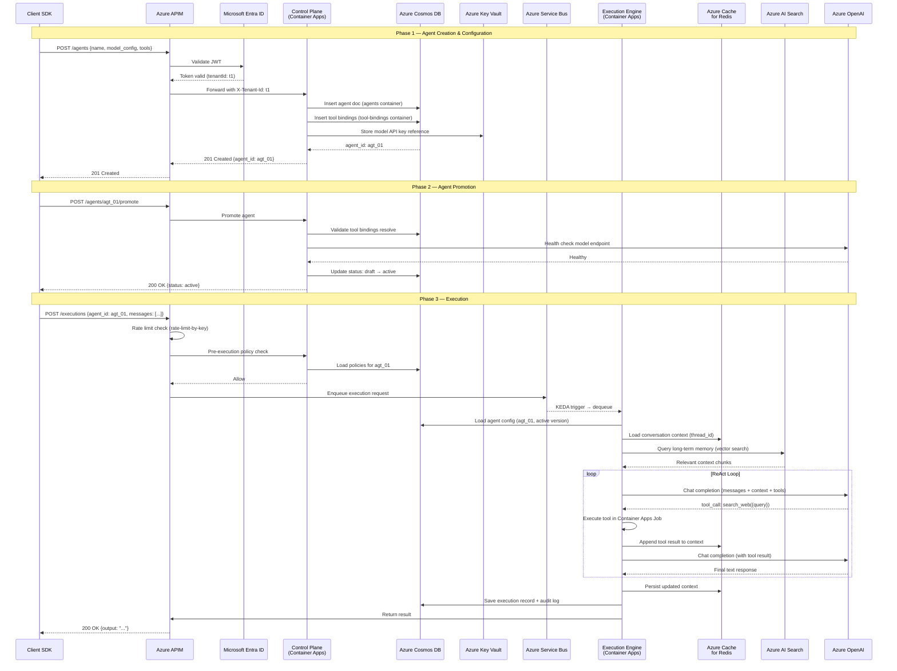
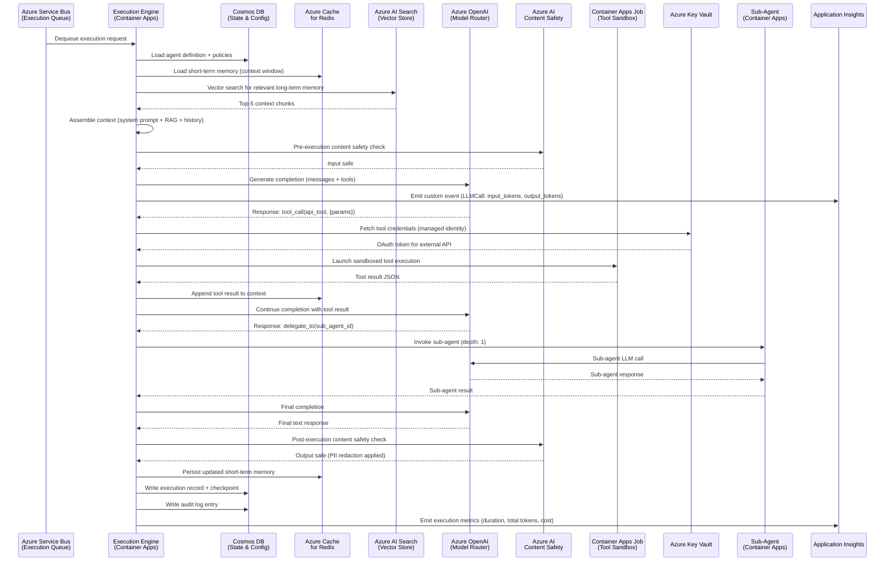
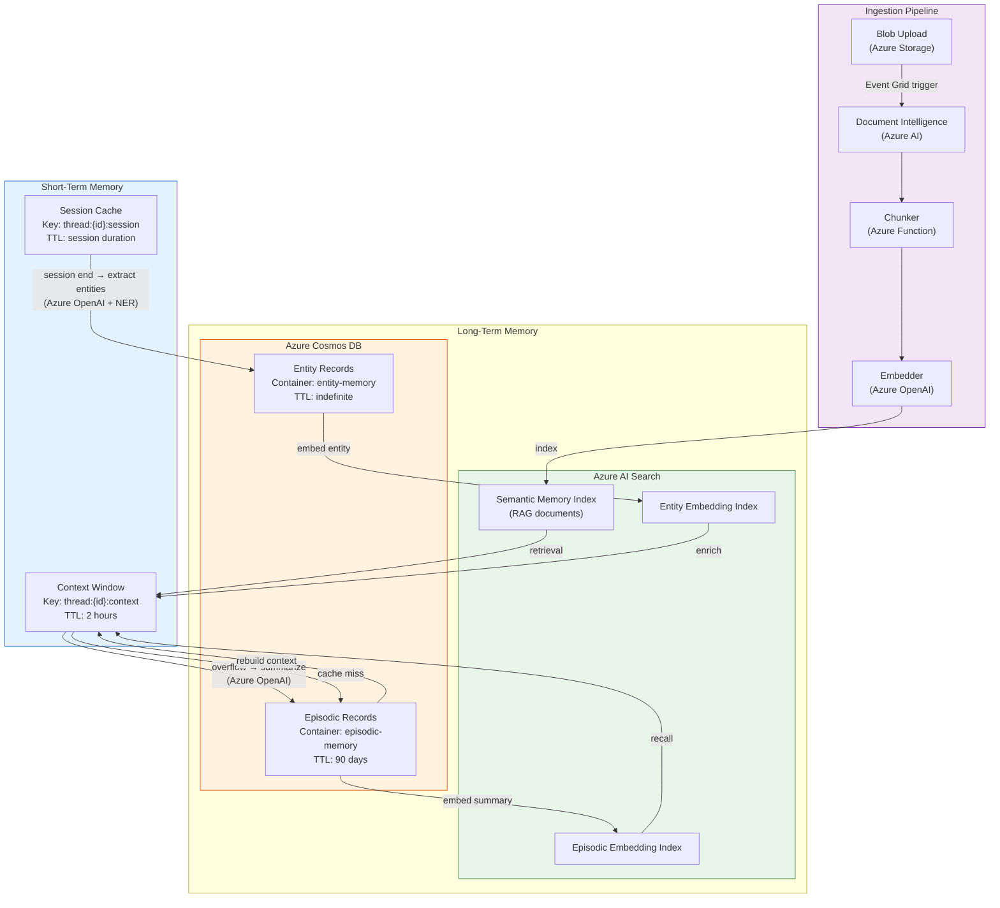
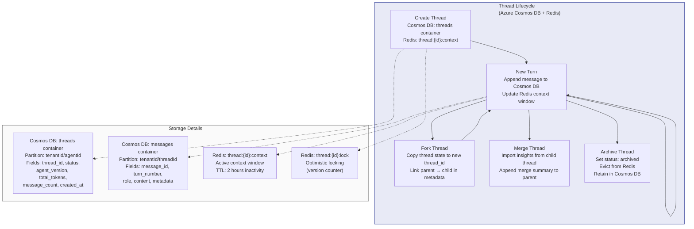
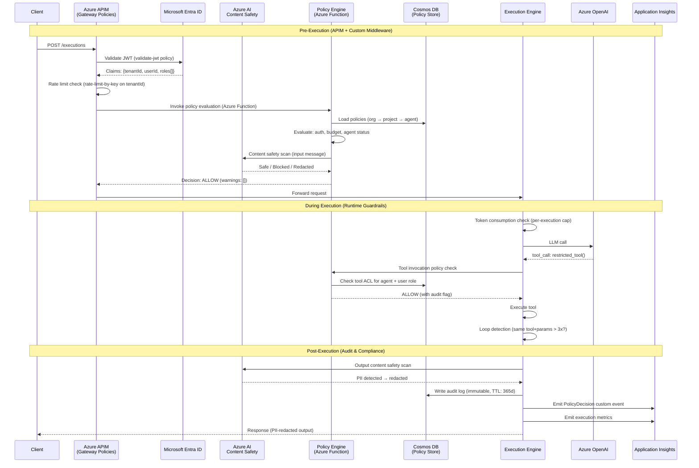
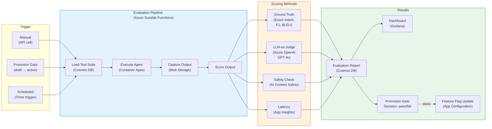
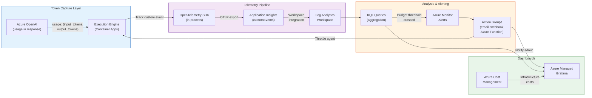
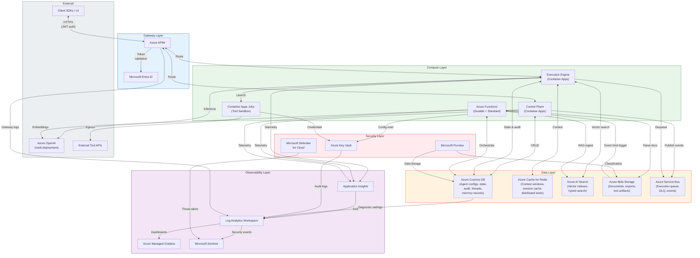

# AI Agent Platform as a Service — Microsoft Technology Architecture Mapping

**Document ID:** ARCH-MSFT-381  
**Version:** 1.0.0  
**Status:** Draft  
**Track:** STU-MSFT (Track 2)  
**Parent Document:** [ARCH-HLD-380 — AI Agent PaaS High-Level Design](ai-agent-paas-hld.md)  
**Last Updated:** 2026-03-22  
**Author:** Archmorph Engineering  

---

## Table of Contents

1. [Executive Summary](#1-executive-summary)
2. [Control Plane — Microsoft Services Mapping](#2-control-plane--microsoft-services-mapping)
3. [Runtime Plane — Microsoft Services Mapping](#3-runtime-plane--microsoft-services-mapping)
4. [Observability & Governance — Microsoft Services](#4-observability--governance--microsoft-services)
5. [End-to-End Request Lifecycle Flow](#5-end-to-end-request-lifecycle-flow)
6. [Agent Execution Flow](#6-agent-execution-flow)
7. [Memory Management Flow](#7-memory-management-flow)
8. [Thread Management Flow](#8-thread-management-flow)
9. [Policy Enforcement Flow](#9-policy-enforcement-flow)
10. [Evaluation Pipeline Flow](#10-evaluation-pipeline-flow)
11. [Cost & Token Observability Flow](#11-cost--token-observability-flow)
12. [Data Movement & Integration Diagram](#12-data-movement--integration-diagram)
13. [Security Enforcement Model](#13-security-enforcement-model)
14. [Scalability Model](#14-scalability-model)
15. [Deployment Architecture](#15-deployment-architecture)
16. [Azure Resource Naming Conventions](#16-azure-resource-naming-conventions)
17. [Recommended SKUs & Sizing](#17-recommended-skus--sizing)

---

## 1. Executive Summary

This document maps every logical component defined in the vendor-neutral High-Level Design (ARCH-HLD-380) to concrete Microsoft Azure services, producing a production-ready, enterprise-grade architecture.

**Purpose.** The HLD establishes a cloud-agnostic reference architecture for an AI Agent Platform as a Service. This mapping document answers the question: *"If we build this on Microsoft Azure, which specific services do we use for each component, and how do they interconnect?"*

**Scope.** This document covers:

- 1:1 mapping of every HLD component to one or more Azure services
- Rationale for service selection (why this service over alternatives)
- End-to-end data flows using Azure service names
- Security, scalability, and deployment models expressed in Azure-native terms
- Resource naming conventions and recommended SKUs for a medium-scale deployment (~1,000 agents, ~10K executions/day)

**Design Constraints:**

- Microsoft products are used as extensively as possible — third-party services are introduced only where Azure has no equivalent
- All services are General Availability (GA) or Public Preview with a GA commitment
- Enterprise-grade: managed identities, Private Endpoints, diagnostic settings enabled on all resources
- Multi-region capable from day one

---

## 2. Control Plane — Microsoft Services Mapping

The control plane handles agent lifecycle, configuration, policy management, model registry, marketplace, and cost controls. All components operate on metadata with low throughput and high consistency requirements.

### 2.1 Complete Mapping Table

| HLD Component (§) | Microsoft Azure Service | SKU / Tier | Rationale |
|---|---|---|---|
| **Agent Registry** (§4.1) | Azure Cosmos DB for NoSQL | Serverless or Autoscale (RU/s) | Globally distributed, multi-model, JSON-native schema-free storage for versioned agent snapshots. Change feed enables event-driven lifecycle transitions. Partition key: `tenantId` |
| **Tool Registry** (§4.2) | Azure Cosmos DB for NoSQL | Same database, separate container | Co-located with Agent Registry for transactional consistency on tool bindings. Schema-free JSON accommodates diverse tool definition schemas |
| **Data Source Connector Registry** (§4.3) | Azure Cosmos DB for NoSQL | Same database, separate container | Connection metadata and health state. Credentials stored as Key Vault references (URI pointers), never inline |
| **Workflow Orchestrator** (§4.4) | Azure Durable Functions | Consumption or Premium plan | Native DAG orchestration via fan-out/fan-in, sub-orchestrations, and human-interaction patterns. Checkpoint/resume built-in. Supports sequential, parallel, and dynamic workflows |
| **Policy Engine** (§4.5) | Custom middleware + Azure API Management (APIM) policies | Standard v2 | APIM handles rate limiting, JWT validation, IP filtering, and request/response transformation. Custom policy evaluation logic runs as an Azure Function behind APIM |
| **Evaluation Engine** (§4.6) | Azure Durable Functions + Azure AI Foundry | Premium plan + S0 | Durable Functions orchestrate batch evaluation pipelines. Azure AI Foundry provides LLM-as-Judge scoring and prompt flow evaluation |
| **Model Registry & Routing** (§4.7) | Azure AI Foundry + Azure OpenAI Service | S0 + multi-deployment | AI Foundry provides a unified catalog of model deployments (Azure OpenAI, Mistral, open-weight). Multi-deployment configuration enables routing strategies |
| **Marketplace Catalog** (§4.8) | Azure Cosmos DB for NoSQL + Azure Blob Storage | Same database + Hot tier | Catalog metadata in Cosmos DB; published agent templates and tool packages stored as blobs with SAS-token-controlled access |
| **Cost & Token Control** (§4.9) | Azure Monitor + Application Insights + custom metering | Log Analytics workspace | Token counts emitted as Application Insights custom metrics and events. Azure Cost Management provides infrastructure cost visibility. Custom metering logic for per-execution token attribution |
| **API Gateway** (§3) | Azure API Management (APIM) | Standard v2 | Centralized API surface with OAuth2 validation, rate limiting, request routing, and built-in developer portal. VNet-integrated for private backend access |
| **Identity Provider** (§7.1) | Microsoft Entra ID (Azure AD) | P1 or P2 | OIDC/SAML SSO, Conditional Access, MFA, App Registrations for service principals. B2C available for consumer-facing scenarios |
| **Secret Management** (§7.3) | Azure Key Vault | Standard | HSM-backed secret, key, and certificate management. Managed identity access eliminates credential passing. Automatic rotation via Key Vault rotation policies |
| **Configuration Management** | Azure App Configuration | Standard | Centralized feature flags and configuration with real-time push notifications. Feature flags control A/B testing, canary rollouts, and agent-level settings |
| **Event Bus** | Azure Event Grid + Azure Service Bus | Standard | Event Grid for system events (agent lifecycle, policy changes, health transitions). Service Bus for reliable command/message delivery with dead-letter support |

### 2.2 Component Detail: Agent Registry on Cosmos DB

**Container Design:**

```
Database: agentpaas-control
├── Container: agents        (partition key: /tenantId)
├── Container: agent-versions (partition key: /tenantId)
├── Container: tools         (partition key: /tenantId)
├── Container: tool-bindings (partition key: /tenantId)
├── Container: policies      (partition key: /tenantId)
├── Container: policy-bindings (partition key: /tenantId)
├── Container: model-endpoints (partition key: /tenantId)
├── Container: data-sources  (partition key: /tenantId)
├── Container: workflows     (partition key: /tenantId)
├── Container: marketplace   (partition key: /category)
└── Container: audit-log     (partition key: /tenantId, TTL: 365 days)
```

**Why Cosmos DB over Azure SQL:**

| Factor | Cosmos DB | Azure SQL |
|---|---|---|
| Schema flexibility | Schema-free JSON documents — agent configs vary widely | Requires rigid schema or JSON columns |
| Global distribution | Turnkey multi-region writes | Requires Always On Availability Groups or Hyperscale |
| Partition-level isolation | Natural tenant isolation via partition key | Row-Level Security (viable but less inherent) |
| Change Feed | Built-in — enables event-driven agent lifecycle | Change Data Capture (CDC) requires additional configuration |
| Serverless pricing | Pay-per-request at low scale | Always-on minimum cost |

### 2.3 Component Detail: Workflow Orchestrator on Durable Functions

**Mapping to HLD Node Types:**

| HLD Node Type (§4.4) | Durable Functions Primitive |
|---|---|
| `agent_invoke` | Activity function calling Execution Engine API |
| `tool_invoke` | Activity function calling Tool Runtime directly |
| `conditional` | Orchestrator `if/switch` based on activity result |
| `parallel_fan_out` | `Task.WhenAll()` on multiple activity invocations |
| `parallel_fan_in` | Aggregation logic after `Task.WhenAll()` completes |
| `human_in_the_loop` | `WaitForExternalEvent()` — pauses orchestration until approval signal received |
| `checkpoint` | Automatic — Durable Functions checkpoints after every `await` |

### 2.4 Component Detail: API Gateway on APIM

**APIM Policy Stack (per-API):**

| Policy Phase | Policy | Purpose |
|---|---|---|
| Inbound | `validate-jwt` | Validate Entra ID access tokens |
| Inbound | `rate-limit-by-key` | Per-tenant rate limiting using `sub` claim |
| Inbound | `set-header` | Inject `X-Tenant-Id` from JWT claims |
| Inbound | `ip-filter` | Restrict to allowed IP ranges (enterprise) |
| Inbound | `cors` | Cross-origin configuration for web clients |
| Backend | `set-backend-service` | Route to Control Plane or Runtime Plane |
| Outbound | `find-and-replace` | Redact sensitive headers |
| On-error | `return-response` | Standardized error envelope |

---

## 3. Runtime Plane — Microsoft Services Mapping

The runtime plane handles agent execution, tool invocation, memory reads/writes, RAG retrieval, and model inference. High throughput, low latency, horizontal scalability.

### 3.1 Complete Mapping Table

| HLD Component (§) | Microsoft Azure Service | SKU / Tier | Rationale |
|---|---|---|---|
| **Agent Execution Engine** (§5.1) | Azure Container Apps | Consumption or Dedicated | Per-agent container isolation with KEDA-based autoscaling. Supports scale-to-zero for idle agents. Dapr sidecar for service invocation, state management, and pub/sub |
| **Tool Execution Runtime** (§5.2) | Azure Container Apps Jobs (event-driven) | Consumption | Ephemeral job containers for sandboxed tool execution. Destroyed after completion. Network egress restricted via NSG rules on the Container Apps Environment VNet |
| **Short-Term Memory** (§10.1) | Azure Cache for Redis | Enterprise E10 or Premium P1 | Sub-millisecond access for conversation context windows and session caches. Redis Cluster mode for horizontal scaling. Data persistence for cache recovery |
| **Long-Term Memory — Vector Store** (§10.2) | Azure AI Search | Standard S1 or S2 | HNSW vector index with hybrid search (vector + BM25). Per-tenant indexes with security filters. Built-in semantic ranking as re-ranker |
| **Long-Term Memory — Episodic & Entity** (§10.2) | Azure Cosmos DB for NoSQL | Same database, runtime containers | `episodic-memory` and `entity-memory` containers with TTL-based retention. Partition key: `tenantId/agentId` |
| **RAG Pipeline — Ingestion** (§11.1) | Azure AI Document Intelligence + Azure Functions | S0 + Premium plan | Document Intelligence for PDF/image parsing and table extraction. Azure Functions for chunking and embedding orchestration |
| **RAG Pipeline — Embedding** (§11.3) | Azure OpenAI Embeddings | `text-embedding-3-large` deployment | Batch embedding via Azure OpenAI with rate-limit-aware queuing |
| **RAG Pipeline — Vector Index** (§11.4) | Azure AI Search | Standard S1 or S2 (shared with Long-Term Memory) | HNSW indexes with configurable dimensions (1536 or 3072). Metadata-filtered vector search |
| **RAG Pipeline — Re-Ranking** (§11.5) | Azure AI Search Semantic Ranker | Built-in (S1+) | L2 re-ranking using Microsoft's cross-encoder model. No additional deployment needed |
| **Model Routing** (§5.8) | Azure OpenAI Service (multi-deployment) + Azure AI Foundry | PTU or TPM deployments | Multiple model deployments behind a custom routing layer. Azure AI Foundry for Mistral, Llama, and open-weight models. Smart-routing via APIM health probes and weighted backends |
| **State Persistence** (§5.5) | Azure Cosmos DB for NoSQL | Same database, `execution-state` container | Execution checkpoints, DAG position, intermediate outputs. Partition key: `tenantId/executionId`. TTL for completed executions |
| **Token & Cost Tracking** (§4.9) | Application Insights + Log Analytics | Workspace-based | Custom events (`LLMCall`) with dimensions: `tenantId`, `agentId`, `executionId`, `model`, `inputTokens`, `outputTokens`, `costUSD`. KQL queries for real-time dashboards |
| **Blob / Document Storage** | Azure Blob Storage | Hot/Cool tiers (LRS or ZRS) | RAG source documents, agent export archives, DLQ payload snapshots. Lifecycle management policies for automatic tiering |
| **Queue-Based Load Leveling** (§8.2) | Azure Service Bus | Premium | Execution request queue with per-tenant sessions for ordering. Dead-letter queues with automatic forwarding. KEDA scaler triggers Container Apps autoscaling on queue depth |
| **Sub-Agent Orchestrator** (§5.6) | Azure Durable Functions + Azure Container Apps | Premium plan | Durable Functions manage fan-out/fan-in orchestration across sub-agent instances on Container Apps. Depth/fan-out limits enforced in orchestrator logic |
| **Content Filtering** (§12.4) | Azure AI Content Safety | S0 | Prompt injection detection, PII scanning, harmful content classification. Integrated as pre- and post-execution middleware |

### 3.2 Component Detail: Execution Engine on Azure Container Apps

**Architecture:**

```
Azure Service Bus (Execution Queue)
    │
    ▼ (KEDA trigger)
Azure Container Apps (Execution Workers)
    ├── Dapr sidecar: state store (Cosmos DB), pub/sub (Event Grid), secret store (Key Vault)
    ├── App container: Agent runtime (Python/Node.js)
    ├── Egress: restricted via VNet + NSG
    └── Scaling: 0–100 replicas based on queue depth
```

**Container Apps Environment Configuration:**

| Setting | Value | Purpose |
|---|---|---|
| Workload profile | Consumption (D4) | 4 vCPU, 8 GiB per replica — matches HLD execution worker sizing |
| Min replicas | 2 | Always-on baseline for low-latency response |
| Max replicas | 100 | Upper bound per HLD §8.3 |
| Scale rule | Azure Service Bus queue length > 10 | KEDA-driven scale-out |
| Cooldown period | 120 seconds | Prevent premature scale-in (matches HLD) |
| Revision mode | Multiple | Blue-green deployments via traffic splitting |

### 3.3 Component Detail: Memory Architecture on Azure

```
┌─────────────────────────────────────────────────────────────┐
│                    Memory Architecture                       │
│                                                              │
│  ┌──────────────────────┐    ┌────────────────────────────┐  │
│  │  Short-Term Memory   │    │    Long-Term Memory        │  │
│  │                      │    │                            │  │
│  │  Azure Cache for     │    │  Azure AI Search           │  │
│  │  Redis (Enterprise)  │    │  (Vector Index + BM25)     │  │
│  │                      │    │                            │  │
│  │  • Context window    │    │  • Semantic memory (RAG)   │  │
│  │  • Session cache     │    │  • Episodic embeddings     │  │
│  │  • TTL: 2 hours      │    │  • Entity embeddings       │  │
│  └──────────┬───────────┘    └──────────┬─────────────────┘  │
│             │                           │                    │
│             │    ┌──────────────────┐    │                    │
│             └───►│  Cosmos DB       │◄───┘                    │
│                  │  (Structured)    │                         │
│                  │                  │                         │
│                  │  • Episodic text │                         │
│                  │  • Entity records│                         │
│                  │  • Checkpoints   │                         │
│                  └──────────────────┘                         │
└──────────────────────────────────────────────────────────────┘
```

### 3.4 Component Detail: RAG Pipeline on Azure

| HLD Stage | Azure Service | Detail |
|---|---|---|
| Document Upload | Azure Blob Storage (Hot) | Documents uploaded via SAS URLs. Event Grid triggers ingestion pipeline |
| Document Parse | Azure AI Document Intelligence | Layout model for PDFs; Prebuilt models for invoices, receipts. Custom models for domain-specific formats |
| Chunking | Azure Functions (Premium) | Custom chunking logic (semantic, recursive, code-aware). Runs as durable function activity |
| Embedding | Azure OpenAI (`text-embedding-3-large`) | Batch embedding with retry and rate-limit backoff. 3072 dimensions for maximum recall |
| Vector Indexing | Azure AI Search (HNSW index) | Per-tenant index with metadata fields. Filterable by `tenantId`, `agentId`, `documentId`, `documentType` |
| Query Encoding | Azure OpenAI (`text-embedding-3-large`) | Same model as ingestion for consistency |
| ANN Search | Azure AI Search (vector search) | Top-20 candidates via HNSW approximate nearest neighbor |
| Re-Ranking | Azure AI Search Semantic Ranker | Cross-encoder re-ranking to top-5 results |
| Context Assembly | Execution Engine (custom logic) | Budget-aware context window assembly per HLD §11.6 |

---

## 4. Observability & Governance — Microsoft Services

### 4.1 Complete Mapping Table

| HLD Component (§) | Microsoft Azure Service | SKU / Tier | Rationale |
|---|---|---|---|
| **Structured Logging** (§6.2) | Azure Monitor Logs (Log Analytics) | Pay-per-GB | Centralized log aggregation with KQL query engine. Application and platform logs shipped via diagnostic settings |
| **Distributed Tracing** (§6.2) | Application Insights (workspace-based) | Pay-per-GB | End-to-end distributed traces across APIM → Container Apps → Functions → External LLM. OpenTelemetry SDK integration |
| **Metrics** (§6.2) | Azure Monitor Metrics + Application Insights Custom Metrics | Included | Platform metrics (CPU, memory, request count) + custom metrics (token consumption, execution duration, tool latency) |
| **Dashboards** (§6.2) | Azure Managed Grafana | Standard | Pre-built dashboards for platform health, agent performance, token economics. Backed by Azure Monitor and Log Analytics data sources |
| **Cost Management** (§4.9) | Azure Cost Management + custom token metering | Included | Infrastructure cost visibility via Cost Management. Token-level cost attribution via Application Insights custom events + KQL aggregation |
| **Alerting** | Azure Monitor Alerts + Action Groups | Included | Metric alerts (token budget threshold), log alerts (error rate spike), activity log alerts (security events). Action Groups route to email, SMS, webhook, Azure Functions |
| **Compliance & Data Governance** | Microsoft Purview | Standard | Data lineage tracking, sensitive data classification (PII detection), compliance posture dashboards |
| **Security Scanning** | Microsoft Defender for Cloud | Plan 2 | Container image vulnerability scanning, misconfiguration detection, threat protection for Key Vault and Storage. Defender for Containers for runtime threat detection |
| **Security Logging** | Microsoft Sentinel | Pay-per-GB | SIEM integration for security event correlation, automated threat response playbooks. Ingests from Entra ID, Key Vault, APIM, and Defender |
| **Audit Logging** (§12.3) | Azure Cosmos DB (append-only) + Log Analytics | TTL-managed | Immutable execution audit records in Cosmos DB with TTL-based retention. Exported to Log Analytics for long-term query and compliance export |

### 4.2 Log Analytics Workspace Architecture

```
Log Analytics Workspace: law-agentpaas-{env}-{region}
├── Application Insights: appi-agentpaas-{env}
│   ├── customEvents: LLMCall, ToolInvocation, PolicyDecision
│   ├── customMetrics: TokensConsumed, ExecutionDuration, QueueDepth
│   ├── traces: Distributed trace spans
│   ├── requests: API request telemetry
│   └── exceptions: Error telemetry
├── Diagnostic Settings (all resources):
│   ├── Azure Container Apps: ContainerAppConsoleLogs, ContainerAppSystemLogs
│   ├── Azure Cosmos DB: DataPlaneRequests, QueryRuntimeStatistics
│   ├── Azure Service Bus: OperationalLogs, VNetAndIPFilteringLogs
│   ├── Azure Key Vault: AuditEvent
│   ├── Azure APIM: GatewayLogs, WebSocketConnectionLogs
│   ├── Azure AI Search: OperationLogs
│   └── Azure Cache for Redis: CacheEvents
└── Custom Tables:
    ├── AgentExecution_CL: Full execution audit trail
    ├── TokenAccounting_CL: Per-call token metrics
    └── PolicyAudit_CL: Policy decision records
```

---

## 5. End-to-End Request Lifecycle Flow

This diagram traces an agent creation → configuration → tool attachment → execution → result through specific Azure services.



---

## 6. Agent Execution Flow

This diagram shows the internal execution engine flow including tool calls, sub-agents, and memory access through Azure services.



---

## 7. Memory Management Flow



**Lifecycle Rules:**

| Phase | Azure Service | Action |
|---|---|---|
| **Creation** | Redis (write-through to Cosmos DB) | Context window populated on first turn. Session cache created on thread start |
| **Enrichment** | Azure Functions + Azure OpenAI | Summarization at session end. Entity extraction and deduplication |
| **Compaction** | Azure Functions (timer trigger, daily) | Merge episodic memories beyond a threshold. Consolidate entity records |
| **Retention** | Cosmos DB TTL + AI Search index lifecycle | Cosmos DB TTL auto-deletes expired records. AI Search index entries removed via scheduled cleanup function |
| **Deletion (GDPR)** | Azure Functions (HTTP trigger) | Hard delete from Redis, Cosmos DB, AI Search, and Blob Storage. Deletion certificate logged to audit |
| **Export** | Azure Functions (HTTP trigger) | Export all memory for a tenant/agent to Azure Blob Storage as JSON archive |

---

## 8. Thread Management Flow



**Concurrency Control:**

- Redis `WATCH`/`MULTI`/`EXEC` for optimistic locking on context window updates
- Cosmos DB conditional writes (`If-Match` on ETag) for thread metadata updates
- Within a single thread, turns are serialized — Service Bus session ID = `threadId` ensures FIFO ordering

---

## 9. Policy Enforcement Flow



**Policy Evaluation Chain:**

| Layer | Service | Policies Evaluated |
|---|---|---|
| Gateway | APIM | JWT validation, rate limiting, IP filtering, CORS, request size |
| Pre-execution | Azure Functions + AI Content Safety | Budget check, agent health, content safety, PII detection |
| Runtime | Execution Engine (embedded) | Token cap, timeout, tool ACL, recursion depth, loop detection |
| Post-execution | Azure Functions + AI Content Safety | Output content safety, PII redaction, audit logging |

---

## 10. Evaluation Pipeline Flow



**A/B Testing via Azure App Configuration:**

| Feature Flag | Value | Effect |
|---|---|---|
| `agent.{agent_id}.canary.enabled` | `true` / `false` | Enable canary traffic splitting |
| `agent.{agent_id}.canary.percentage` | `0–100` | Percentage of traffic to candidate version |
| `agent.{agent_id}.active_version` | `2.1.0` | Current production version |
| `agent.{agent_id}.candidate_version` | `2.2.0` | Version under evaluation |

Feature flags are read by the Execution Engine via the App Configuration SDK with real-time push notification — no restart required to change routing.

---

## 11. Cost & Token Observability Flow



**Custom Event Schema (`LLMCall`):**

```json
{
    "name": "LLMCall",
    "properties": {
        "tenantId": "t_abc123",
        "projectId": "proj_01",
        "agentId": "agt_01",
        "executionId": "exec_789",
        "model": "gpt-4o",
        "provider": "azure_openai",
        "deploymentName": "gpt4o-prod-eastus"
    },
    "measurements": {
        "inputTokens": 1250,
        "outputTokens": 430,
        "cachedTokens": 800,
        "costUSD": 0.0187,
        "latencyMs": 2340
    }
}
```

**Key KQL Queries:**

```kql
// Token consumption per tenant per day
customEvents
| where name == "LLMCall"
| where timestamp > ago(24h)
| extend tenantId = tostring(customDimensions.tenantId)
| summarize
    totalInputTokens = sum(todouble(customMeasurements.inputTokens)),
    totalOutputTokens = sum(todouble(customMeasurements.outputTokens)),
    totalCostUSD = sum(todouble(customMeasurements.costUSD)),
    callCount = count()
    by tenantId, bin(timestamp, 1h)
| order by tenantId, timestamp

// Budget alert: tenant approaching 80% of monthly budget
customEvents
| where name == "LLMCall"
| where timestamp > startofmonth(now())
| extend tenantId = tostring(customDimensions.tenantId)
| summarize monthlyCost = sum(todouble(customMeasurements.costUSD)) by tenantId
| join kind=inner (
    externaldata(tenantId: string, monthlyBudget: double)
    [@"https://staccounting.blob.core.windows.net/budgets/tenant-budgets.csv"]
    with (format="csv", ignoreFirstRecord=true)
) on tenantId
| where monthlyCost > monthlyBudget * 0.8
| project tenantId, monthlyCost, monthlyBudget, percentUsed = monthlyCost / monthlyBudget * 100
```

**Alert Rules:**

| Alert | Condition | Action Group |
|---|---|---|
| Budget 50% threshold | KQL: `monthlyCost > budget * 0.5` | Email notification |
| Budget 80% threshold | KQL: `monthlyCost > budget * 0.8` | Email + webhook (Slack) |
| Budget 100% exhausted | KQL: `monthlyCost >= budget` | Email + Azure Function (throttle agent) |
| Error rate spike | Metric: `requests/failed` > 5% for 5 min | PagerDuty webhook |
| Queue depth high | Service Bus metric: `ActiveMessages` > 500 for 5 min | Email + autoscale audit log |

---

## 12. Data Movement & Integration Diagram



---

## 13. Security Enforcement Model

### 13.1 Identity & Access (Microsoft Entra ID)

| HLD Actor | Entra ID Mapping | Auth Method |
|---|---|---|
| Human users (console) | Entra ID user accounts | OIDC SSO with MFA (Conditional Access) |
| API clients (SDKs) | Entra ID App Registrations | Client credentials flow (client_id + client_secret or certificate) |
| Service-to-service | Managed Identities (system-assigned) | No credentials — Azure handles token acquisition |
| Agents (during execution) | Execution-scoped tokens | Short-lived bearer tokens issued by the platform, not Entra ID |

**RBAC Mapping to Entra ID:**

| HLD Role | Entra ID Implementation |
|---|---|
| `viewer` | Custom App Role: `AgentPaaS.Viewer` |
| `developer` | Custom App Role: `AgentPaaS.Developer` |
| `operator` | Custom App Role: `AgentPaaS.Operator` |
| `admin` | Custom App Role: `AgentPaaS.Admin` |
| `super_admin` | Custom App Role: `AgentPaaS.SuperAdmin` (restricted assignment) |

Roles are assigned through Entra ID Enterprise Application role assignments, scoped to projects via custom claims or group membership.

### 13.2 Key Vault Integration

| Secret Category | Key Vault Type | Rotation |
|---|---|---|
| LLM API keys | Secrets | 90-day auto-rotation via Key Vault rotation policy |
| Database connection strings | Secrets | Managed Identity eliminates the need (no connection string) |
| Tool OAuth credentials | Secrets (per-tenant Key Vault instance) | Tenant-managed |
| Data encryption keys | Keys (RSA-2048 or RSA-4096) | Annual auto-rotation with re-encryption via Event Grid trigger |
| TLS certificates | Certificates | Auto-renewal via Key Vault + APIM/Container Apps integration |
| JWT signing keys | Keys | 180-day rotation, old key kept for verification grace period |

**Access Model:**

- All services access Key Vault via Managed Identity — no credentials stored anywhere
- Key Vault Firewall: Allow access only from Container Apps VNet and APIM subnet
- Key Vault access policies: least-privilege (e.g., Execution Engine has `Get` on secrets only, not `List` or `Set`)
- Diagnostic settings emit all access events to Log Analytics for audit

### 13.3 Network Security

```
┌──────────────────────────────────────────────────────────────┐
│                    Azure Virtual Network                      │
│                    CIDR: 10.0.0.0/16                         │
│                                                              │
│  ┌─────────────────────┐  ┌─────────────────────────────┐   │
│  │  Gateway Subnet     │  │  Application Subnet          │   │
│  │  10.0.1.0/24        │  │  10.0.2.0/24                │   │
│  │                     │  │                              │   │
│  │  • APIM (VNet-      │  │  • Container Apps Env        │   │
│  │    integrated)       │  │  • Azure Functions (VNet-    │   │
│  │  • App Gateway       │  │    integrated)               │   │
│  │    (optional WAF v2) │  │  • Container Apps Jobs       │   │
│  └─────────┬───────────┘  └──────────┬───────────────────┘   │
│            │                         │                        │
│  ┌─────────▼─────────────────────────▼───────────────────┐   │
│  │             Data Subnet                                │   │
│  │             10.0.3.0/24                                │   │
│  │                                                        │   │
│  │  Private Endpoints:                                    │   │
│  │  • pe-cosmos.privatelink.documents.azure.com           │   │
│  │  • pe-redis.privatelink.redis.cache.windows.net        │   │
│  │  • pe-search.privatelink.search.windows.net            │   │
│  │  • pe-blob.privatelink.blob.core.windows.net           │   │
│  │  • pe-sb.privatelink.servicebus.windows.net            │   │
│  │  • pe-kv.privatelink.vaultcore.azure.net               │   │
│  │  • pe-openai.privatelink.openai.azure.com              │   │
│  └────────────────────────────────────────────────────────┘   │
│                                                              │
│  NSG Rules:                                                  │
│  • Gateway → Application: Allow TCP 443, 8080               │
│  • Application → Data: Allow TCP 443, 6380, 5432            │
│  • Application → Internet: Deny All (except Azure OpenAI)   │
│  • Data → any outbound: Deny All                            │
└──────────────────────────────────────────────────────────────┘
```

**Private Endpoints for all PaaS services:**

| Azure Service | Private Endpoint DNS Zone |
|---|---|
| Cosmos DB | `privatelink.documents.azure.com` |
| Redis | `privatelink.redis.cache.windows.net` |
| AI Search | `privatelink.search.windows.net` |
| Blob Storage | `privatelink.blob.core.windows.net` |
| Service Bus | `privatelink.servicebus.windows.net` |
| Key Vault | `privatelink.vaultcore.azure.net` |
| Azure OpenAI | `privatelink.openai.azure.com` |
| App Configuration | `privatelink.azconfig.io` |
| Event Grid | `privatelink.eventgrid.azure.net` |

All PaaS services have public network access **disabled**. Access is exclusively via Private Endpoints within the VNet.

### 13.4 Microsoft Defender for Cloud

| Defender Plan | Coverage |
|---|---|
| Defender for Containers | Container image vulnerability scanning in ACR, runtime threat detection on Container Apps |
| Defender for Key Vault | Anomalous Key Vault access detection (unusual IP, bulk reads, disabled logging) |
| Defender for Storage | Malware scanning on blob uploads, anomalous access patterns |
| Defender for Cosmos DB | Anomalous query patterns, potential SQL injection detection |
| Defender for Resource Manager | Suspicious management operations (bulk deletes, policy changes) |

### 13.5 Compliance

| Requirement | Azure Service |
|---|---|
| GDPR data deletion | Azure Functions (orchestrated hard delete across Cosmos DB, AI Search, Redis, Blob Storage) + Purview lineage |
| SOC 2 access logging | Key Vault audit logs + Entra ID sign-in logs + APIM gateway logs → Log Analytics → Sentinel |
| HIPAA PHI handling | Cosmos DB CMK encryption + AI Search CMK + Blob Storage CMK + network isolation |
| Data residency | Azure region pinning (e.g., West Europe only). Cosmos DB geo-fencing. AI Search region selection |
| Audit trail retention | Cosmos DB TTL: 365 days. Log Analytics retention: 730 days (configurable) |

---

## 14. Scalability Model

### 14.1 Azure Container Apps Autoscaling

| HLD Signal (§8.3) | Azure Container Apps Scale Rule | Configuration |
|---|---|---|
| Queue depth > 100 | KEDA: `azure-servicebus` scaler | `queueName`, `messageCount: 10` (scale out per 10 messages) |
| CPU > 70% | Built-in CPU scaler | `metadata.value: 70` |
| Memory > 80% | Built-in Memory scaler | `metadata.value: 80` |
| HTTP concurrency | Built-in HTTP scaler | `concurrentRequests: 50` |

**Scaling Bounds:**

| Component | Min Replicas | Max Replicas | Scale-to-Zero |
|---|---|---|---|
| Control Plane API | 2 | 20 | No |
| Execution Workers | 2 | 100 | No |
| Tool Runtime (Jobs) | 0 | 50 | Yes |
| RAG Ingestion Worker | 0 | 10 | Yes |

### 14.2 Azure Cosmos DB Scaling

| Strategy | Configuration |
|---|---|
| Throughput mode | Autoscale (400–40,000 RU/s per container) |
| Partition key | `/tenantId` for tenant-scoped containers; `/tenantId/agentId` for fine-grained |
| Cross-partition queries | Minimized by design — most queries filter on partition key |
| Hot partition mitigation | Hierarchical partition keys (e.g., `/tenantId/agentId`) distribute load |
| Global distribution | Multi-region writes for active-active premium tier |
| Consistency level | Session (default) — strong per-session, eventual cross-session |

### 14.3 Azure AI Search Scaling

| Tier | Replicas | Partitions | Vector Dimensions | Use Case |
|---|---|---|---|---|
| Standard S1 | 3 | 1 | 3072 | < 500 agents, < 1M vectors |
| Standard S2 | 3 | 2 | 3072 | 500–2,000 agents, 1–10M vectors |
| Standard S3 | 3 | 3+ | 3072 | > 2,000 agents, > 10M vectors |

- 3 replicas minimum for 99.9% read SLA
- Partitions added as index size grows
- Per-tenant index with security filters (`tenantId` field) rather than per-tenant search service (cost optimization)

### 14.4 Azure Cache for Redis Scaling

| Tier | Nodes | Memory | Use Case |
|---|---|---|---|
| Premium P1 | 1 primary + 1 replica | 6 GB | < 500 concurrent threads |
| Premium P3 | 1 primary + 1 replica | 26 GB | 500–5,000 concurrent threads |
| Enterprise E10 | 3-node cluster | 12 GB (sharded) | > 5,000 concurrent threads |

- Redis Cluster mode for horizontal scaling beyond single-node memory limits
- Geo-replication (active-passive) for cross-region cache access
- RDB persistence enabled for cache recovery

### 14.5 Azure Service Bus Scaling

| Aspect | Configuration |
|---|---|
| Tier | Premium (1 Messaging Unit baseline, auto-inflate to 4) |
| Queue partitioning | Session-enabled queue with `sessionId = tenantId` for per-tenant ordering |
| Dead-letter queue | Enabled with `MaxDeliveryCount: 5` |
| Message lock duration | 120 seconds (matches execution timeout) |
| Auto-inflate | Enabled — scale from 1 to 4 MUs on sustained load |

---

## 15. Deployment Architecture

### 15.1 Multi-Region Strategy

```
                    ┌──────────────────────┐
                    │   Azure Front Door   │
                    │   (Global LB + WAF)  │
                    └──────────┬───────────┘
                               │
              ┌────────────────┼────────────────┐
              │                │                │
    ┌─────────▼──────┐  ┌─────▼───────┐  ┌─────▼───────┐
    │  East US 2     │  │ West Europe │  │ Southeast   │
    │  (Primary)     │  │ (Secondary) │  │ Asia        │
    │                │  │             │  │ (DR only)   │
    │  Full stack    │  │ Full stack  │  │ Data        │
    │  (active)      │  │ (active)    │  │ replica     │
    └────────────────┘  └─────────────┘  └─────────────┘
```

| Component | Multi-Region Strategy | RPO | RTO |
|---|---|---|---|
| Azure Front Door | Active-active global load balancing | 0 | < 60s (DNS failover) |
| Azure APIM | Multi-region deployment (Premium) or independent per region (Standard v2) | 0 | < 60s |
| Container Apps | Independent environments per region | 0 | < 60s |
| Cosmos DB | Multi-region writes (strong consistency on session, eventual cross-region) | 0 | < 10s |
| Redis | Active geo-replication (Enterprise) or independent caches per region (Premium) | < 5s | < 30s |
| AI Search | Independent indexes per region, synced via Change Feed → Functions | < 60s | < 120s |
| Service Bus | Geo-disaster recovery (paired namespace) | 0 | < 60s |
| Key Vault | Vault per region with synchronized secrets via DevOps pipeline | < 300s | < 60s |
| Blob Storage | GRS (geo-redundant storage) or GZRS | < 15min | < 60min (manual failover) |
| Azure OpenAI | Multi-region deployments, traffic managed by custom router | 0 | < 30s |

### 15.2 Blue-Green Deployment

**Container Apps Revision-Based:**

```
Container Apps (Execution Engine)
├── Revision: exec-v2-1-0 (blue)  — 100% traffic
├── Revision: exec-v2-2-0 (green) — 0% traffic (staged)
│
│  Step 1: Deploy green revision (0% traffic)
│  Step 2: Smoke test via internal endpoint
│  Step 3: Shift traffic: blue 90% / green 10% (canary)
│  Step 4: Monitor metrics for 30 minutes
│  Step 5: Shift traffic: blue 0% / green 100%
│  Step 6: Deactivate blue revision
```

**APIM Revision-Based:**

- APIM supports API revisions for breaking API changes
- Non-breaking changes deployed in-place
- Breaking changes: new revision published, clients migrate via version header

### 15.3 CI/CD Pipeline

| Stage | Tool | Action |
|---|---|---|
| Source | GitHub | Monorepo with `/backend`, `/infra`, `/functions` |
| Build | GitHub Actions | Docker build, unit tests, security scan (Defender for Cloud) |
| Artifact | Azure Container Registry (ACR) | Push container images with semantic version tags |
| Infrastructure | Terraform (azurerm provider) | Plan → Apply (with approval gate for production) |
| Deploy (staging) | GitHub Actions → Container Apps CLI | Deploy new revision to staging, run integration tests |
| Deploy (production) | GitHub Actions → Container Apps CLI | Blue-green deployment with traffic splitting |
| Validation | Azure Load Testing | Post-deployment load test + latency verification |
| Rollback | GitHub Actions (manual trigger) | Revert traffic to previous revision |

### 15.4 Disaster Recovery Playbook

| Scenario | Detection | Response | Recovery Time |
|---|---|---|---|
| Single AZ failure | Azure Monitor: resource health alerts | Automatic — Container Apps span AZs | < 60s (transparent) |
| Region failure | Front Door health probes fail | Automatic — Front Door routes to secondary region | < 60s |
| Cosmos DB failover | Automatic multi-region failover | Transparent — clients reconnect to nearest region | < 10s |
| Redis failure | Cache miss rate spikes | Read-through from Cosmos DB. Rebuild cache on recovery | Cache cold: 5–10 min |
| Azure OpenAI outage | Circuit breaker opens | Route to alternate deployment/region | < 30s |
| Total platform failure | All health checks fail | Manual: activate DR region (Southeast Asia) from Cosmos snapshot | < 15 min |

---

## 16. Azure Resource Naming Conventions

**Pattern:** `{resource-type}-{project}-{environment}-{region}-{instance}`

| Resource Type | Abbreviation | Example |
|---|---|---|
| Resource Group | `rg` | `rg-agentpaas-prod-eus2` |
| Azure Cosmos DB Account | `cosmos` | `cosmos-agentpaas-prod-eus2` |
| Azure Cache for Redis | `redis` | `redis-agentpaas-prod-eus2` |
| Azure AI Search | `srch` | `srch-agentpaas-prod-eus2` |
| Azure Container Apps Environment | `cae` | `cae-agentpaas-prod-eus2` |
| Azure Container Apps (Control Plane) | `ca` | `ca-agentpaas-cp-prod-eus2` |
| Azure Container Apps (Execution) | `ca` | `ca-agentpaas-exec-prod-eus2` |
| Azure Functions (Durable) | `func` | `func-agentpaas-orch-prod-eus2` |
| Azure Functions (RAG Ingestion) | `func` | `func-agentpaas-rag-prod-eus2` |
| Azure API Management | `apim` | `apim-agentpaas-prod-eus2` |
| Azure Key Vault | `kv` | `kv-agentpaas-prod-eus2` |
| Azure App Configuration | `appcs` | `appcs-agentpaas-prod-eus2` |
| Azure Service Bus Namespace | `sbns` | `sbns-agentpaas-prod-eus2` |
| Azure Event Grid Topic | `evgt` | `evgt-agentpaas-prod-eus2` |
| Azure OpenAI Service | `oai` | `oai-agentpaas-prod-eus2` |
| Azure AI Content Safety | `cs` | `cs-agentpaas-prod-eus2` |
| Azure Blob Storage Account | `st` | `stagentpaasprodeus2` (no hyphens, 3–24 chars) |
| Azure Container Registry | `acr` | `acragentpaasprodeus2` (no hyphens) |
| Application Insights | `appi` | `appi-agentpaas-prod-eus2` |
| Log Analytics Workspace | `law` | `law-agentpaas-prod-eus2` |
| Azure Managed Grafana | `grafana` | `grafana-agentpaas-prod-eus2` |
| Microsoft Sentinel | `sentinel` | Deployed on `law-agentpaas-prod-eus2` |
| Virtual Network | `vnet` | `vnet-agentpaas-prod-eus2` |
| Private Endpoint | `pe` | `pe-cosmos-agentpaas-prod-eus2` |
| Network Security Group | `nsg` | `nsg-app-agentpaas-prod-eus2` |
| Managed Identity | `id` | `id-agentpaas-exec-prod-eus2` |

**Environment Abbreviations:** `dev`, `stg`, `prod`  
**Region Abbreviations:** `eus2` (East US 2), `weu` (West Europe), `sea` (Southeast Asia)

---

## 17. Recommended SKUs & Sizing

Baseline for medium workload: ~1,000 agents, ~10K executions/day, ~5M tokens/day.

### 17.1 Compute

| Service | SKU / Plan | Instances | Monthly Est. Cost |
|---|---|---|---|
| Container Apps (Control Plane) | Consumption (D4: 4 vCPU, 8 GiB) | 3 replicas | ~$200 |
| Container Apps (Execution Workers) | Consumption (D4: 4 vCPU, 8 GiB) | 5–20 (autoscaled) | ~$500–2,000 |
| Container Apps Jobs (Tool Runtime) | Consumption | 0–10 (per-invocation) | ~$100–500 |
| Azure Functions (Durable + RAG) | Premium EP1 (1 vCPU, 3.5 GiB) | Min 1, prewarmed | ~$150 |
| Azure APIM | Standard v2 | 1 unit | ~$350 |

### 17.2 Data

| Service | SKU / Tier | Configuration | Monthly Est. Cost |
|---|---|---|---|
| Azure Cosmos DB | Autoscale | 400–40,000 RU/s, ~100 GB storage | ~$300–1,500 |
| Azure Cache for Redis | Premium P1 | 6 GB, 1 shard, 1 replica | ~$320 |
| Azure AI Search | Standard S1 | 3 replicas, 1 partition | ~$750 |
| Azure Blob Storage | Hot (LRS) | ~500 GB | ~$10 |
| Azure Service Bus | Premium (1 MU) | Auto-inflate to 4 MU | ~$670 |

### 17.3 AI & Cognitive

| Service | SKU / Model | Throughput | Monthly Est. Cost |
|---|---|---|---|
| Azure OpenAI (GPT-4o) | Standard (TPM) | 100K TPM | ~$2,000–5,000 (usage-based) |
| Azure OpenAI (Embeddings) | `text-embedding-3-large` | 350K TPM | ~$200–500 (usage-based) |
| Azure AI Document Intelligence | S0 | Pay-per-page | ~$50–200 |
| Azure AI Content Safety | S0 | Pay-per-request | ~$50–100 |
| Azure AI Foundry | S0 | — | ~$0 (pay for model usage) |

### 17.4 Observability & Security

| Service | SKU | Configuration | Monthly Est. Cost |
|---|---|---|---|
| Application Insights | Workspace-based | ~50 GB/month ingestion | ~$115 |
| Log Analytics Workspace | Pay-per-GB | ~100 GB/month, 90-day retention | ~$230 |
| Azure Managed Grafana | Standard | 1 instance | ~$150 |
| Azure Key Vault | Standard | ~10K operations/month | ~$10 |
| Azure App Configuration | Standard | ~100K requests/day | ~$60 |
| Microsoft Defender for Cloud | Plan 2 | Containers + Key Vault + Storage | ~$200 |
| Microsoft Sentinel | Pay-per-GB | ~20 GB/month | ~$50 |
| Microsoft Purview | Standard | Data map + classification | ~$200 |

### 17.5 Networking

| Service | SKU | Purpose | Monthly Est. Cost |
|---|---|---|---|
| Azure Front Door | Standard | Global LB + WAF | ~$350 |
| Virtual Network | — | VNet + subnets + NSGs | ~$0 (included) |
| Private Endpoints (×9) | — | All PaaS connections | ~$65 |
| Azure DNS (Private Zones) | — | Private DNS for Private Endpoints | ~$5 |

### 17.6 Total Estimated Monthly Cost

| Category | Low (5K exec/day) | Medium (10K exec/day) | High (50K exec/day) |
|---|---|---|---|
| Compute | ~$1,000 | ~$3,200 | ~$12,000 |
| Data | ~$1,500 | ~$2,550 | ~$8,000 |
| AI & Cognitive | ~$1,500 | ~$3,500 | ~$15,000 |
| Observability & Security | ~$800 | ~$1,015 | ~$3,000 |
| Networking | ~$400 | ~$420 | ~$1,000 |
| **Total** | **~$5,200** | **~$10,685** | **~$39,000** |

*Estimates assume standard pricing in East US 2. Actual costs vary by usage patterns, reserved capacity discounts, and negotiated enterprise agreements.*

---

## Appendix A: HLD Component → Azure Service Cross-Reference

This table provides a complete, flat cross-reference from every HLD section to its Azure realization.

| HLD § | HLD Component | Azure Service(s) |
|---|---|---|
| 3 | API Gateway | Azure API Management (Standard v2) |
| 3 | Identity Provider | Microsoft Entra ID (P1/P2) |
| 3 | Rate Limiter | APIM rate-limit-by-key policy |
| 4.1 | Agent Registry | Azure Cosmos DB for NoSQL |
| 4.2 | Tool Registry | Azure Cosmos DB for NoSQL |
| 4.3 | Data Source Connector Registry | Azure Cosmos DB for NoSQL + Azure Key Vault |
| 4.4 | Workflow Orchestrator | Azure Durable Functions |
| 4.5 | Policy Engine | Azure Functions + APIM policies + Azure AI Content Safety |
| 4.6 | Evaluation Engine | Azure Durable Functions + Azure AI Foundry |
| 4.7 | Model Registry | Azure AI Foundry + Azure OpenAI Service |
| 4.8 | Marketplace Catalog | Azure Cosmos DB + Azure Blob Storage |
| 4.9 | Cost & Token Control | Application Insights + Azure Monitor Alerts + Azure Cost Management |
| 5.1 | Agent Execution Engine | Azure Container Apps (Consumption) |
| 5.2 | Tool Execution Runtime | Azure Container Apps Jobs |
| 5.3 | Memory Management Layer | Azure Cache for Redis + Azure AI Search + Azure Cosmos DB |
| 5.4 | Thread Manager | Azure Cosmos DB + Azure Cache for Redis |
| 5.5 | State Manager | Azure Cosmos DB + Azure Cache for Redis |
| 5.6 | Sub-Agent Orchestrator | Azure Durable Functions + Azure Container Apps |
| 5.7 | RAG Pipeline | Azure AI Document Intelligence + Azure Functions + Azure OpenAI (Embeddings) + Azure AI Search |
| 5.8 | Model Abstraction & Router | Azure OpenAI Service (multi-deployment) + Azure AI Foundry |
| 6.1 | Tenant Isolation | Cosmos DB partition keys + AI Search security filters + Redis key prefixes + VNet isolation |
| 6.2 | Observability | Application Insights + Log Analytics + Azure Managed Grafana |
| 6.2 | Token Accounting | Application Insights custom events + KQL dashboards |
| 6.6 | Event Bus | Azure Event Grid + Azure Service Bus |
| 7.1 | Authentication | Microsoft Entra ID (OIDC/SAML) |
| 7.1 | Authorization (RBAC) | Entra ID App Roles + custom middleware |
| 7.2 | Tenant Isolation | Cosmos DB RLS + VNet + Managed Identities |
| 7.3 | Secret Management | Azure Key Vault (Standard) |
| 7.4 | Network Security | Azure VNet + NSG + Private Endpoints |
| 7.5 | Data Encryption | Cosmos DB CMK + Blob SSE + AI Search CMK + TLS 1.3 |
| 8.1 | Horizontal Scaling | Container Apps KEDA autoscaling |
| 8.2 | Queue-Based Load Leveling | Azure Service Bus (Premium) |
| 8.3 | Autoscaling Triggers | KEDA scalers (Service Bus, CPU, HTTP) |
| 8.4 | Multi-Region | Azure Front Door + Cosmos DB multi-region + per-region Container Apps |
| 9.1 | Circuit Breakers | Polly / custom middleware in Execution Engine |
| 9.3 | Dead Letter Queues | Azure Service Bus DLQ |
| 9.4 | State Recovery | Cosmos DB checkpoints + Redis persistence |
| 10.1 | Short-Term Memory | Azure Cache for Redis (Enterprise/Premium) |
| 10.2 | Long-Term Memory (Vector) | Azure AI Search (HNSW vector index) |
| 10.2 | Long-Term Memory (Episodic/Entity) | Azure Cosmos DB for NoSQL |
| 11.1 | Document Ingestion | Azure Blob Storage + Azure AI Document Intelligence |
| 11.3 | Embedding Pipeline | Azure OpenAI (`text-embedding-3-large`) |
| 11.4 | Vector Index | Azure AI Search (HNSW) |
| 11.5 | Re-Ranking | Azure AI Search Semantic Ranker |
| 12.1 | Pre-Execution Policies | APIM policies + Azure Functions + AI Content Safety |
| 12.2 | Runtime Guardrails | Execution Engine embedded logic |
| 12.3 | Post-Execution Audit | Cosmos DB (audit-log container) + Log Analytics |
| 12.4 | Content Filtering | Azure AI Content Safety |
| 13 | Data Model | Azure Cosmos DB containers (see §2.2) |
| 14 | Deployment Topology | Azure Container Apps + Front Door + multi-region |

---

*End of document.*
